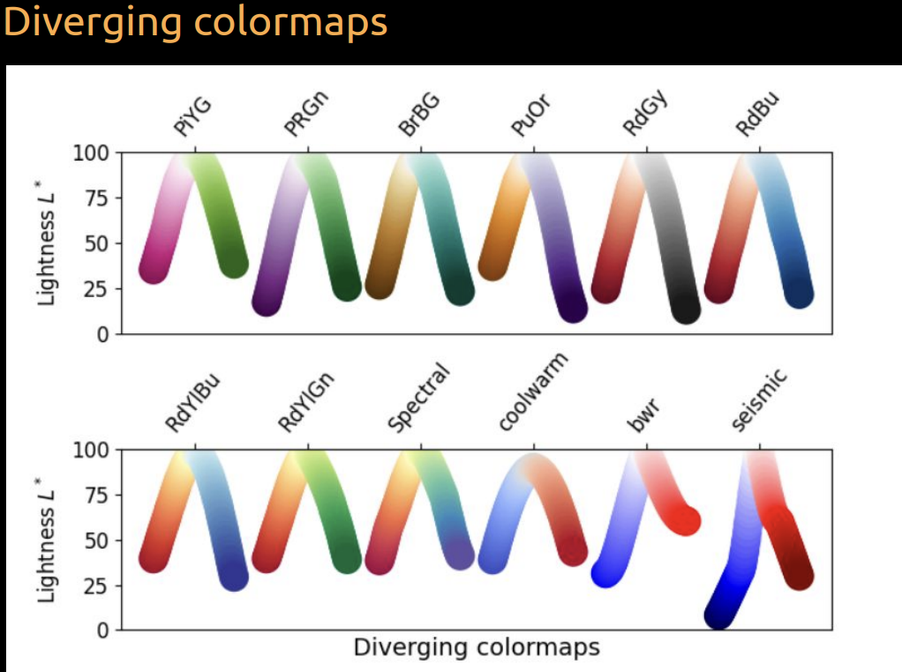
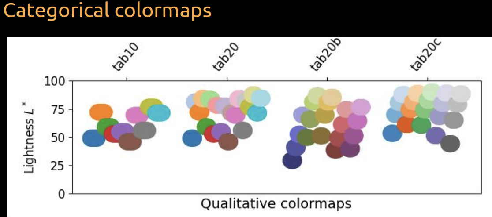

# Data Visualization

## Intro to Data Visualization

- Easier to understand data when it is visualized
- Anscombe's quartet: 4 datasets with the same mean, variance, correlation, and linear regression line but look very different when plotted

- We are using high-level declarative (altair, ggplot) instead of low-level imperative (matplotlib)
  

## Plotting in Python (Altair)

- grammar: `alt.Chart(data).mark_type().encode(x,y).properties()`
- example gallery: https://altair-viz.github.io/gallery/index.html

```python
import altair as alt

# to unlimit the number of rows displayed (5000 by default)
alt.data_transformers.enable('vegafusion')

alt.Chart(cars, title="My plot title").mark_line(opacity=0.6).encode(
    x=alt.X("Year:T"), # encoders
    y=alt.Y("mean(Miles_per_Gallon)"),  # same as doing `y=cars.groupby('Year')['Miles_per_Gallon'].mean()`
    color=alt.Color("Origin"),
).facet(
    "region",
    columns=2, # number of columns in the facet
)
```

## different mark_types

| Mark Type                                     | Description                                   | Example Use Case                                                                               |
| --------------------------------------------- | --------------------------------------------- | ---------------------------------------------------------------------------------------------- |
| `mark_area`                                   | Filled area plots.                            | Display quantitative data over an interval.                                                    |
| `mark_bar`                                    | Bar charts.                                   | Compare discrete categories or time intervals.                                                 |
| `mark_circle`, `mark_square`, `mark_geoshape` | Geometric shape marks.                        | Visualize point data in 2D space (circle, square) or geographic regions and shapes (geoshape). |
| `mark_line`                                   | Line charts.                                  | Show trends over a continuous domain.                                                          |
| `mark_point`                                  | Scatter plots with customizable point shapes. | Visualize point data with various symbols.                                                     |
| `mark_rect`                                   | Rectangular marks, used in heatmaps.          | Display data in 2D grid-like structures.                                                       |
| `mark_boxplot`                                | Boxplots.                                     | Summarize data distribution with quartiles.                                                    |

- no violin plot but can do `mark_circle` with y and color the same variable and size as count().
- pandas explode `df.explode()` to explode a column of lists into multiple rows

### alt.X, alt.Y, alt.Color, alt.Size, alt.Shape, alt.Opacity

- `alt.X("Year:T")` is the same as `alt.X("Year", type="temporal")`
- can do `alt.X().scale()` to change the scale of the axis
  - `.stack()` to stack the axis
  - `.scale()` to change the scale
    - `.scale(type="log")` to change to log scale
    - `.scale(range=(0, 100))` to change the domain
    - `.scale(zero=False)` to not include 0 in the domain
  - `.bin()` to bin the axis, makes **histogram** if used on `mark_bar()`
    - default: stack=True
    - takes in binwidth or maxbins
  - `.sort()` to sort the axis
    - .sort("x") to sort by x (ascending)
    - .sort("-x") to sort by x (descending)
  - `.title("")`: change the title of the axis

### Encoders

| Data Type    | Shorthand Code | Description                       |
| ------------ | -------------- | --------------------------------- |
| quantitative | Q              | a continuous real-valued quantity |
| ordinal      | O              | a discrete ordered quantity       |
| nominal      | N              | a discrete unordered category     |
| temporal     | T              | a time or date value              |
| geojson      | G              | a geographic shape                |

*https://altair-viz.github.io/user_guide/encodings/index.html#encoding-data-types*

### Repeated Charts

```python
alt.Chart(movies).mark_point(opacity=0.3, size=10).encode(
     alt.X(alt.repeat('row')).type('quantitative'),
     alt.Y(alt.repeat('column')).type('quantitative')
).properties(
    width=200,
    height=200
).repeat(
    column=['runtime', 'revenue', 'budget'],
    row=['runtime', 'revenue', 'budget']
)
```

### Correlation plot

```python
corr_df = (
    movies
    .corr('spearman', numeric_only=True)
    .abs()                      # Use abs for negative correlation to stand out
    .stack()                    # Get df into long format for altair
    .reset_index(name='corr'))  # Name the index that is reset to avoid name collision

alt.Chart(corr_df).mark_circle().encode(
    x='level_0',
    y='level_1',
    size='corr',
    color='corr'
)
```

## Plotting in R (ggplot2)

- grammar: `ggplot(data, aes(x, y)) + geom_type() + facet_wrap() + theme()`

```r
read_csv(url) |>
    ggplot(aes(x = Year, y = Miles_per_Gallon, color = Origin)) +
    geom_line(stat = "summary", fun = mean, alpha = 0.6) +
    # stat_summary(geom = "line", fun = mean) # alternative way of doing the same thing
    facet_wrap(~ region, ncol = 2) +
    # properties
    ggtitle("My plot title") +
    labs(x = "Year", y = "Miles per Gallon")
```

- in ggplot, fill and color are different
  - fill is the color of the inside of the shape (bars, area, etc.)
  - color is the color of the outline of the shape (points, lines, etc.)

### different geom_types

| Geom Function                             | Description                                    | Example Use Case                                                                                        |
| ----------------------------------------- | ---------------------------------------------- | ------------------------------------------------------------------------------------------------------- |
| `geom_area`                               | Filled area plots.                             | Display quantitative data over an interval.                                                             |
| `geom_bar` & `geom_col`                   | Bar charts.                                    | Compare discrete categories. `geom_col` is a special case of `geom_bar` where height is pre-determined. |
| `geom_point`, `geom_tile`, `geom_polygon` | Geometric shape marks.                         | `geom_point` for scatter plots, `geom_tile` for heatmaps, and `geom_polygon` for custom shapes.         |
| `geom_line`                               | Line charts.                                   | Show trends over a continuous domain.                                                                   |
| `geom_smooth`                             | Adds a smoothed conditional mean.              | Fit and display a trend line for scattered data.                                                        |
| `geom_boxplot`                            | Boxplots.                                      | Summarize data distribution with quartiles.                                                             |
| `geom_histogram`                          | Histograms.                                    | Display frequency distributions.                                                                        |
| `geom_text` & `geom_label`                | Display text and labels.                       | Annotate plots with text or labeled rectangles.                                                         |
| `geom_jitter`                             | Points with a small amount of random noise.    | Display individual data points without overlap.                                                         |
| `geom_path`                               | Connect observations in the order they appear. | Display paths or trajectories.                                                                          |
| `geom_violin`                             | Violin plots.                                  | Combine boxplot and kernel density estimation.                                                          |
| `geom_rug`                                | Marginal rug plots.                            | Display 1D data distribution on plot margins.                                                           |

### Ordering

- `reorder()` to reorder the axis

```r
gm2018 %>%
    add_count(region) %>%
    ggplot(aes(y = reorder(region, n))) + # y is region, reorder by its count (n)
    geom_bar()
```

### GGally

- Repeated Charts

```r
library(GGally)
GGally::ggpairs(movies %>% select_if(is.numeric), progress = FALSE)
```

- Correlation plot

```r
GGally::ggcorr(movies)
```

## Faceting

- Faceting displays groups based on a dataset variable in separate subplots.
- It's useful for splitting data over additional categorical variables.
- Avoids overloading a single chart with too much information.
- Using color groupings in a histogram can obscure differences between groups.
- Faceting each group in separate subplots clarifies distribution comparisons.

## Visual Channel


## Visualizing Distributions

## Most basic (fast to make)

shows only 1 value of distribution, can show 3 with error bars:

- Dot plots
- Bar plots

## A bit better

- box plots: normally shows 5 values (min, max, median, 25th percentile, 75th percentile)
- Histograms
  - **cons**: binning required and distribution sensitive to bin settings
- KDE
  - shows density of data points
  - gives a smooth curve because uses "gaussian" (default) centered at each data point
  - No binning required (not sensitive to bin width or bin location)
  - less affected by sparse data
  - **cons**: y-axis is density, not count (hard to interpret)
- Violin plots: mirror of density estimates (KDE)
  - more would show higher density, unlike box plots (smaller box plots would show higher density)
  - **cons**: over-smoothing of data (when too little data points)

## Showing all data

- scatter plots: shows all data points (can overlap and saturate)
- jitter plots: scatter plots with jittering over a small width in y-axis

- raincloud plots: violin plots with jittering

## Plotting Density

### Python: Plotting density in Altair

- `alt.Chart(df).transform_density('x', as_=['x', 'density']).mark_area().encode(x='x:Q', y='density:Q')`
- `alt.Chart(df).explode('col_name')`: explode a column (of list normally) into multiple rows

# Visualization for Communication

## Some notes

- same data can give different messages
- keep same color mapping for same categories across plots
- labels horizontally > vertically
- Pie charts aint it when:
  - categories > 3
  - comparing > 1 pie charts
- Don't have too many lines in a line chart
  - unless you gray out the lines and highlight the one you want to show

### Overplotting

- Too many points in a plot
- Some solutions:
  - lower size
  - lower opacity (alpha in ggplot)
- If you have too many points, you can use a heatmap
  - ggplot: `gromm::geom_bin2d(bins=40)` or `gromm::geom_hex(bins=40)`
    - hex is preferred because better granularity
- match group colours in different charts

```R
ggplot(diamonds) +
    aes(x=carat, y=price) +
    geom_hex(bins=40)
```

- altair:

```python
alt.Chart(diamonds).mark_rect().encode(
  alt.X('carat', bin=alt.Bin(maxbins=40)),
  alt.Y('price', binsalt.Bin(maxbins=40)),
  alt.Color('count()'))
```

### Axes Formatting

- Python Altair:

```python
# clip=True to remove points outside of the plot axis
alt.Chart(diamonds,
        title='Diamonds',
        subtitle='Price vs. Carat'
    ).mark_rect(clip=True).encode(
  alt.X('carat',
    bin=alt.Bin(maxbins=40),
    title='Carat', # set the axis title, blank if no title
    scale=alt.Scale(domain=(0, 3)), # set the axis extent
    reverse=True # reverse=True to flip the axis (largest value on the left)
    # axis=None # remove the axis (no labels no titles)
    ),
  alt.Y('price',
    binsalt.Bin(maxbins=40),
    title='Price',
    scale=alt.Scale(domain=(0, 2000)),
    axis=alt.Axis(format='$s') # set the axis format 1000 -> $1.0k
    ),
  alt.Color('count()'))
```

- R ggplot:

```R
ggplot(diamonds) +
    aes(x=carat, y=price) +
    geom_hex(bins=40) +
    scale_x_continuous(
        limits=c(0, 3),
        expand=c(0, 0)) + # expand=c(0, 0) to remove padding [c(mult, add)] for both sides
    scale_y_continuous(
        limits=c(0, 2000),
        trans="reverse", # to flip the axis
        labels=scales::label_dollar()) + # to format the axis labels
    labs(x="Carat", y="Price", fill="Number", # to set the axis labels
        title="Diamonds", subtitle="Price vs. Carat") + # to set the title and subtitle
    theme(axis.title.x=element_blank(), # to remove the axis title
        axis.text.x=element_blank(), # to remove the axis labels
        axis.ticks.x=element_blank()) +# to remove the axis ticks
    # theme_void() # to remove everything (no labels no titles)
```

## Trendlines

- (Rolling) Mean: average of a subset of data
  - to communicate to general public
- Linear Regression: line of best fit
  - for extrapolation
  ```python
  points +  points.mark_line(size=3).transform_regression(
    'Year',
    'Horsepower',
    groupby=['Origin'],
    method='poly', # 'linear' (default), 'log', 'exp', 'pow', 'quad', 'poly'
  )
  ```
- Loess: linear regression with a moving window (subset of data)
  - python:

```python
points +  points.mark_line(size=3).transform_loess(
    'Year',
    'Horsepower',
    groupby=['Origin'],
    bandwidth=0.8, # 0.3 (default), 1 (max is similar to linear regression)
)
```

- R:

```R
ggplot(cars) +
    aes(x = Year,
        y = Horsepower,
        color = Origin,
        fill = Origin) + # fill the CI area around the line
    geom_point() +
    geom_smooth(se = FALSE,
        span = 0.8, # similar to bandwidth
        method = "loess") # method = "lm" for linear regression
```

# Color Thoery and Application

- Sometimes need to consider color blindness
  - diagram still needs to work in b&w and red-weakened
- Talk in HSV (hue, saturation, value) instead of RGB
  - Hue: color
  - Saturation: how much color (vibrant/ colourful)
  - Value: how bright

## Some general rules

- in Altair: `alt.Color('species').scale(scheme='dark2', reverse=True)
- in ggplot: `scale_color_brewer(palette='Dark2')`

| **Data Type**            | **Variation**      | **Color Map Type**                | **Example**                           |
| ------------------------ | ------------------ | --------------------------------- | ------------------------------------- |
| Numerical                | Vary value         | Sequential (Perceptually uniform) | Number of people (0-100)              |
| Categorical              | Vary hue           | Categorical                       | Subject (math, science, english)      |
| Ordered                  | Vary hue and value | Not specified                     | Low, medium, high                     |
| Cyclic                   | Vary hue and value | Cyclic                            | Degrees (0-360) or days of week (0-6) |
| Data with natural center | Not specified      | Diverging                         | Temperature (0-100)                   |

 

 

- Also consider intuitive colors
  - (e.g. red for hot, blue for cold)

## Add annotations

- in Altair:

```python
bars = alt.Chart(wheat).mark_bar().encode(
    x='year:O',
    y="wheat",
    color=alt.Color('highlight').legend(None)
)
bars + bars.mark_text(dy=-5).encode(text='wheat')

# Or for line plot
lines = alt.Chart(stocks).mark_line().encode(
    x='date',
    y='price',
    color=alt.Color('symbol').legend(None)
)

text = alt.Chart(stock_order).mark_text(dx=20).encode(
    x='date',
    y='price',
    text='symbol',
    color='symbol'
)

lines + text
```

- in ggplot:

```R
ggplot(wheat) +
    aes(x = year,
        y = wheat,
        fill = highlight,
        label = wheat) +
    geom_bar(stat = 'identity', color = 'white') +
    geom_text(vjust=-0.3)

# Or for line plot
ggplot(stocks) +
    aes(x = date,
        y = price,
        color = symbol,
        label = symbol) +
    geom_line() +
    geom_text(data = stock_order, vjust=-1) +
    ggthemes::scale_color_tableau() +
    theme(legend.position = 'none')
```

### Frequency Framing

- people normally judge probabilities wrongly
- Normalize the counts and show each individual count

## Error bars

- Specify what kind of error bar

  - min, max
  - std dev
  - std error
  - 95% confidence interval

- in Altair:

```python
points.mark_errorband(extent='ci') # always 95% confidence interval

# good way
err_bars = alt.Chart(cars).mark_errorbar(extent='ci', rule=alt.LineConfig(size=2)).encode(
  x='Horsepower',
  y='Origin'
)

(err_bars.mark_tick(color='lightgrey') + # show ticks
err_bars + # error bars
err_bars.mark_point(color='black').encode(x='mean(Horsepower)')) # mean as a point
```

- In ggplot: use `Hmisc::mean_cl_boot()`

```R
ggplot(cars) +
    aes(x = Horsepower,
        y = Origin) +
    geom_point(shape = '|', color='grey', size=5) + # show ticks
    geom_pointrange(stat = 'summary', fun.data = mean_cl_boot, size = 0.7) # error bar + mean as a point

# For line mean and errobar
... + geom_line(stat = 'summary', fun = mean) + # mean as a line
    geom_ribbon(stat = 'summary', fun.data = mean_cl_boot, alpha=0.5, color = NA) # error bar as a ribbon
```

## Statistical vs practical significance

- Statistical significance: is the difference between two groups
  statistically significant?
- Practical significance: is the difference between two groups
  practically significant?

## Figure composition

### Python

- vertically: `plot1 & plot2` or `alt.vconcat(plot1, plot2)`
- horizontally: `plot1 | plot2` or `alt.hconcat(plot1, plot2)`
- add title: `(plot1 | plot2).properties(title='title')`

### R

- use package `patchwork`
- vertically: `plot_grid(plot1, plot2, ncol=1)`
- horizontally: `plot_grid(plot1, plot2, nrow=1)`

- Add labels: `plot_grid(plot1, plot2, labels=c('A', 'B'))`
- Set width: `plot_grid(plot1, plot2, rel_widths=c(1, 2))`

## Interactive visualization

### Panning and zooming

- Add `.interactive()` to the end of the chart

```python
alt.Chart(cars).mark_circle().encode(
    x='Horsepower',
    y='Miles_per_Gallon',
).interactive()
```

### Details on demand

- Add a tooltip to show details on demand

```python
alt.Chart(cars).mark_circle().encode(
    x='Horsepower',
    y='Miles_per_Gallon',
    tooltip=['Name', 'Origin']
)
```

### Interval selection

- Use `alt.selection_interval()` to select a range of data points
  - format: `alt.condition(check, if_true, if_false)`

```python
brush = alt.selection_interval(
    encodings=['x'], # only select x axis, default is both x and y
    resolve='union' # default is 'global', which means all charts are linked
  )

points = alt.Chart(cars).mark_circle().encode(
    x='Horsepower',
    y='Miles_per_Gallon',
    # Use alt.condition to do a selection
    color=alt.condition(brush, 'Origin', alt.value('lightgray'))
).add_params(
    brush
)

# linking different plots
points | points.encode(x='Acceleration')
```

### Click selection

- default: `on='click'`

```python
click = alt.selection_point(fields=['Origin'], on='mouseover', bind='legend')

bars = alt.Chart(cars).mark_bar().encode(
    x='count()',
    y='Origin',
    color='Origin',
    opacity=alt.condition(click, alt.value(0.9), alt.value(0.2))
).add_params(
    click
)
```

### Filtering data based on selection

- use `transform_filter` to filter data based on selection

```python
brush = alt.selection_interval()
click = alt.selection_point(fields=['Origin'], bind='legend')

points = alt.Chart(cars).mark_circle().encode(
    x='Horsepower',
    y='Miles_per_Gallon',
    color=alt.condition(brush, 'Origin', alt.value('lightgray')),
    opacity=alt.condition(click, alt.value(0.9), alt.value(0.2))
).add_params(
    brush
)

bars = alt.Chart(cars).mark_bar().encode(
    x='count()',
    y='Origin',
    color='Origin',
    opacity=alt.condition(click, alt.value(0.9), alt.value(0.2))
).transform_filter( # changes bar plot based on selection of points
    brush
)

(points & bars).add_params(click)
```

# ## Saving figures

- In python: `chart.save('filename.png', scale_factor=2.0)`
  - `scale_factor` is optional, default is 1.0
- In R: `ggsave('filename.png', plot1, width=4, height=4, dpi=300)`
  - saves most recent plot if no plot is specified
  - can save to .svg but need `svglite` package

## Pairwise comparisons

- Python:

```python
points = alt.Chart(scores_this_year).mark_circle(size=50, color='black', opacity=1).encode(
    alt.X('score_type'),
    alt.Y('score'),
    alt.Detail('time')).properties(width=300)
points.mark_line(size=1.8, opacity=0.8
    ).encode(
        alt.Color('diff',
        scale=alt.Scale(scheme='blueorange', domain=(-6, 6))) # diverging colormap
        # scale(range=['coral', 'green', 'steelblue']) # for categorial [negative, neutral, positive]
    ) +
    points
```

- R:

```R
ggplot(scores_this_year) +
    aes(x = score_type,
        y = score,
       group = time) +
    geom_line(aes(color = self_belief), size = 0.8) +
    geom_point(size=3) + labs(x='') +
    # colour the lines by diverging colormap (sometimes not a good idea)
    scale_color_distiller(palette = 'PuOr', limits = c(-5, 5))
```
