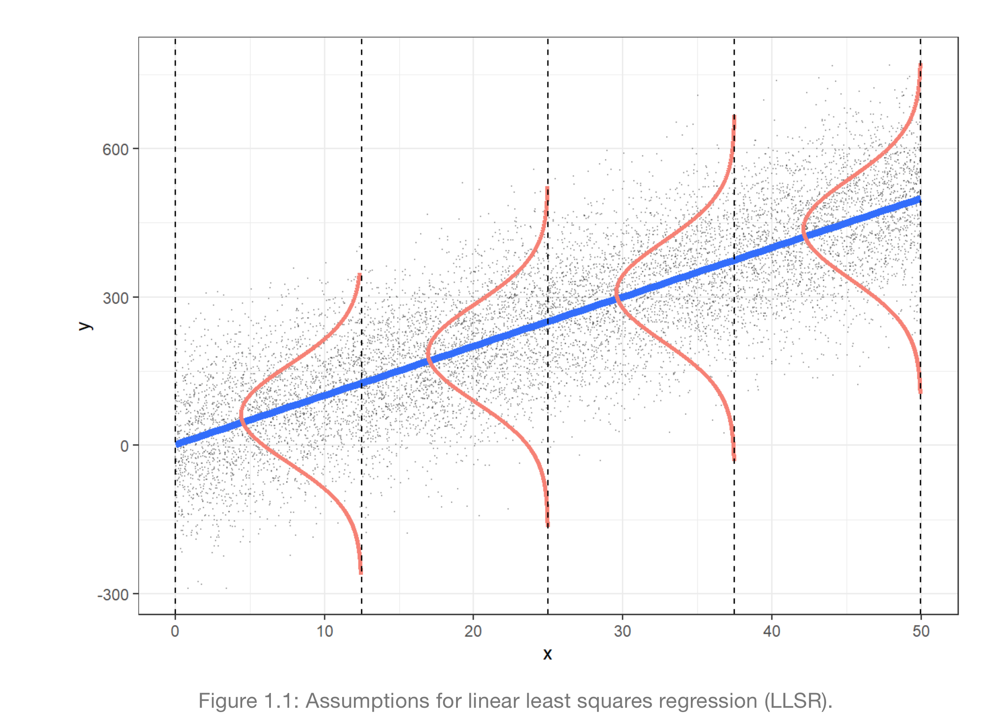

# Regression I

## Introduction

- Basic idea: fit a line to data
- Can help with:
  - **Estimation**: how to estimate the true (but unknown) relation between the response and the input variables
  - **Inference**: how to use the model to infer information about the unknown relation between variables
  - **Prediction**: how to use the model to predict the value of the response for new observations
- Before starting, normally do some exploratory data analysis (EDA) to get a sense of the data
  - find out size
  - distribution of variables
  - missing values/ outliers
  - relationships between variables

## Simple Linear Regression

- Simple linear regression: one response variable and one explanatory variable

Let $(X_i, Y_i)$ for $i = 1, \dots, n$ random sample of size $n$ from a population.

$$Y_i = \beta_0 + \beta_1 X_i + \epsilon_i$$

Where:

- $Y$ is the response variable
- $X$ is the explanatory/ input variable
- $\epsilon_i \sim N(0, \sigma^2)$ and $\epsilon_1, \dots, \epsilon_n$ are independent.
  - It represents other factors not taken into account in the model



_Image from the book: “Beyond Multiple Linear Regression”, from Paul Roback and Julie Legler_

Assumptions:

1. conditional expectation of $Y$ is linearly related to $X$
   $$E(Y|X) = \beta_0 + \beta_1 X$$
2. iid
3. all random error $\epsilon_i$ is normally distributed with mean 0 and variance $\sigma^2$

$$E(\epsilon | X) = 0 \\ and \\ Var(\epsilon | X) = \sigma^2$$

### Best Line

- Line that minimizes the sum of squared errors (SSE) or distance between the line and the data points

$$SSE = \sum_{i=1}^n (Y_i - \hat{Y}_i)^2 = \sum_{i=1}^n (Y_i - \hat{\beta}_0 - \hat{\beta}_1 X_i)^2$$
[[fact check the equation above]]

### R: using lm()

```R
# fit a linear model
lm(Y ~ X, data = data)

# plot linear line using ggplot2
ggplot(data, aes(x = X, y = Y)) +
  geom_point() +
  geom_smooth(method = "lm", se = FALSE)
```

## SLR with catagorical covariates

- Turn categorical into dummy variables (numerical)

  - e.g. X = Fireplace in a house, Y = Price of the house
  - Make dummy variable: $X_2 = 1$ if house has fireplace, $X_2 = 0$ if house doesn't have fireplace
  - $E(Y|X_2) = \beta_0+ \beta_2 X_2$

- Some cool thing:
  - $\beta_2 = E(Y|X_2 = 1) - E(Y|X_2 = 0) = \mu_1 - \mu_0$
    - SAME as null hypothesis for t-test
  - $\beta_0 = E(Y|X_2 = 0)$

## Estimation with SLR

$$ Y_i = \beta_0 + \beta_1 X_i + \epsilon_i $$

- For Linear Regression, we are estimating:
  - $\beta_0$ and $\beta_1$

## Uncertainty in Estimation

```R
lm <- lm(Y ~ X, data = data) |>
    tidy() |>
    mutate_if(is.numeric, round, 3) # round to 3 decimal places

# Returns:
# term  estimate    std.error   statistic	p.value
# <chr> <dbl>        <dbl>      <dbl>             <dbl>
```

### Standard Error

- If take LR for new samples, we will get different estimates
  - **Standard Error** is the standard deviation of the sampling distribution of the estimate
- **Methods to measure uncertainty in estimation**:
  1. compute SE after taking **multiple samples**
  2. rarely take multiple samples, just take it **theoretically** (what `lm` does), see third col above
  3. can also **bootstrap** from sample to get distribution of estimates -> get standard error

#### i. Multiple Samples

- Take multiple samples and compute the variance of the estimates

#### ii. Theoretical Standard Error

- **Assumption**: conditional distribution of $Y_i$ given $X_i$ is normal with mean $\beta_0 + \beta_1 X_i$ and variance $\sigma^2$, the $\epsilon_i$ term.
- Use t test with $df=n-p$
  - n = sample size
  - p = number of parameters in the model
- Used by `lm` to get standard error
- If conditional dist is normal => error term is normal => sampling distribution of $\hat{\beta_1}$ is normal
  - Or if the sample size is large enough, sampling distribution of $\hat{\beta_1}$ is approximately normal (CLT)

#### iii. Bootstrap

- Bootstrap Normal Theory

  $$\beta \pm z_{\alpha/2} SE(\hat{\beta})$$

  - SE = stdev of bootstrap distribution

- Bootstrap Percentile Method

  - basically take the 2.5th and 97.5th percentile of the bootstrap distribution (95% confidence interval)

  $$\hat{b}_{\alpha/2} , \hat{b}_{1-\alpha/2}$$

### Confidence Intervals

```R
tidy(lm_s, conf.int = TRUE)
```

- If 0 is in the confidence interval, then we can't reject the null hypothesis ($\beta_1 = 0$)

## Hypothesis tests for SLR

Can do:

1. $H_0: \beta_0 = 0$ vs $H_a: \beta_0 \neq 0$

   - Usually not interesting

2. **$H_0: \beta_1 = 0$ vs $H_a: \beta_1 \neq 0$**
   - Answers: is there a linear relationship between $X$ and $Y$?

Recall, test statistic under null hypothesis:

$$ t = \frac{\hat{\beta_1}}{SE(\hat{\beta_1})} $$

Which has a t-distribution with $n-p$ degrees of freedom

## Multiple Linear Regression

$$Y_i = \beta_0 + \beta_1 X_{i1} + \beta_2 X_{i2} + \dots + \beta_p X_{ip} + \epsilon_i$$

e.g.
$$ Y_i = \beta_0 + \beta_1 height_i + \beta_2 weight_i + \epsilon_i $$

- Linear regression models the conditional expectation as linear combination of the predictors

$$ E(Y|X_1, X_2, \dots, X_p) = \beta_0 + \beta_1 X_1 + \beta_2 X_2 + \dots + \beta_p X_p $$

### MLR in R

```R
# visualize the relationship between variables
# using ggpairs from GGally package
ggpairs(data)

# fit the model
lm_s <- lm(Y ~ X1 + X2 + X3, data = data)
```

### Categorical variables in MLR

- For 2 categories (e.g. Fireplace exits or not) we only need 1 dummy variable
  - corresponding to 0 or 1
- For 3 categories (e.g. old, modern, new) we need 2 dummy variables

  - M corresponds to 1 if house is modern, 0 otherwise
  - N corresponds to 1 if house is new, 0 otherwise

- **For $k$ categories, we need $k-1$ dummy variables**

```R
lm(Y ~ cat_var, data = data) # cat_var is a categorical variable
```

## Interaction Terms

- Normally when you have categorical and continuous variables, the linear model will:
  - fit different intercepts for each category
  - fit the same slope for each category (_simpler_)\*
- Interaction terms allow us to fit different slopes for each category

\*_Occam's razor: if can explain with simpler model, do so_

e.g.

$$Y_i = \beta_0 + \beta_1 X_i + \beta_2 Z_i + (\beta_3 X_i Z_i) + \epsilon_i$$

- $X_i$ is a continuous variable
- $Z_i$ is a categorical variable
- $\beta_3$ is the interaction term

```R
fit <- lm(score ~ age*sex, data = dat)
tidy(fit) |> mutate_if(is.numeric, round, 3)
# Returns columns:(intercept), age, sexmale, age:sexmale
```

- `Intercept`: average teaching score of female instructors of zero age
- `age`: slope for female instructors. Increase in age by 1 year will increase teaching score by `age` for female instructors
- `sexmale`: holding age constant, the difference in teaching score between male and female
- `age:sexmale` is the offset slope. Increase in age by one year is associated with the increase in teaching score of `age + age:sexmale` for male instructors.

## Goodness of Fit

- Is this better than nothing/ null model (only intercept)?
  - In other words is $E(Y|X)$ better than $E(Y)$?

### Sum of Squares Decomposition

- Total sum of squares (**TSS**):
  - $TSS = \sum (y_i - \bar{y})^2$
  - Sum of squares from the null (intercept only) model
- Explained sum of squares (**ESS**):
  - $ESS = \sum (\hat{y}_i - \bar{y})^2$
  - measures how mich it is explained by the model
    - better model = larger ESS
- Residual sum of squares (**RSS**):
  - $RSS = \sum (y_i - \hat{y}_i)^2$
  - RSS == SSE (sum of squared errors) == n \* MSE (mean squared error)
  - Estimated parameters minimizes RSS (objective function)
- **Where**:
  - $y_i$ observed ith value of y
  - $\hat{y}_i$ predicted value of y with a model (of sample)
  - $\bar{y}_i$ mean of y

If using linear regression using least squares:

$$ TSS = ESS + RSS $$

_Recall_: **Residuals** is the difference between the observed value and the predicted value. $r_i = y_i - \hat{y}_i$

### Coefficient of Determination

$$ R^2 = \frac{ESS}{TSS} = 1 - \frac{RSS}{TSS} $$

- $R^2$ is the proportion of variance explained by the model
  - Tells us how well the regression model explains the variation in the data
- $R^2$ is between -inf and 1 (1 being perfect fit)
  - generally between 0 and 1 since expect TSS > RSS
    - ONLY IF the model has an intercept and is estimated by LS
  - only less than 0 if model is worse than null model

```R
glance(fit)
```

#### Limitations of $R^2$

- $R^2$ increases with number of predictors
  - $R^2$ will never decrease when adding predictors
- Computed based on "in-sample" predictions
  - We do not know how well the model will perform on new data
  - Basically only on train data, dunno performance on test data
- Is it useful?
  - Yes, to compare size of residuals of fitted model to null model
  - Cannot be used to test any hypothesis since its distribution is unknown

#### $R^2$ on Test Data

- Is no longer coefficient of determination
- Measures correlation between the true and predicted values
- $R^2 = Cor(Y, \hat{Y})^2$ if $\hat{Y}$ is a prediction obtained from a LR with an intercept estimated by LS.
  - This is ued to assess the prediction performance of a model

### Better model: F-test

- Compare two models
  - $reduced$: intercept + some predictors
  - $full$: intercept + predictors
- Is the full model better than the reduced model? Simultaneously testing if many parameters are 0
- F-test is a **global test**
  - tests if all parameters are 0
  - if F-test is significant, then at least one parameter is not 0

$$F \propto \frac{(RSS_{reduced} - RSS_{full}) / k}{RSS_{full} / (n - p)}$$

- **params**:
  - k = number of parameters tested (difference between models)
  - p = number of predictors in the full model (s + 1)

```R
lm_red <- lm(score~1, data=dat) # intercept only
lm_full <- lm(score~ age + sex, data=dat)

anova(lm_red,lm_full)
# F-test tests H0: coef_age = coef_sex = 0

glance(lm_full)
# also includes F-statistic in "statistic" column + p-value
# compares it to null model (intercept only)
```

- F-test can test multiple parameters at once
  - e.g. $\beta_1 = \beta_2 = \beta_3 = 0$
- For one parameter, F-test is equivalent to t-test
  - e.g. $\beta_1 = 0$
  - For one parameter, $t^2 = F$
    - where t is the t-statistic and F is the F-statistic

#### Interpretation

- if F-statistic is large (F > 1), then the full model is better than the reduced model
- if F-statistic is small (F < 1), then the full model is not better than the reduced model

#### F-test vs $R^2$

- Both depend on RSS and TSS, there is a formula to convert between them
- F-test has a known F-distribution (under certain assumptions) so we can use it to make probabilistic statements

## Model Evaluation

### Inference vs Prediction

- What is your goal?
  - **Inference**: understand the relationship between the response and the predictors
  - **Prediction**: predict the response for future observations

### Evaluation Metrics

- **Mean squared error (MSE)**: average squared error on new data
  - $MSE = \frac{1}{n} \sum_{i=1}^n (y_i - \hat{y}_i)^2$
  - _Train MSE_: MSE on training data
  - _Test MSE_: MSE on test data
- **Residual Sum of Squares (RSS)**: n \* MSE
  - $\sum_{i=1}^n (y_i - \hat{y}_i)^2$
  - small is good
  - residuals are measured in training data
- **Residual Standard Error (RSE)**: estimates the standard deviation of the residuals
  - $\sqrt{\frac{1}{n-p} RSS}$
    - p = number of parameters in the model
  - Based on training data to evaluate fit of the model (small is good)
- **Coefficient of Determination ($R^2$)**:
  - $R^2 = \frac{ESS}{TSS} = 1 - \frac{RSS}{TSS}$
  - \*See `Interaction Terms > Coefficient of Determination` for more info

## Variable Selection

### Inference

- Use **F-test** to test to compare and test nested models
  - `anova(lm_red,lm_full)`
- **t-test** to test contribution of individual predictors
  - `tidy(lm_full, conf.int = TRUE)`
- **F-test** is equivalent to t-test when there is only one predictor
- **$R^2$** is the proportion of variance explained by the model
  - $R^2$ increases with number of predictors (RSS decreases)
- **Adjusted $R^2$** penalizes for number of predictors
  - Adjusted $R^2$ increases only if the new predictor improves the model more than expected by chance
  - Adjusted $R^2$ decreases if the new predictor does not improve the model more than expected by chance
    $$R^2_{adj} = 1 - \frac{RSS/(n-p)}{TSS/(n-1)}$$
  - Cam be used to compare models with different number of parameters/ predictors

_Nested models_: one model is a special case of the other

- e.g. `lm(y ~ x1 + x2)` is nested in `lm(y ~ x1 + x2 + x3)`

### Prediction

#### Test MSE

- Average squared error on new data
- Selection criteria:
  - The Mallows Cp
  - Akaike information criterion (AIC)
  - Bayesian information criterion (BIC)
- These add different penalties to the training RSS to adjust for the fact that the training error tends to underestimate the test error

#### Automated proedure for feature selection

- **Forward selection**
  - Start with null model
  - Add predictors one at a time (select the best feats at that number of feats)
  - Stop when no more predictors improve the model
  - `leaps::regsubsets`
- **Backward selection**: start with full model and remove predictors one at a time
- **Hybrid**: after adding a predictor, check if any predictors can be removed

```R
dat_forward <- regsubsets(
  assess_val ~ age + FIREPLACE + GARAGE + BASEMENT,
  data = dat_s,
  nvmax = 5, # max number of feats
  method = "forward", # backward, exhaustive, etc.
)

# view
fws_summary <- summary(dat_forward)
# will have rsq, adj r2, rss, cp, bic, etc.
```

#### Regularization

- Offers an alternative to the above methods
- e.g. Ridge, Lasso, Elastic Net

## Prediction Intervals vs Confidence Intervals for Prediction

- Conditional expectation of predictor $Y$ given $X$:
  $$E(Y|X)$$
- Assumes linear form of ^

---

- Terms:
  - $\hat{y}_i$ is the predicted value of the LR model (sample)
  - $E(Y_i|X_i)$ is the conditional expectation of $Y$ given $X_i$
    - or the average value of $Y_i$ for a given $X_i$
    - or LR model of population
- With our model $\hat{y}$ we can predict:

  - $E(Y|X_0)$
  - $Y_i$ (Actual value of $Y$ for $X_i$)
    - A lot harder to predict (individual prediction)

- **2 types of intervals**:
  - Confidence intervals for prediction (**CIP**)
  - Prediction intervals (**PI**)

| CIP                                           | PI                                              |
| --------------------------------------------- | ----------------------------------------------- |
| Uncertainty of the **mean** of the prediction | Uncertainty of the **individual** prediction    |
| Uncertainty of $E(Y_i\|X_i)$                  | Uncertainty of $Y_i$                            |
| Error from estimation of $\beta$              | Error from estimation of $\beta$ and $\epsilon$ |
| Smaller than PI                               | Wider than CIP                                  |
| Centered around $\hat{y}_i$                   | Centered around $\hat{y}_i$                     |

### Confidence Intervals for Prediction (CIP)

- We are interested in the **mean of the prediction**, not the individual prediction
  $$E(Y_i|X_i)$$
- Uncertainty only comes from the estimation (1 source of uncertainty)

The model:
$$\hat{Y}_i = \hat{\beta}_0 + \hat{\beta}_1 X_i$$

approximates, with uncertainty, the conditional expectation:
$$E(Y_i|X_i) = \beta_0 + \beta_1 x_i$$

i.e. Estimated coeffs ($\hat{\beta}_0$ and $\hat{\beta}_1$) are estimates of true population coeffs ($\beta_0$ and $\beta_1$)

- **95% CIP** is a range where we have 95% confidence that it contains the average value of $Y_i$ for a given $X_i$
  - smaller CIP means smaller confidence interval => less confidence it contains the true values

#### CIP in R

```R
model_sample <- lm(y ~ x, data = data_sample)

data_sample |>
  select(x, y) |>
  cbind(
    predict(
      model_sample,
      interval = "confidence",
      level = 0.95, # 95% CIP is default
      se.fit=TRUE # standard error of the fit,
    )$fit
  )
# or
predict(
  model_sample,
  interval = "confidence",
  newdata = tibble(x1 = 1, x2 = 2),
)
```

### Prediction Intervals (PI)

- We are interested in the **individual prediction**: $Y_i$
- Wider than CIP

The model:
$$\hat{Y}_i = \hat{\beta}_0 + \hat{\beta}_1 X_i + \epsilon_i$$
approximates, with uncertainty, an actual observation $Y_i$.

- Uncertainty comes from 2 sources:

  - Estimation of the coeffs ($\hat{\beta}_0$ and $\hat{\beta}_1$)
  - Variability of the error term $\epsilon_i$
    - Actual observation $Y_i$ differs from the average (population) by $\epsilon_i$

- **95% PI** is a range where we have 95% confidence that it contains the actual value of $Y_i$ for a given $X_i$

#### PI in R

```R
data_sample |>
  select(x, y) |>
  cbind(
    predict(
      model_sample,
      interval = "prediction", # change from "confidence"
      level = 0.95, # 95% CIP is default
      se.fit=TRUE # standard error of the fit
    )$fit
  )
```

## Potential Problems in LR

### Linearity

- Linearity in regression != linearity in math
- Linearity in regression means that the model is linear in the parameters

- Examples of linear regression models:
  - $ y = \beta_0 + \beta_1 x_1 + \beta_2 x_2 + \beta_3 x_3 $
  - $ y = \beta_0 + \beta_1 x_1 + \beta_2 x_2 +\beta_3 x_1^2 + \beta_4 x_1 x_2$
  - $ y = \beta_0 + \beta_1 x_1 + \beta_2 e^{x_1} + \beta_3 \log(x_2)$
- Non-linear examples:
  - $ y = \beta_0 + \beta_1 x_1 + \beta_2 x_1^{\beta_3} $

### Normality of the Error term

- LS estimation do not depend on any normality assumption
- But if small sample size, normality assumption is needed for inference (since CLT does not apply)
- OLS (Ordinary Least Squares) do not require assumptions of normality. BUT we need to assume it in order to do inference (e.g. CIP, PI, hypothesis testing).

#### Q-Q plot

- Q-Q plot is a graphical method for assessing whether or not a data set follows a given distribution such as normal distribution
- Points in the Q-Q plot follow a straight line if the data are distributed normally

```R
model <- lm(y ~ x, data = data_sample)

plot(model, which = 2) # which = 2 for Q-Q plot
```


### Equal Variance

- We assumed that $\epsilon_i$ are iid with mean 0 and variance $\sigma^2$
- Estimated using RSE (residual standard error)
- How to check this assumption?
  - Plot residuals vs fitted values
    - Need to see evenly spread points around 0
    - Do not want to see funnel shape
- heteroscedasticity: variance of residuals is not constant
- homoscedasticity: variance of residuals is constant

```R
plot(model, which = 1) # which = 1 for residuals vs fitted values
```


### Multicollinearity

- Some of the explanatory variables are linearly related
- When this happens, the LS are very "unstable"
  - contribution of each variable to the model is hard to assess
  - can inflate the standard errors of the coefficients

#### Diagnosing Multicollinearity

- Correlation matrix
- Variance Inflation Factor (VIF)
  - only works for linear models with > 1 explanatory variables
  - VIF of $x_j$ is $VIF_j = \frac{1}{1-R_j^2}$
  - $R_j^2$ is the $R^2$ from the regression of $x_j$ on all other explanatory variables
    - How much of the observed variation of $X_j$ is explained by the other explanatory variables
  - If $VIF_j >> 1$, then multicollinearity is a problem, remove $x_j$ from the model
- Ridge deals with multicollinearity
  - shrinks the coefficients of correlated variables towards each other

### Cofounding Factors

- Cofounding factors are variables, not in model, that are related to both the response and the explanatory variables

- Confounding refers to a situation in which a variable, not included in the model, is related with both the response and at least one covariate in the model.

- e.g. Job hunting, create a LR model to predict salaries based on programming languages
  - Cofounding factor: years of experience, education level, etc.

## Maximum Likelihood Estimation (MLE)

### Example case

- Want to use LR to predict a binary outcome (e.g. whether a person will buy a product or not)
- Linear model will predict the "probability" of buying a product
  - BUT it will predict values outside of the [0, 1] range
- It also violates:
  - the assumption of normality (residuals are not normally distributed)
  - equal variance (qq plot shows that residuals are not equal).

#### Solution: **MLE (Maximum Likelihood Estimation)**

- Using MLE and assume Bernoulli distribution for $Y_i$, we can predict probabolities between 0 and 1.

$$ Y \sim Bernoulli(p) $$
$$ Bernoulli(p) = p^y (1-p)^{1-y} $$

$$ E(Y) = p $$

## Logistic Regression

### Logit function

- Logit function is the inverse of the logistic function
- Properties:
  - Range: $(-\infty, \infty)$
  - Monotonic: always increasing or always decreasing
  - Differentiable: can be differentiated

$$ logit(p) = log(\frac{p}{1-p}) = \beta_0 + \beta_1 x_1 + ... + \beta_p x_p $$

$$ p_i = \frac{e^{\beta_0 + \beta_1 x_1 + ... + \beta_p x_p}}{1 + e^{\beta_0 + \beta_1 x_1 + ... + \beta_p x_p}} = \frac{1}{1 + e^{-(\beta_0 + \beta_1 x_1 + ... + \beta_p x_p)}} $$

### Terminology

- **Probability of success**
  $$p = \frac{Odds}{1 + Odds}$$
- **Odds of success**:
  $$\frac{p}{1-p}$$

### Logistic Regression in R

```R
logistic_model <- glm(as.factor(y) ~ x1 + x2 + x3,
    data = data,
    family = binomial # use binomial distribution
)

# default is to predict the log odds of success
predict(logistic_model) # type = "link"

# to predict the odds of success
predict(logistic_model, type = "response")
```

#### Interpretation

- **Intercept**: log odds of success when all predictors are 0
- **Coefficients**: log odds ratio of success for a 1 unit increase in the predictor

To get the odds ratio, we need to exponentiate the coefficients.

```R
# returns the exp(log(odds ratio)) = odds ratio
tidy(logistic_model, exponentiate = TRUE)
```

example:

- if $\beta_1 = 0.4$, then the odds ratio is $e^{0.4} = 1.49$.
- This means that for a 1 unit increase in $x_1$, it is more likely to be a success by a factor of 1.49.
- Cannot say anything about probability of success increasing as $x_1$ increases.

#### Inference of Logistic Regression

- We can determine whether a regressor is **statistically associated with the logarithm of the response’s odds** through hypothesis testing for $\beta_i$.
  - i.e. To determine whether a coefficient is significant
- Do the **Walad Statistics** test
  $$ z_i = \frac{\hat{\beta_i}}{SE(\hat{\beta_i})} $$
  - $H_0$: $\beta_i = 0$
  - $H_a$: $\beta_i \neq 0$

```R
tidy(logistic_model, conf.int = TRUE)
# then check the p-value to see if the coefficient is significant
```
