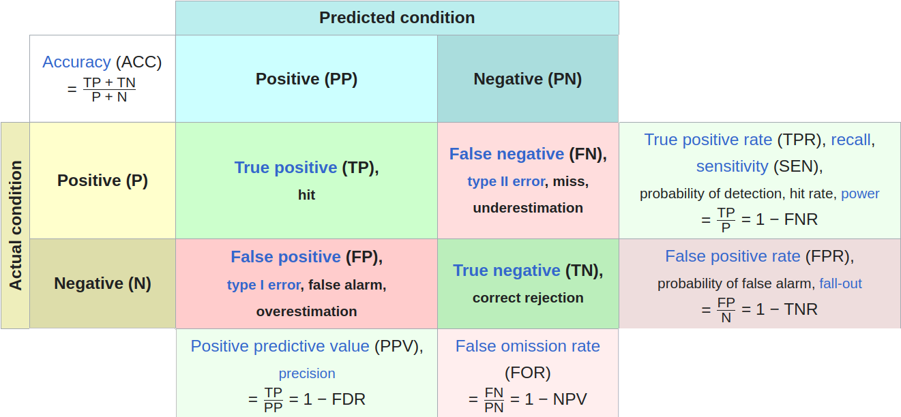
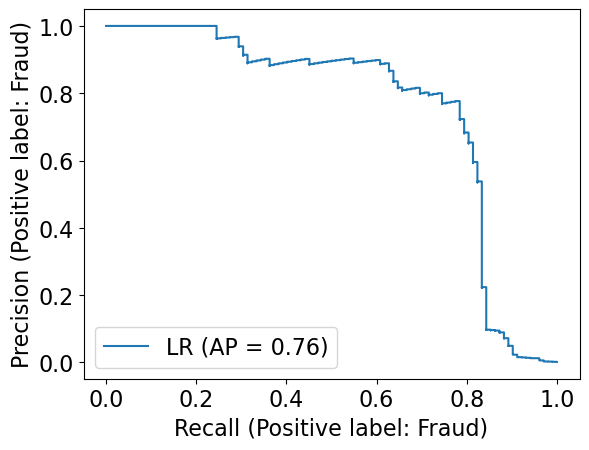
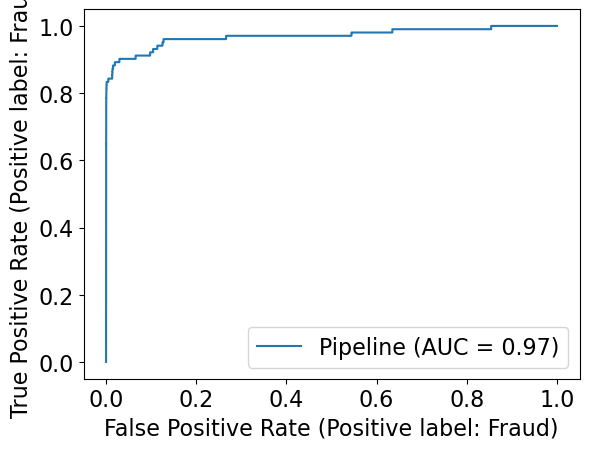
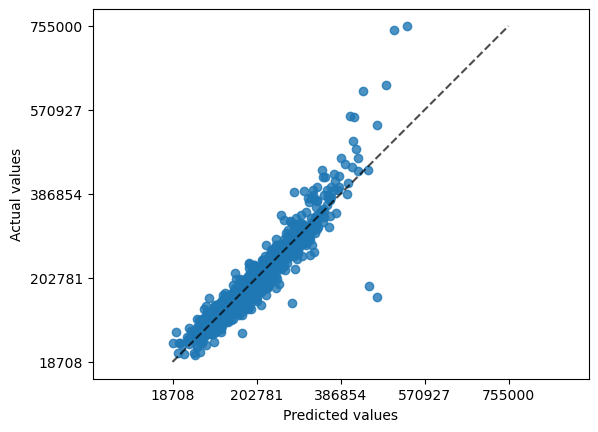
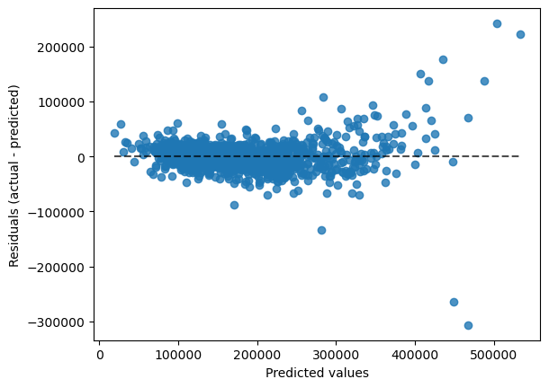
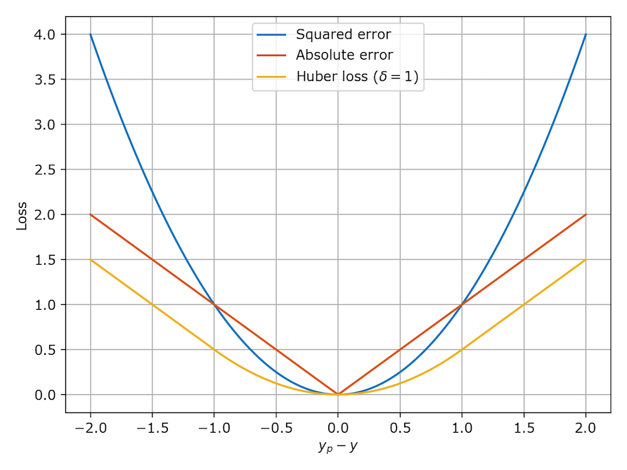
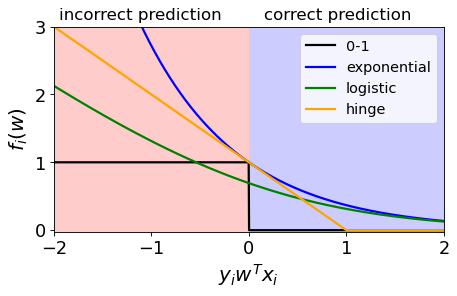

# Model Selection

## Classification Metrics

- Need to evaluate the performance of a classifier not just by accuracy

### Logistic Regression

- Linear regression with sigmoid function
- Hyperparameter: `C` (default 1.0)
  - Lower C => more regularization => smaller coefficients => underfitting

```python
from sklearn.linear_model import LogisticRegression

pipe_lr = make_pipeline(preprocessor, LogisticRegression())
pd.DataFrame(cross_validate(pipe_lr, X_train, y_train, cv=10, return_train_score=True))
```

### Confusion Matrix



- Choose the positive case based on which class is more important to us or which class is rare
  - spotting a class (e.g. fraud/ spam/ disease detection)
- Can do this in python:

```python
from sklearn.metrics import confusion_matrix
from sklearn.model_selection import cross_val_predict

# gets values without plot
confusion_matrix(y_train, cross_val_predict(pipe_lr, X_train, y_train, cv=5))

# get values with plot
from sklearn.metrics import ConfusionMatrixDisplay

ConfusionMatrixDisplay.from_estimator(pipe_lr, X_train, y_train, display_labels=['Not Fraud', 'Fraud']);
```

Output of confusion matrix by default:

```
             | Predicted F [0]| Predicted T [1]
Actual F [0] | TN             | FP
Actual T [1] | FN             | TP
```

#### Values

- **Precision**
  $$precision = \frac{TP}{PP} =  \frac{TP}{TP + FP}$$
- **Recall** or True positive rate (TPR)
  $$recall = \frac{TP}{P} = \frac{TP}{TP + FN}$$
- **f1-score**
  $$f1 = 2 \cdot \frac{precision * recall}{precision + recall} = 2 \frac{1}{\frac{1}{precision} + \frac{1}{recall}}$$

#### Classification Report

```python
from sklearn.metrics import classification_report

print(classification_report(y_train, cross_val_predict(pipe_lr, X_train, y_train, cv=5)))

# output
#               precision    recall  f1-score   support

#        Fraud       0.89      0.63      0.74       102
#    Non fraud       1.00      1.00      1.00     59708

#     accuracy                           1.00     59810
#    macro avg       0.94      0.81      0.87     59810
# weighted avg       1.00      1.00      1.00     59810

```

### Precision Recall curve

- tradeoff between precision and recall
- setting a threshold is called setting the **operating point**
- Changing the **threshold** of the classifier (default of logistic regression is **0.5**)
  - remember `predict_proba` returns the probability of the positive class, if higher than threshold, then positive class
  - as **_threshold increases_**, higher bar => precision increases and recall decreases (less FP but less TP)
  - as **_threshold decreases_**, lower bar => precision decreases and recall increases (more TP but more FP)

#### Plotting Precision Recall Curve

```python
from sklearn.metrics import PrecisionRecallDisplay

PrecisionRecallDisplay.from_estimator(
    pipe_lr,
    X_valid,
    y_valid,
    pos_label='Fraud',
    name='LR',  # For Logistic Regression
);
```



- Want the curve to be as close to the top right corner as possible (100% precision and 100% recall)
  - Threshold of **0** in bottom left => All points are predicted to be positive => 100% recall and 0% precision
  - Threshold of **1** in top right => All points are predicted to be negative => 0% recall and 100% precision

Or if want just the values:

```python
from sklearn.metrics import precision_recall_curve

pd.DataFrame(
    precision_recall_curve(
        y_valid,
        pipe_lr.predict_proba(X_valid)[:, fraud_column],
        pos_label='Fraud',
    ),
    index=['precision', 'recall', 'threshold']
).T
```

#### AP (Average Precision) score

- Area under the precision recall curve
- Higher is better (0 is worst, 1 is best)
- Also supports multi-class using one-vs-rest approach + averaging
- **IMPORTANT**:
  - F1 score is for a given threshold and measures the quality of predict.
  - AP score is a summary across thresholds and measures the quality of predict_proba.

```python
from sklearn.metrics import average_precision_score

ap_lr = average_precision_score(y_valid, pipe_lr.predict_proba(X_valid)[:, fraud_column], pos_label='Fraud')
```

| AP score                            | f1 score                      |
| ----------------------------------- | ----------------------------- |
| measures quality of `predict_proba` | measures quality of `predict` |

- These two metrics do not always agree\*

### ROC Curve

- Receiver Operating Characteristic: plots the **true positive rate** (recall) against the **false positive rate** (1 - specificity)
  - Instead of plotting precision against recall, plots recall (TPR) against FPR

$$FPR = \frac{FP}{N} = \frac{FP}{FP + TN}$$

```python
from sklearn.metrics import RocCurveDisplay

RocCurveDisplay.from_estimator(
    pipe_lr,
    X_valid,
    y_valid,
    pos_label='Fraud'
);
```



- Ideal is top left corner (100% TPR and 0% FPR)
- Lower left (Threshold of 1) => 0% TPR and 0% FPR
- Upper right (Threshold of 0) => 100% TPR and 100% FPR

#### AUC (Area Under the Curve)

- Area under the ROC curve

- AUC is the probability that a randomly chosen positive point has a higher score than a randomly chosen negative point
  - **AUC of 1.0**: all positive points have a higher score than all negative points.
  - **AUC of 0.5**: means random chance.

### Class Imbalance

- If we balance the classes:
  - Precision goes down, FP goes up
  - Recall goes up, FN goes down
  - F1 score goes down
  - AP score goes down
  - AUC score goes down
  - generally reduce accuracy

#### Solutions to Class Imbalance

- _Class weights_: penalize the minority class more

```python
LogisticRegression(
  max_iter=500,
  # give more importance to "Fraud" class (10x)
  class_weight={'Non fraud': 1, 'Fraud': 10}

  # class_weight='balanced' => automatically give more importance to minority class
  )
```

## Regression Metrics

### Model Building

#### Dummy Regressor

```python
from sklearn.dummy import DummyRegressor

dummy = DummyRegressor(strategy='mean') # default
pd.DataFrame(cross_validate(dummy, X_train, y_train, cv=10, return_train_score=True))
```

#### Ridge

- Linear regression with L2 regularization
- Hyperparameter: `alpha` (default 1.0)
  - Higher alpha => more regularization => smaller coefficients => underfitting
  - more regularization : smaller coefficients => less sensitive to changes in the input features => less likely to overfit

```python
from sklearn.linear_model import Ridge

lr_pipe = make_pipeline(preprocessor, Ridge())
pd.DataFrame(cross_validate(lr_pipe, X_train, y_train, cv=10, return_train_score=True))

# fit model
lr_pipe.fit(X_train, y_train)

# get coefficients
df = pd.DataFrame(
    data={"coefficients": lr_pipe.named_steps["ridge"].coef_}, index=feature_names)

df.sort_values("coefficients", ascending=False)
```

#### RidgeCV

- Ridge with cross-validation to find the best alpha

```python
from sklearn.linear_model import RidgeCV

alphas = 10.0 ** np.arange(-6, 6, 1)

ridgecv_pipe = make_pipeline(preprocessor,
  RidgeCV(alphas=alphas, cv=10))
ridgecv_pipe.fit(X_train, y_train);

# best alpha
best_alpha = ridgecv_pipe.named_steps["ridgecv"].alpha_
```

### Scoring Regression Models

- Cannot use equality since we are predicting a continuous variable (not classification)

#### Scoring Methods in Regression Models

| Metric                                    | Description                                                                                                                                | Formula                                                                                        | Min Value                | Max Value   | Code Example (sklearn)                                                                                                    |
| ----------------------------------------- | ------------------------------------------------------------------------------------------------------------------------------------------ | ---------------------------------------------------------------------------------------------- | ------------------------ | ----------- | ------------------------------------------------------------------------------------------------------------------------- |
| **MSE** (Mean Squared Error)              | Measures the average of the squares of the errors, i.e., the average squared difference between the estimated values and the actual value. | $$MSE = \frac{1}{n}\sum_{i=1}^{n}(Y_i - \hat{Y}_i)^2$$                                         | 0 (perfect)              | ∞           | `from sklearn.metrics import mean_squared_error` <br> `mse = mean_squared_error(y_true, y_pred)`                          |
| **RMSE** (Root Mean Squared Error)        | Square root of the MSE. It measures the standard deviation of the prediction errors or residuals.                                          | $$RMSE = \sqrt{MSE}$$                                                                          | 0 (perfect)              | ∞           | `rmse = mean_squared_error(y_true, y_pred, squared=False)`                                                                |
| **MAE** (Mean Absolute Error)             | Measures the average of the absolute errors.                                                                                               | $$MAE = \frac{1}{n}\sum_{i=1}^{n}\left\| Y_i - \hat{Y}_i \right\| $$                           | 0 (perfect)              | ∞           | `from sklearn.metrics import mean_absolute_error` <br> `mae = mean_absolute_error(y_true, y_pred)`                        |
| **MAPE** (Mean Absolute Percentage Error) | Measures the average of the absolute percentage errors.                                                                                    | $$MAPE = \frac{1}{n}\sum_{i=1}^{n}\left\| \frac{Y_i - \hat{Y}_i}{Y_i} \right\| \times 100\% $$ | 0 % (perfect)            | ∞ %         | `from sklearn.metrics import mean_absolute_percentage_error` <br> `mape = mean_absolute_percentage_error(y_true, y_pred)` |
| **R²** (Coefficient of Determination)     | Measures how well future samples are likely to be predicted by the model.                                                                  | $$R^2 = 1 - \frac{\sum_{i=1}^{n}(Y_i - \hat{Y}_i)^2}{\sum_{i=1}^{n}(Y_i - \bar{Y})^2}$$        | -ve [if worst than mean] | 1 (perfect) | `from sklearn.metrics import r2_score` <br> `r2 = r2_score(y_true, y_pred)`                                               |

- MAE is less sensitive to outliers than MSE

#### Inspecting error

- Can plot the actual vs predicted values to see the error (and plot line of gradient 1 = perfect prediction)

```python
from sklearn.metrics import PredictionErrorDisplay

PredictionErrorDisplay.from_estimator(
    ridge_tuned,
    X_train,
    y_train,
    kind='actual_vs_predicted',
    subsample=None  # show all predictions
)
```



- Can plot the residuals (error) vs predicted values to see if there is a pattern (e.g. heteroscedasticity)

```python
from sklearn.metrics import PredictionErrorDisplay

PredictionErrorDisplay.from_estimator(
    ridge_tuned,
    X_train,
    y_train,
    subsample=None  # show all predictions
)
```



## Data Cleaning

Need to have good data to build a good model.

**Bad quality data**:

1. Missing values
2. Few observations overall or in a specific group
3. Biased sample (not representative of the population)
4. Non-independent observations
5. Inaccurate measurements
6. Fabricated data
7. Out of bounds values
8. Obsure column names
9. Typos (spelling differences in categorical variables)
10. Using multiple values to represent same thing (e.g. NA, NONE, NULL, NaN)
11. Incorrect data types

### Importance of Features

**Better features help more than a better model.**

- Good features would ideally:

  - capture the most important information
  - allow learning with few examples
  - generalize to new scenarios

- _Trade-off for simple and expressive features_:
  - simple features: overfitting risk is low but low score
  - expressive features: overfitting risk is high but high score

### Feature Preprocessing vs. Feature Engineering

| Preprocessing                                        | Engineering                                                                             |
| ---------------------------------------------------- | --------------------------------------------------------------------------------------- |
| step of cleaning and preparing the data for analysis | creating new features from existing data                                                |
| generally HAVE to do, or error                       | optional but can improve model performance                                              |
| e.g. scaling, normalization, imputation              | e.g. one-hot encoding, binning, get more data, group-wise normalization, transformation |

- **Feature Selection**: removing irrelevant features, normally done after feature engineering

## Feature Engineering

Common guidelines:

1. Is not unique or random
2. Has a variance (not constant)
3. Adds unique variance (is not constant transformation)
   - changing units (e.g. from meters to feet) is not feature engineering
4. Is ideally interpretable

Examples:

- Looking up and getting additional data
- Discretization (binning): e.g. age -> age group
- Group-wise normalization: express feature relative to group mean/median
- Transformation: e.g. height, weight -> BMI

### Polynomial Feature Transformation

- parameter: degree
  - higher degree: more expressive features => more overfitting
- Try to capture non-linear relationships
  - Linear regression can only capture lines, planes, hyperplanes
- e.g. add a squared feature (feat1^2)

### sklearn: PolynomialFeature

- Do polynomial then StandardScaler
  - avoids polynomials being very large

```python
from sklearn.preprocessing import PolynomialFeatures

poly = PolynomialFeatures(degree=2)
# degree: max degree of polynomial features
X_enc = poly_feats.fit_transform(X_toy)
pd.DataFrame(X_enc, columns=poly_feats.get_feature_names_out()).head()
```

Degree example:

| Dimension | Degree | Examples              |
| --------- | ------ | --------------------- |
| 1         | 2      | 1, x, x^2             |
| 2         | 2      | 1, x, y, x^2, xy, y^2 |

### Matrix Notation for Linear Regression

$$ \hat{y} = Xw $$

- X: design matrix (n x d)
- w: weights (d x 1)
- y: target (n x 1)

**For polynomial features:**

$Z = [1, x, x^2]$

$$ \hat{y} = Zw = \begin{bmatrix} 1 & x_1 & x_1^2 \\ 1 & x_2 & x_2^2 \\ \vdots & \vdots & \vdots \\ 1 & x_n & x_n^2 \end{bmatrix} \begin{bmatrix} w_0 \\ w_1 \\ w_2 \end{bmatrix} = \begin{bmatrix} w_0 + w_1x_1 + w_2x_1^2 \\ w_0 + w_1x_2 + w_2x_2^2 \\ \vdots \\ w_0 + w_1x_n + w_2x_n^2 \end{bmatrix} $$

### Kernel Trick

- Polynomial features can be expensive to compute
- Kernel trick: compute dot product between two vectors in a higher dimensional space without computing the transformation explicitly

## Feature Importance

### Feature Correlation

```python
import seaborn as sns

sns.heatmap(df.corr(), annot=True)
```

- Shows correlation between features
- Extremely simplistic:
  - Only looks at linear correlation
  - Only looks at pairwise correlation (isolates features)

### Coefficients in Linear Models

- Correlation among features might make coefficients completely uninterpretable.
- Fairly straightforward to interpret coefficients of ordinal features.
- In categorical features, it’s often helpful to consider one category as a reference point and think about relative importance.
- For numeric features, relative importance is meaningful after scaling.
- You have to be careful about the scale of the feature when interpreting the coefficients.
- Remember that explaining the model
  explaining the data or explaining how the world works.
- The coefficients tell us only about the model and they might not accurately reflect the data.

## Feature Selection

- More features => more complex model => overfitting
- **Feature selection** find features that are important for prediction and remove the rest.

**Why?**

- Interpretability: easier to explain with fewer features
- Computation: faster to train simpler models (curse of dimensionality)
- Data collection: cheaper to collect fewer features
- Storage: less space to store fewer features
- Fundamental Tradeoff: reduce overfitting by reducing complexity

**How?**

- domain knowledge
- automatic feature selection
  - model-based selection
  - recursive feature elimination
  - forward/backward selection

### Intrinsic Feature Selection

- Fast and easy
- Arbitrary, does not take into account feature combinations
- e.g. correlation threshold, variance threshold

### Model-Based Feature Selection

- Use a supervised model to judge the importance of each feature, and keep only the most important ones.
- Can use different model than the final estimator.
- Use a model that provides some measure of feature importance. (e.g. decision trees, linear models, etc.)

**General Steps**:

- Select a threshold for which features to keep.
- Discard features below the threshold.

```python
from sklearn.feature_selection import SelectFromModel

select_lr = SelectFromModel(Ridge(), threshold="median")

# Add feature selection to pipeline (after preprocessing)
pipe = make_pipeline(preprocessor, select_lr, Ridge())

# access selected features
pipe.named_steps["selectfrommodel"]
# can do: .n_features_in_, .threshold_, .get_support()
```

### Recursive Feature Elimination (RFE)

- Recursively remove features, build a model on those features that remain, and then repeatedly construct a model and remove the weakest feature until a specified number of features remain.
- **Iteratively** eliminates unimportant features.
- Computationally expensive

#### RFE Algorithm

1. Decide the number of features to select.
2. Assign importances to features, e.g. by fitting a model and looking at `coef_` (Linear models) or `feature_importances_` (RandomForestClassifier).
3. Remove the least important feature.
4. Repeat steps 2-3 until only $k$ features are remaining.

```python
from sklearn.feature_selection import RFE

rfe = RFE(Ridge(), n_features_to_select=120)

pipe_rf_rfe = make_pipeline(preprocessor, rfe, RandomForestRegressor(random_state=42))

results["rfe + rfe"] = mean_std_cross_val_scores(
    pipe_rf_rfe, X_train, y_train, return_train_score=True
)
```

**Note**: for categorical features, RFE might remove some OHE features. This is an unresolved issue.

#### RFECV

- RFE but using CV to find the optimal number of features to keep.
- very slow since there is CV within CV.

```python
from sklearn.feature_selection import RFECV

rfecv = RFECV(Ridge())

pipe_rf_rfecv = make_pipeline(
    preprocessor, rfecv, RandomForestRegressor(random_state=42)
)
pipe_rf_rfecv.fit(X_train, y_train);

# optimal number of features
pipe_rfe_ridgecv.named_steps["rfecv"].n_features_
# which features were selected
pipe_rfe_ridgecv.named_steps["rfecv"].support_
```

### Search and Score Methods (Forward/Backward Selection)

- Not based on feature importance.
- Define a scoring function $f(S)$ that measures the quality of a subset of features $S$.
- Search through all possible subsets of features and pick the subset with the best score.

  - e.g. for A, B, C search through {}, {A}, {B}, {C}, {A, B}, {A, C}, {B, C}, {A, B, C}...
  - \# subsets = $2^p$ where $p$ is the number of features

- **Forward selection**: start with no features and add one at a time.
  - add the feature that results in the best score.
- **Backward selection**: start with all features and remove one at a time.
  - remove the feature that results in the best score.

```python
from sklearn.feature_selection import SequentialFeatureSelector

pipe_forward = make_pipeline(
    preprocessor,
    SequentialFeatureSelector(Ridge(), direction="forward"),
    RandomForestRegressor(random_state=42),
)

# results['rf_forward_fs'] = mean_std_cross_val_scores(pipe_forward, X_train, y_train, return_train_score=True)

pipe_forward.fit(X_train, y_train)
```

### Warnings about Feature Selection

- A feature relevance is only defines in the context of other features.
  - Adding/removing features can change the importance of other features.
- Relevance != causality
- The methods don’t always work.

## Loss Function

- A function that measures how well a model fits the data
- The goal is to **minimize** the loss function
  - smaller loss $\rightarrow$ better model
- Captures what is important to minimize
- Common loss functions:
  - Least squares loss
  - Absolute error loss
  - Huber loss



### Scoring Metric vs Loss Function

| Scoring Metric                             | Loss Function                            |
| ------------------------------------------ | ---------------------------------------- |
| Report the results (often several metrics) | Used to train/ fit the model             |
| Find best model hyperparams                | Find best model parameters               |
| Can pick those suitable for the task       | Constrainted (need to be differentiable) |

## Regression Loss Functions

### Ordinary Least Squares (OLS) Loss

$$J(\omega) = \sum_{i=1}^{n} (y_i - \omega^T x_i)^2 $$

- Define loss as sum of squared errors (difference between prediction and actual value)
- Penalizes heavily for large errors
  - sensitive to outliers
- For a well-defined OLS, there is a unique solution (not always the case)
  - $\omega = (X^T X)^{-1} X^T y$
    - $X^T X$ must be invertible

### Absolute Value Loss (L1 Loss/ Robust Regression)

$$J(\omega) = \sum_{i=1}^{n} |y_i - \omega^T x_i| $$

- Less sensitive to outliers
- But minimization is harder
  - not differentiable at 0
  - no closed form solution
- Alternative: **Huber Loss**
  - behaves like OLS for small errors

## Classification Loss Functions

$$ y_i w^T x_i = \begin{cases} \text{correct} & y_i w^T x_i > 0 \\ \text{incorrect} & y_i w^T x_i < 0 \end{cases} $$

- $y_i$: positive
  - correct: $w^T x_i > 0 \rightarrow y_i w^T x_i > 0$
  - incorrect: $w^T x_i < 0 \rightarrow y_i w^T x_i < 0$
- $y_i$: negative
  - correct: $w^T x_i < 0 \rightarrow y_i w^T x_i > 0$
  - incorrect: $w^T x_i > 0 \rightarrow y_i w^T x_i < 0$

### Different Loss Functions



|             | 0-1 Loss                                                                                                                                | <span style="color:blue"> Exponential Loss </span>                                                         | <span style="color:Orange"> Hinge Loss </span>                                                        | <span style="color:green"> Logistic Loss </span>                                      |
| ----------- | --------------------------------------------------------------------------------------------------------------------------------------- | ---------------------------------------------------------------------------------------------------------- | ----------------------------------------------------------------------------------------------------- | ------------------------------------------------------------------------------------- |
| description | Only cares about whether the prediction is correct or not                                                                               | Punishes the wrong predictions exponentially, value gets smaller as more confident for correct predictions | - Confident and correct predictions are not penalized<br />- Grows linearly for incorrect predictions | - Used in logistic regression<br />- Smooths the degenerate 0-1 loss with log-sum-exp |
| function    | $$\mathbb{1}\{y \neq w^T x\}$$                                                                                                          | $$e^{-y w^T x}$$                                                                                           | $$\max(0, 1 - y w^T x)$$                                                                              | $$\log(1 + e^{-y w^T x})$$                                                            |
| loss        | - when incorrect, loss is 1<br />- when correct, loss is 0<br />- Total loss is the sum of all losses (number of incorrect predictions) | - when incorrect, loss is large<br />- when correct, loss is small                                         | - if correct $y w^T x > 1$, $1-y w^T x <0$ <br />- if incorrect $y w^T x < 1$, $1-y w^T x >0$         | - Convex, differentiable, and smooth                                                  |

- Hinge loss + L2 regularization = SVM

### Sigmoid vs Logistic Loss

Let $z = y_i w^T x_i$

- Sigmoid loss: $\sigma(z) = \frac{1}{1 + e^{-z}}$
  - maps to [0, 1] (probability)
  - for `predict_proba`
- Logistic loss: $\log(1 + e^{-z})$
  - maps $y_i w^T x_i$ to $[0, \infty]$ = loss contribution for a single example
  - important for `fit`

### Sklearn Logistic Regression

```python
from sklearn.linear_model import LogisticRegression

model = LogisticRegression()
model.fit(X_train, y_train)
model.predict(X_test)
model.predict_proba(X_test)
```

- hyperparameters:
  - `C`: inverse of regularization strength
    - smaller `C` $\rightarrow$ stronger regularization $\rightarrow$ smaller weights $\rightarrow$ simpler model $\rightarrow$ underfitting

## Final Cost Function

$$J(w) = \text{loss} + \lambda \cdot \text{regularization} $$

- more complex model => higher regularization => higher cost

## Regularization

- adding penalty on model complexity (to reduce overfitting)
- Benefits:
  - reduce overfitting
  - less prone to outliers
- **Key Idea**: Pick the line/ hyperplane with the smalles slope (simplest model)

| L0 Norm                     | L1 Norm                  | L2 Norm                                  |
| --------------------------- | ------------------------ | ---------------------------------------- |
| Number of non-zero elements | Sum of absolute values   | Square root of the sum of squared values |
| $\|\|w\|\|_0$               | $\|\|w\|\|_1$            | $\|\|w\|\|_2$                            |
| N/A                         | $\sum_{i=1}^{n} \|x_i\|$ | $\sqrt{\sum_{i=1}^{n} x_i^2}$            |

## L0 Regularization

$$J(\omega) = ||X\omega - y||_2^2 + \lambda ||\omega||_0$$

- Where $||\omega||_0$ is the **L0-norm**: number of non-zero elements in $\omega$
- To increase the degrees of freedom by 1, need to decrease the error by $\lambda$
  - degrees of freedom: number of parameters in the model
  - smaller DOF is preferred
- Hard to optimize since it is non-convex and non-differentiable

## L2 Regularization

$$J(\omega) = ||X\omega - y||_2^2 + \lambda ||\omega||_2^2$$

- Where $||\omega||_2^2$ is the **L2-norm**: sum of squared values of $\omega$
- Weights decrease, but **DO NOT** become zero
- Big $\lambda$ => more regularization => lower weights => simpler model => underfitting
  - $\lambda=0$ same as OLS
- As $\lambda$ increases (simpler model):
  - $||X\omega - y||_2^2$ increases (less accurate)
  - $||\omega||_2^2$ decreases (smaller weights)

### Picking $\lambda$

- Theory: As n grows, $\lambda$ should be in the range of $[0,\sqrt{n}]$
- Do this by optimizing validation error or CV error

### Sklearn: Ridge Regression

```python
from sklearn.linear_model import Ridge
ridge = Ridge(alpha=1.0) # alpha is lambda
ridge.fit(X_train, y_train)
```

## L1 Regularization

$$J(\omega) = ||X\omega - y||_2^2 + \lambda ||\omega||_1$$

- Similar to L2 but uses L1-norm instead.
  - both shrink weights and result in simpler models
- Weights **can become zero**
  - some features are completely ignored
  - kinda like feature selection

### Terminology

- sparsity: linear function with many zero-valued coefficients
- L0 and L1 regularization => sparse models

### Sklearn: Lasso Regression

```python
from sklearn.linear_model import Lasso
lasso = Lasso(alpha=1.0) # alpha is lambda
lasso.fit(X_train, y_train)
```

## Regularization and scaling

- Scaling does not matter:
  - Decision trees/ Naive Bayes/ Random Forests: only look at 1 feature at a time
  - Least Squares Loss: just change weights
- Scaling matters:
  - KNN: distance will be affected by large values
  - Regularized Least Squares: regularization term will be affected by large values

## Regularization and collinearity

- L2 regularization: only 1 unique solution
  - e.g. 3 collinear features => all equal weights (1/3)
- L1 regularization: many solutions
  - e.g. 3 collinear features => (1,0,0), (0,1,0), (0,0,1), (1/2,1/2,0), etc.

## Sklearn: Elastic Net

$$J(\omega) = ||X\omega - y||_2^2 + \lambda(\alpha ||\omega||_1 + (1-\alpha)||\omega||_2^2)$$

- $\lambda$ is the regularization parameter
- $\alpha$ promotes:
  - sparcity in L1
  - smoothness in L2
- Function is strictly convex, so there is a unique solution (no collinearity problem)

```python
from sklearn.linear_model import ElasticNet
elastic_net = ElasticNet(alpha=1.0, l1_ratio=0.5) # alpha is lambda, l1_ratio is alpha
elastic_net.fit(X_train, y_train)
```

## Ensemble Methods

- **Key Idea**: Groups make better decisions than individuals, especially when the group members are diverse.

- Tree-based is the most successful ensemble method

  - Random Forest
  - Gradient Boosted Trees

- Ways to combine models:
  - Averaging
  - Stacking

### Diversity

- Does not make the individual models better but adds diversity => better ensemble
- Think of it visually as high variance (not precise) and low bias (accurate on average)
- ((insert image from slides))

| RF                     | Boosting                          |
| ---------------------- | --------------------------------- |
| Many independent trees | Trees are dependent on each other |
| random diversity       | non-random diversity              |
| can be parallelized    | sequential                        |

#### Bagging

- Train each model on a different subset of the **data**
- **Bootstrap Aggregation**: Sampling with replacement.

### Random Forest

- Bagging + Random set of **features** at each node.
- Deep trees, normally full depth.
- **General Idea**:

  - Single tree is likely to overfit
  - Use a collection of diverse trees
  - Each tree overfits on some part of the data but reduce overfitting by averaging

- At each node:
  - randomly select a subset of features (independednt from each node)
  - find best split among the subset of features
  - grow tree to full depth
- Prediction:
  - Vote the trees

#### Sklearn RandomForestClassifier

- uses soft prediction (avg predict_proba)
- easy to fit in parallel (each tree is independent)
- Some important hyperparameters:
  - `n_estimators`: number of trees (higher = more complex)
  - `max_depth`: max depth of each tree (higher = more complex)
  - `max_features`: max number of features to consider at each split (higher = more complex)
    - Defaults:
      - Classification: sqrt(# features)
      - Regression: # features / 3 or # features
- `max_features` and `n_estimators` get better scores as values increase but more computationally expensive
  - different from standard "hyperparameter tuning"

### Extremely Randomized Trees

- Random Forest + Random Thresholds (instead of the best threshold)
- Individually, each tree is not that good
- Each tree is grown to full depth
- In sklearn: `ExtraTreesClassifier`
- ((insert image about the variance comparison))

### AdaBoost (Adaptive Boosting)

- Boost performance through reweighting of data

1. Fit initial model on training data
2. reweight the training data so that samples that the initial model got wrong became more important
3. Fit the next model on the reweighted data
   - will prioritize the samples that the previous model performed poorly on
4. Repeat until you have a set of models
5. Combine the models into a single model

### Gradient Boosted Trees

- better than AdaBoost
- **Key Idea**: Trying to decrease the **residuals** of the previous model by creating new tree that can predict the residuals (then use it as correction)
  - No randomization
  - combine multiple shallow (depth 1-5) trees
  - built sequentially
- Was computationally expensive but now it is not:
  - XGBoost, LightGBM, CatBoost

1. Construct a base tree (root node), no splits
2. Build next tree based on errors of previous tree
   - the errors are the residuals
3. Combine the tree from step 1 with the tree from step 2
4. Repeat until max number of estimators is reached
5. Combine the trees into a single model

```python
from xgboost import XGBClassifier
from catboost import CatBoostClassifier
from lightbgm.sklearn import LGBMClassifier
```

- **Important Hyperparameters:**
  - `n_estimators`: number of boosting rounds (higher = more complex)
  - `learning_rate`: controls how strongly each tree tries to correct the mistakes of the previous trees (higher = more corrections = more complex)
  - `max_depth`: max depth of each tree (higher = more complex)
  - `scale_pos_weight`: balancing of positive and negative weights

### Combining Models

#### Averaging

- Take vote of all models

#### Sklearn VotingClassifier

- `voting='soft'` uses `predict_proba` and averages the probabilities
  - good if trust `predict_proba`
- `voting='hard'` uses `predict` and takes the majority vote

```python
from sklearn.ensemble import VotingClassifier

averaging_model = VotingClassifier(
    list(classifiers.items()), voting="soft"
)  # need the list() here for cross-validation to work!
```

#### Stacking

- **Key idea:** Weighted voting via simple model
  - use outputs as inputs to a new model
- Use a simpler model like logistic regression as "meta-model"
- Each model is a feature for the meta-model

## Important to model != Important to the real world

## Model Interpretability

- Looking at **feature importance** can help us understand the model
- Why?
  - **Debugging:** find systematic errors
  - **Diagnosing bias:** find underlying biases
  - **Feature engineering:** find new features
  - **Feature selection:** find unimportant features
  - Model interpretability can be leveraged by domain experts to diagnose systematic errors and underlying biases of complex ML systems.

### Tree-based feature importance

- **Key idea:** How much does each feature contribute to the model?
- Use a tree-based model (e.g. random forest) to measure feature importance
  - Do not use single decision tree because it is not stable

| Pros                                                            | Cons                                                        |
| --------------------------------------------------------------- | ----------------------------------------------------------- |
| Easy to interpret                                               | Not stable (can change a lot with small changes in data)    |
| Can be used for feature selection                               | Can be biased towards high cardinality\* features (e.g. ID) |
| Can be used for feature engineering (e.g. interaction features) | Can be biased towards numerical features (e.g. age)         |
| na                                                              | Can only be used for tree-based models (e.g. random forest) |

\*_high cardinality_: a feature with a lot of unique values

### Permutation feature importance

- Randomly shuffle a feature and measure how much the model performance changes
- No issue with high cardinality features
- Can add a random noise column to measure feature importance
  - Can be used as a threshold to remove features

| Pros                                                         | Cons                                                                    |
| ------------------------------------------------------------ | ----------------------------------------------------------------------- |
| Can be used for any model (not just tree-based models)       | Correlated features are still an issue                                  |
| no issue with high cardinality features                      | We do not know if they contribute positively or negatively to the model |
| Simple concept, easy to understand                           |                                                                         |
| Use validation data, so not picking up features that overfit |                                                                         |

#### in Python

```python
from sklearn.inspection import permutation_importance

perm_importance = permutation_importance(
    model,
    X_test,
    y_test,
    n_repeats=10,
    random_state=42,
    n_jobs=-1
)
```

- can be used on non `sklearn` models
- do not have a sign
- only tell us importance not direction of importance

### Shapley values

- What is the contribution of each feature to the prediction?
- The order of the features matters due to interactions
- Could use backward/ forward selection to find the best subset of features but very expensive
- Instead, see how the prediction changes when we add a feature
- **Shapley values:** the average marginal contribution of a feature value over all possible coalitions
  - **Marginal contribution:** the difference in the prediction with and without the feature
  - **Coalition:** a subset of features

read: https://towardsdatascience.com/using-shap-values-to-explain-how-your-machine-learning-model-works-732b3f40e137

#### Shap values

- Indicate the contribution of each feature to the prediction
- Same units as the prediction (for classification, it is probability)

#### Shap in Python

```python
import shap

X_test_enc = pd.DataFrame(
    data = pipe[:-1].transform(X_test),
    columns = feature_names,
    index = X_test.index
)

explainer = shap.Explainer(pipe[-1])
explanation = explainer(X_test_enc)

# [sample, feature, class], class 1 is the positive class
explanation[:,:,1].values

# visualize
# also [sample, feature, class]
shap.plots.waterfall(explanation[2,:,1])

# or force plot: compresses the waterfall plot
shap.plots.force(explanation[2,:,1])

# summary plit to show impact of each feature
shap.plots.beeswarm(explanation[:,:,1])
shap.summary_plot(explanation[:,:,1])
```
