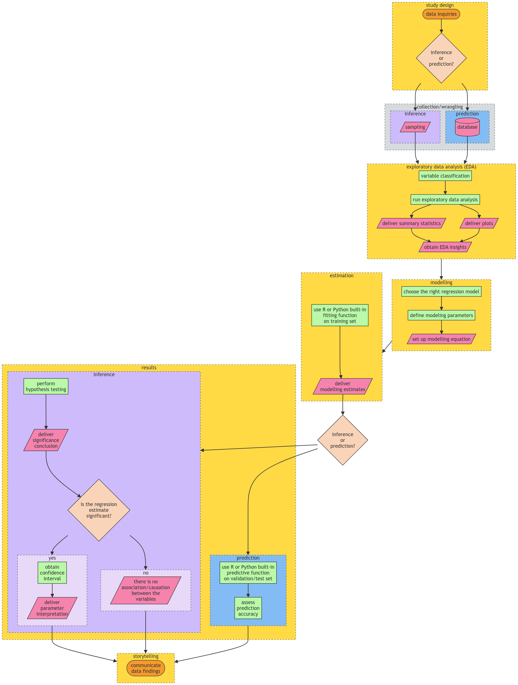
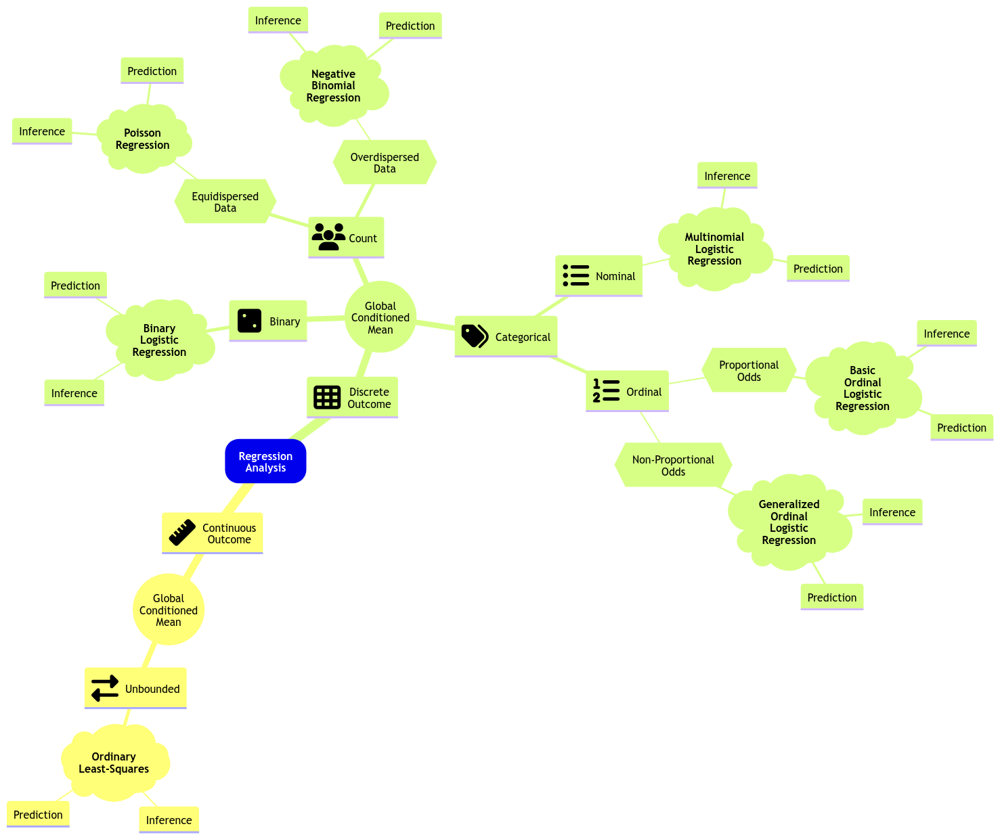
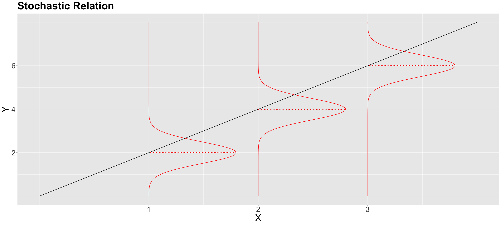
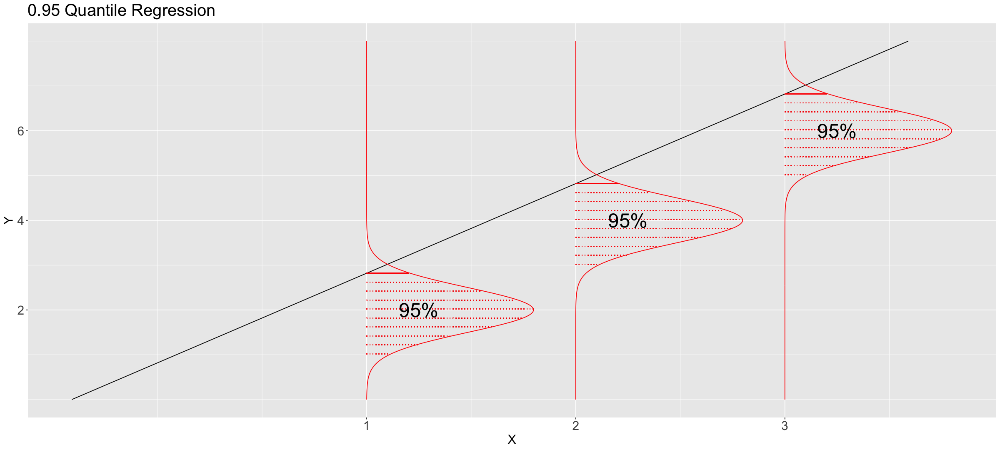

# Regression II

## Data Science Workflow

- General stages of the workflow:
  1. Study design
  2. Data collection and wrangling
  3. Exploratory data analysis (EDA)
  4. Data modeling
  5. Estimation
  6. Results
  7. Storytelling



From: https://pages.github.ubc.ca/MDS-2023-24/DSCI_562_regr-2_students/notes/lecture1-glm-link-functions-and-count-regression.html

- Choose a proper workflow according to either:
  - Inferential
  - Predictive
- Also choose correct regression model

## Review of Regression I

### Ordinary Least Squares (OLS) Regression

- Response of continuous nature (hence the "ordinary")
- Response is subject to **regressors** (or explanatory variables/ features/ independent variables)
  - More than 1 regressor => **multiple linear regression**

$$Response = Systematic + Random$$

$$Y_i = \beta_0 + \beta_1 g_1(x_{i1}) + \beta_2 g_2(x_{i2}) + \dots + \beta_p g_p(x_{ip}) + \epsilon_i$$

- random is the $\epsilon_i$ term

#### Assumptions

1. **Linearity**: the relationship between the response and functions of the regressors is linear
2. Errors are **independent** of each other and are **normally distributed** with mean 0 and variance $\sigma^2$

Hence, each $Y_i$ is assumed to be independent and normally distributed.

#### Estimation

- To fit will need $k+2$ parameters: $\beta_0, \beta_1, \dots, \beta_k, \sigma^2$
- Minimize the sum of squared errors (SSE) OR maximize the likelihood of the observed data

- **Maximum Likelihood Estimation (MLE)**: find the parameters that maximize the likelihood of the observed data
  - **Likelihood**: the probability of observing the data given the parameters
  - **Log-likelihood**: the log of the likelihood

#### Inference

- Do a t-test on the parameters to see if they are statistically significant

### Limitations of OLS

- OLS allows response to take any real number.
- Examples of non-suitable responses:
  - Non-negative values
  - Binary values (success/failure)
  - Count data

## Link Function

- Recall: OLS models a continuous response via its conditional mean

$$\mu_i = E(Y_i | X_i) = \beta_0 + \beta_1 g_1(x_{i1}) + \beta_2 g_2(x_{i2}) + \dots + \beta_p g_p(x_{ip}) $$

- **BUT** this is not suitable for non-continuous responses (e.g. binary, count, non-negative).
- **Solution**: use a **link function** $h(\mu_i)$ to map the conditional mean to the real line

</br>

- **Link function**: relate the systematic component, $\eta_i$, with the response’s mean

$$h(\mu_i) = \eta_i = \beta_0 + \beta_1 g_1(x_{i1}) + \beta_2 g_2(x_{i2}) + \dots + \beta_p g_p(x_{ip}) $$

- **Monotonic**: allows for a one-to-one mapping between the mean of the response variable and the linear predictor

$$\mu_i = h^{-1}(\eta_i)$$

- **Differentiable**: to allow for maximum likelihood estimation (MLE), used to obtain $\hat{\beta}$
  $$

## Generalized Linear Models (GLM)

- **Generalized Linear Models (GLM)**: a generalization of OLS regression that allows for non-continuous responses

**GLM** = **link function** + **error distribution**



## Poisson Regression

- **Poisson regression**: a GLM for count data (Equidispersed)

  - **Equidispersed**: the variance of the response is equal to its mean (i.e. $Var(Y_i) = E(Y_i) = \lambda_i$)

- It assumes a random sample of $n$ count observations $Y_i$s
  - Independent
  - Not Identically Distributed: Each $Y_i$ has its own mean $E(Y_i) = \lambda_i > 0$ and variance $Var(Y_i) = \lambda_i > 0$

$$Y_i \sim Poisson(\lambda_i)$$

- $\lambda_i$ is the risk of event occurance in a given timeframe or area (definition of Poisson distribution)

### Link Function for Poisson Regression

- **Log link function**: the log of the mean of the response variable is linearly related to the regressors

$$h(\mu_i) = log(\mu_i) = \eta_i = \beta_0 + \beta_1 X_{i1} + \beta_2 X_{i2} + \dots + \beta_p X_{ik} $$

Hence,

$$\lambda_i = e^{\eta_i} = e^{\beta_0 + \beta_1 X_{i1} + \beta_2 X_{i2} + \dots + \beta_p X_{ik}}$$

- This is good since $\lambda_i$ (mean count) is always positive

### Poisson Regression in R

```r
glm(Y ~ X, family = poisson, data = dataset)

# view each regression coefficient
tidy(glm_model)
tidy(glm_model, conf.int = TRUE) # for 95% confidence interval

# view model summary
glance(glm_model)
```

#### Interpretation of Coeffs of Poisson Regression

e.g. $\beta_1 = 0.5$

- $\beta_1$ is the expected change in the log of the mean count for a one-unit increase in $X_1$ holding all other variables constant
- a one-unit increase in $X_1$ will increase the mean count by $e^{0.5} = 1.65$ times.

### Inference of Poisson Regression

- To determine the significance of the parameters $\beta_1, \beta_2, \dots, \beta_p$, we can do a **Wald statistic**

$$z_j = \frac{\hat{\beta_j}}{SE(\hat{\beta_j})}$$

- To test the hypothesis:
  - $H_0: \beta_j = 0$
  - $H_1: \beta_j \neq 0$

## Negative Binomial Regression

- **Negative Binomial Regression**: a GLM for count data (Overdispersed)

  - **Overdispersed**: the variance of the response is greater than its mean (i.e. $Var(Y_i) > E(Y_i) = \lambda_i$)

---

**Check for Overdispersion**

```r
dispersiontest(glm_model)
```

- if p-value < 0.05, then there is overdispersion (reject null hypothesis)

If use Poisson regression on overdispersed data, then the standard errors will be underestimated => **Type I error** (false positive) increases

---

- Recall PMF of **Negative Binomial Distribution**:

$$P(Y_i | m,p_i) = (^{y_i + m - 1}_{y_i}) p_i^{y_i} (1 - p_i)^m$$

- $y_i$ is the number of failures before experiencing $m$ successes where probability of success is $p_i$

$$E(Y_i) = \frac{m(1-p_i)}{p_i}$$

$$Var(Y_i) = \frac{m(1-p_i)}{p_i^2}$$

- Rearranging the above equations, we get:

$$E(Y_i) = \lambda_i$$

$$Var(Y_i) = \lambda_i (1 + \frac{\lambda_i}{m})$$

- Interesting information:

$$X \sim Poisson(\lambda) = lim_{m \to \infty} Negative Binomial(m, p_i)$$

### Negative Binomial Regression in R

```r
glm.nb(Y ~ X, data = dataset)
```

Since negative binomial has the same link function as Poisson, we can interpret the coefficients the same way.

## Likelihood-based Model Selection

### Deviance Test

- The deviance ($D_k$) is used to compare a given model with k regressors ($l_k$) with the **baseline/ saturated model** ($l_0$).
  - The baseline model is the "perfect" fit to the data (overfitted), it has a distinct poisson mean ($\lambda_i$) for each $i$th observation.

$$D_k = 2 log \frac{\hat{l}_k}{\hat{l}_0}$$

- **Interpretation of $D_k$**

  - Large value of $D_k$ => poor fit compared to baseline model
  - Small value of $D_k$ => good fit compared to baseline model

#### $D_k$ in Poisson Regression

$$D_k = 2 \sum_{i=1}^n \left[ y_i log \left( \frac{y_i}{\hat{\lambda}_i} \right) - (y_i - \hat{\lambda}_i) \right]$$

\*note: when $y_i = 0$, log term is defined to be 0.

- Hypothesises are as follows (opposite of normal hypothesis):
  - $H_0$: Our model with k regressors fits the data better than the saturated model.
  - $H_A$: Otherwise

```R
glance(model) # D_k is "deviance" col

# to get p-value
pchisq(summary_poisson_model_2$deviance,
  df = summary_poisson_model_2$df.residual,
  lower.tail = FALSE
)
```

- Formally `deviance` is **residual deviance**, this is a test statistic.
- Asmptomatically, it has a null distribution of:

$$D_k \sim \chi^2_{n-k-1}$$

- dof: $n-k-1$
  - $n$ is the number of observations
  - $k$ is the number of regressors (including intercept)

#### Deviance for nested models

```R
anova(model_1, model_2, test = "Chisq")
# deviance column is \delta D_k
```

- model_1 is nested in model_2
- $H_0$: model_1 fits the data better as model_2
- $H_A$: model_2 fits the data better as model_1

$$\Delta D_k = D_{k_1} - D_{k_2} \sim \chi^2_{k_2 - k_1}$$

### Akaike Information Criterion (AIC)

$$AIC_k = D_k + 2k$$

- AIC can be used to compare models that are not nested.
- Smaller AIC is better (means better fit)
- Can get from `glance()` function

### Bayesian Information Criterion (BIC)

$$BIC_k = D_k + k log(n)$$

- BIC tends to select models with fewer regressors than AIC.
- smaller BIC is better (means better fit)
- Can get from `glance()` function

## Multinomial Logistic Regression

- Is a MLE-based GLM for when the response is **categorical** and **nominal**.
  - **Nominal**: unordered categories
    - e.g. red, green, blue
  - **Ordinal**: ordered categories
    - e.g. low, medium, high
- Similar to binomial logistic regression, but with more than 2 categories.
- Link function is the **logit** function.
  - need more than 1 logit function to model the probabilities of each category.
  - One category is the **baseline category**, the other categories are **compared to the baseline category**.

$$\eta_i^{(model 2, model 1)} = \log\left[\frac{P(Y_i = \texttt{model 2} \mid X_{i, 1}, X_{i,2}, X_{i,3})}{P(Y_i = \texttt{model 1} \mid X_{i, 1}, X_{i,2}, X_{i,3})}\right]$$

$$= \beta_0^{(\texttt{model 2},\texttt{model 1})} + \beta_1^{(\texttt{model 2},\texttt{model 1})} X_{i, 1} + \beta_2^{(\texttt{model 2},\texttt{model 1})} X_{i, 2} + \beta_3^{(\texttt{model 2},\texttt{model 1})} X_{i, 3}$$
$$\eta_i^{(model 3, model 1)} = \log\left[\frac{P(Y_i = \texttt{model 3} \mid X_{i, 1}, X_{i,2}, X_{i,3})}{P(Y_i = \texttt{model 1} \mid X_{i, 1}, X_{i,2}, X_{i,3})}\right]$$

$$=\beta_0^{(\texttt{model 3},\texttt{model 1})} + \beta_1^{(\texttt{model 3},\texttt{model 1})} X_{i, 1} + \beta_2^{(\texttt{model 3},\texttt{model 1})} X_{i, 2} + \beta_3^{(\texttt{model 3},\texttt{model 1})} X_{i, 3}$$

With some algebra, we can get the following (For m categories):

$$p_{i, \texttt{model 1}} = \frac{1}{1 + \sum_{j=2}^m e^{\eta_i^{(\texttt{model j}, \texttt{model 1})}}}$$

$$p_{i, \texttt{model 2}} = \frac{e^{\eta_i^{(\texttt{model 2}, \texttt{model 1})}}}{1 + \sum_{j=2}^m e^{\eta_i^{(\texttt{model j}, \texttt{model 1})}}}$$

- All probabilities sum to 1.

### Nuances: Baseline Category

- The baseline level is the level that is not included in the model.
  - can find using `levels()` function, the first level is the baseline level.

```R
levels(data$response) # to check levels

# to change levels
data$response <- recode_factor(data$response,
  "0" = "new_level_0",
  "1" = "new_level_1",
)
```

### Estimation of MLR

```R
model <- multinom(response ~ regressor_1 + regressor_2 + regressor_3,
  data = data)

# to get test statistics
mlr_output <- tidy(model,
  conf.int = TRUE, # to get confidence intervals (default is 95%)
  exponentiate = TRUE) # to get odds ratios
# default result is log odds ratios

# can filter p-values
mlr_output |> filter(p.value < 0.05)

# predict
predict(model, newdata = data, type = "probs")
# sum of all probabilities is 1
```

### Inference of MLR

- Check if regressor is significant using **Wald test**.

$$z_j^{(u,v)} = \frac{\hat{\beta}_j^{(u,v)}}{SE(\hat{\beta}_j^{(u,v)})}$$

- For large sample sizes, $z_j^{(u,v)} \sim N(0,1)$
- To test the hypothesis:
  - $H_0$: $\beta_j^{(u,v)} = 0$
  - $H_A$: $\beta_j^{(u,v)} \neq 0$

### Coefficient Interpretation for MLR

e.g. $\beta_1^{(b,a)} = 0.5$

- For a 1 unit increase in $X_1$, the odds of being in category $b$ is $e^{0.5} = 1.65$ times the odds of being in category $a$.

e.g. $\beta_2^{(c,a)} = -0.5$

- For a 1 unit increase in $X_2$, the odds of being in category $c$ decrease by $39\%$ [$ 1 - (e^{-0.5}) = 1 - 0.61 = 0.39$] less than being in category $a$.

## Ordinal Logistic Regression

- **Ordinal**: has a natural ordering
- There might be loss of information when using MLR for ordinal data
- We are going to use the **proportional odds model** for ordinal data
  - It is a **cumulative logit model**

### Preprocessing for Ordinal Data

- Reorder the levels of the response variable

```R
data$response <- as.ordered(data$response)
data$response <- fct_relevel(
  data$response,
  c("unlikely", "somewhat likely", "very likely")
)
levels(data$response)
```

### Data Model for OLR

- For a response with **$m$** responses and **$k$** regressors, the model is:

- We will have:
  - $m-1$ equations (link functions: logit)
  - $m-1$ intercepts
  - $k$ regression coefficients

#### Link Functions for m responses OLR

$$
\begin{gather*}
\text{Level } m - 1 \text{ or any lesser degree versus level } m\\
\text{Level } m - 2 \text{ or any lesser degree versus level } m - 1 \text{ or any higher degree}\\
\vdots \\
\text{Level } 1 \text{ versus level } 2 \text{ or any higher degree}\\
\end{gather*}
$$

$$
\begin{gather*}
\eta_i^{(m - 1)} = \log\left[\frac{P(Y_i \leq m - 1 \mid X_{i,1}, \ldots, X_{i,k})}{P(Y_i = m \mid X_{i,1}, \ldots, X_{i,k})}\right] = \beta_0^{(m - 1)} - \beta_1 X_{i, 1} - \beta_2 X_{i, 2} - \ldots - \beta_k X_{i, k} \\
\eta_i^{(m - 2)} = \log\left[\frac{P(Y_i \leq m - 2 \mid X_{i,1}, \ldots, X_{i,k})}{P(Y_i > m - 2 \mid X_{i,1}, \ldots, X_{i,k})}\right] = \beta_0^{(m - 2)} - \beta_1 X_{i, 1} - \beta_2 X_{i, 2} - \ldots - \beta_k X_{i, k} \\
\vdots \\
\eta_i^{(1)} = \log\left[\frac{P(Y_i = 1 \mid X_{i,1}, \ldots, X_{i,k})}{P(Y_i > 1 \mid X_{i,1}, \ldots, X_{i,k})}\right] = \beta_0^{(1)} - \beta_1 X_{i, 1} - \beta_2 X_{i, 2} - \ldots - \beta_k X_{i, k}.
\end{gather*}
$$

#### Probability that $Y_i$ is in level j

$$p_{i,j} = P(Y_i = j \mid X_{i,1}, \ldots, X_{i,k}) = P(Y_i \leq j \mid ...) - P(Y_i \leq j - 1 \mid ...)$$

- $i$ is the index of the observation
- $j$ is the level of the response variable

$$\sum_{j = 1}^{m} p_{i,j} = 1$$

### Estimation of OLR

- use `MASS::polr` function

```R
ordinal_model <- polr(
  formula = response ~ regressor_1 + regressor_2,
  data = data,
  Hess = TRUE # Hessian matrix of log-likelihood
)
```

### Inference of OLR

- Similar to MLR using **Wald test**

```R
cbind(
  tidy(ordinal_model),
  p.value = pnorm(abs(tidy(ordinal_model)$statistic),
    lower.tail = FALSE
  ) * 2
)
# confidence intervals

confint(ordinal_model) # default is 95%
```

### Coefficient Interpretation of OLR

- e.g. $\beta_1 = 0.6$
  - For a one unit increase in $X_1$, the odds of being in a higher category is $e^{0.6} = 1.82$ times the odds of being in a lower category, holding all other variables constant.

### Predictions

```R
predict(ordinal_model, newdata = data, type = "probs")
# returns probabilities for each level
```

- To get the **corresponding predicted** cumulative odds for a new observation, use `VGAM::vglm` function

```R
olr <- vglm(
  response ~ regressor_1 + regressor_2,
  propodds, # for proportional odds model
  data,
)

# can also predict using this model, same as code block above
predict(olr, newdata = data, type = "response")

# get predicted cumulative odds
predict(olr, newdata = data, type = "link") |>
  exp() # to get odds instead of log odds
```

- Interpret the predicted cumulative odds as:
  - e.g. $logitlink(P[Y_i \geq j]) = 2.68$
    - A student with [data for $X_i$] is 2.68 times more likely to be in $j$ or higher category than in category $j - 1$ or lower, holding all other variables constant.
  - e.g. $logitlink(P[Y_i \geq 2]) = 0.33$
    - A student with [data for $X_i$] is 3.03 (1/0.33) times more likely to be in $j$ category or lower than in category j or higher, holding all other variables constant.

### Non-proportional Odds

- If the proportional odds assumption is not met, we can use the **partial proportional odds model**.
- Test for proportional odds assumption using the **Brant-Wald test**.
  - $H_0$: Our OLR model globally fulfills the proportional odds assumption.
  - $H_A$: Our OLR model does not globally fulfill the proportional odds assumption.

```R
brant(ordinal_model)
```

- If the proportional odds assumption is not met, we can use the **generalized ordinal logistic regression model**.
  - Basically all $\beta$'s are allowed to vary across the different levels of the response variable.

## Linear Fixed Effects Model

- **Linear Fixed Effects Model (LFE)** is a generalization of the linear regression model
- **Fixed Effects**: the parameters of the model
  - constant for all observations

### Limitations

- **Data Hierarchy**: the data is organized in a hierarchy
  - Can be due to **sampling levels**
  - e.g. investmests in different firms, students in different schools (sampling schemes may be different in different schools)
- Might have some correlation between datapoints in firms/ schools
  - violates the independence assumption (i.i.d. observations)

#### Example: Investments in different firms

- Goal: assessing the association of gross investment with market_value and capital in the population of American firms.
- Data: 11 firms, 20 observations per firm
  - 2 heirachical levels: firm and observation

1. Trial 1: ignore firm

```R
ordinary_model <- lm(
  formula = investment ~ market_value + capital,
  data = Grunfeld)
```

2. Trial 2: Different intercepts for different firms

```R
model_varying_intercept <- lm(
  # -1: so that baseline is not included as first intercept
    formula = investment ~ market_value + capital + firm - 1,
    data = Grunfeld)
```

3. Trial 3: OLS regeression for each firm

- This does NOT solve our goal.
- We want to find out among all firms, not one specific firm.

```R
model_by_firm <- lm(
  investment ~ market_value * firm + capital * firm,
  data = Grunfeld)
```

## Linear Mixed Effects Model

- Fundamental idea:
  - data subsets of elements share a correlation structure
  - i.e. all n rows of training data are not independent

$$ \text{mixed effect} = \text{fixed effect} + \text{random effect} $$

$$\beta_{0j} = \beta_0 + b_{0j}$$

- $\beta_{0j}$/ mixed effect: the intercept for the $j$th school/ firm
- $\beta_0$/ fixed effect: the average intercept
- $b_{0j}$/ random effect: the deviation of the $j$th school/ firm from the average intercept
  - $b_{0j} \sim N(0, \sigma^2_{0})$
  - independent of the error term $\epsilon$
- **Variance of the $i$th observation**:
  - $\sigma^2_{0} + \sigma^2_{\epsilon}$

### Full Equation for LME

$$
y_{ij} = \beta_{0j} + \beta_{1j}x_{1ij} + \beta_{2j}x_{2ij} + \epsilon_{ij} \\ = (\beta_0 + b_{0j}) + (\beta_1 + b_{1j})x_{1ij} + (\beta_2 + b_{2j})x_{2ij} + \epsilon_{ij}
$$

For $i$ in $1, 2, \ldots, n_j$ and $j$ in $1, 2, \ldots, J$

**Note**: $(b_{0j}, b_{1j}, b_{2j}) \sim N(\textbf{0}, \textbf{D})$

- $\textbf{0}$: vector of zero, e.g. $(0, 0, 0)^T$
- $\textbf{D}$: generic covariance matrix

$$\textbf{D} = \begin{bmatrix} \sigma^2_{0} & \sigma_{01} & \sigma_{02} \\ \sigma_{10} & \sigma^2_{1} & \sigma_{12} \\ \sigma_{20} & \sigma_{21} & \sigma^2_{2} \end{bmatrix} = \begin{bmatrix} \sigma^2_{0} & \rho_{01}\sigma_{0}\sigma_{1} & \rho_{02}\sigma_{0}\sigma_{2} \\ \rho_{10}\sigma_{0}\sigma_{1} & \sigma^2_{1} & \rho_{12}\sigma_{1}\sigma_{2} \\ \rho_{20}\sigma_{0}\sigma_{2} & \rho_{21}\sigma_{1}\sigma_{2} & \sigma^2_{2} \end{bmatrix}$$

- $\rho_{uv}$: pearson correlation between uth and vth random effects

### Model Fitting of LME

- use the `lmer` function from the `lme4` package

```R
mixed_intercept_model <- lmer(
  response ~ regressor_1 + regressor_2 +
    (1 | school), # random intercept by firm
  data
)

full_model <- lmer(
  response ~ regressor_1 + regressor_2 +
    (regressor_1 + regressor_2| school),
    # random intercept and slope by firm
  data
)
```

- Equation for mixed intercept model:

$$y_{ij} = (\beta_0 + b_{0j}) + \beta_1x_{1ij} + \beta_2x_{2ij} + \epsilon_{ij}$$

- Equation for full model:

$$y_{ij} = (\beta_0 + b_{0j}) + (\beta_1 + b_{1j})x_{1ij} + (\beta_2 + b_{2j})x_{2ij} + \epsilon_{ij}$$

### Inference of LME

- Cannot do inference using normal t-test

```R
summary(mixed_intercept_model)
summary(full_model)

# obtain coefficients
coef(mixed_intercept_model)$firm
coef(full_mixed_model)$firm
```

### Prediction with LME

1. Predict on _existing_ group

2. Predict on _new_ group

```R
predict(full_model,
  newdata = tibble(school = "new_school", regressor_1 = 1, regressor_2 = 2))
```

## Piecewise Local Regression

- Recall that classical linear regression (parametric) favours interpreatbility when aiming to make inference
- If goal is **accurate prediction**, then we can use **local regression** (non-linear)

### Piecewise Constant Regression

- Use step function to fit a piecewise constant function

$$
C_0(X_i) = I(X_i < c_1) = \begin{cases} 1 & \text{if } X_i < c_1 \\ 0 & \text{otherwise} \end{cases}
$$

$$
C_1(X_i) = I(c_1 \leq X_i < c_2) = \begin{cases} 1 & \text{if } c_1 \leq X_i < c_2 \\ 0 & \text{otherwise} \end{cases}
$$

$$
\vdots
$$

$$
C_{k-1}(X_i) = I(c_{k-1} \leq X_i < c_k) = \begin{cases} 1 & \text{if } c_{k-1} \leq X_i < c_k \\ 0 & \text{otherwise} \end{cases}
$$

$$
C_k(X_i) = I(X_i \leq c_k) = \begin{cases} 1 & \text{if } X_i \leq c_k \\ 0 & \text{otherwise} \end{cases}
$$

$$Y_i = \beta_0 + \beta_1 C_1(X_i) + \beta_2 C_2(X_i) + \cdots + \beta_k C_k(X_i) + \epsilon_i$$

- No need $C_0$ just by definition of $C_0$

```R
breakpoints <- c(10, 20, 30, 40, 50) # or 5 (number of breakpoints)

# create steps
data <- data |> mutate(
    steps = cut(data$var_to_split,
                breaks = breakpoints,
                right = FALSE))
levels(data$steps) # check levels

model <- lm(Y ~ steps, data = data)
```

### Non-Continous Piecewise Linear Regression

- Add interaction terms to the model

$$Y_i = \beta_0 + \beta_1C_1(X_i) + \cdots + \beta_kC_k(X_i) \\ + \beta_{k+1}X_i + \beta_{k+2}X_iC_1(X_i) + \cdots + \beta_{2k}X_iC_k(X_i) + \epsilon_i$$

```R
model_piecewise_linear <- lm(Y ~ steps * var_to_split, data = data)
```

### Continous Piecewise Linear Regression

$$Y_i = \beta_0 + \beta_1X_i + \beta_2(X_i - c_1)_+ + \cdots + \beta_k(X_i - c_{k-1})_+ + \epsilon_i$$

Where:

$$(X_i - c_j)_+ = \begin{cases} X_i - c_j & \text{if } X_i > c_j \\ 0 & \text{otherwise} \end{cases}$$

```R
model_piecewise_cont_linear <- lm(Y ~ var_to_split +
    I(var_to_split - breakpoint[2]) * I(var_to_split >= breakpoint[2]) +
    I(var_to_split - breakpoint[3]) * I(var_to_split >= breakpoint[3]) +
    I(var_to_split - breakpoint[4]) * I(var_to_split >= breakpoint[4]) +
    I(var_to_split - breakpoint[5]) * I(var_to_split >= breakpoint[5]),
    data = data)
```

## kNN Regression

- In this section:
  - $k$: number of neighbours
  - $p$: number of regressors
- **kNN** is a non-parametric method
- no training phase (lazy learner)
- finds $k$ closest neighbours to the query point $x_0$ and predicts the average of the neighbours' responses
- $k=1$ means no training error but overfitting

```R
model_knn <- knnreg(Y ~ X, data = data, k = 5)
```

## Locally Weighted Scatterplot Smoothing (LOWESS)

- Idea:

  - Find closest points to $x_i$ (query point)
  - assign weights based on distance
    - closer -> more weight
  - use weighted least squares for **second degree polynomial** fit

- Minimize sum of squares of weighted residuals

$$\sum_{i=1}^n w_i(y_i - \beta_0 - \beta_1x_i - \beta_2x_i^2)^2$$

- This model can deal with **heteroscedasticity** (non-constant variance)
  - Weighted least squares allows different variance for each observation
- Things to consider:
  - `span`: between 0 and 1, specifies the proportion of points considered as neighbours (more neighbours -> smoother fit)
  - `degree`: degree of polynomial to fit

```R
model_lowess <- lowess(Y ~ X, data = data, span = 0.5, degree = 2)
```

## Quantile Regression

### Quantile: Recap

- The **quantile** $Q(\tau)$ is the observed value of $X$ such that $\tau * 100\%$ of the data is less than or equal to $X$.
  - i.e. on the left side of the distribution

 

### Applications of Quantile Regression

- **Quantile regression** is a form of regression analysis used to estimate the conditional median or other quantiles of a response variable.

- Types of questions that can be answered with quantile regression:
  - For baseball teams in the upper 75% threshold in runs, are these runs largely associated with a large number of hits?
  - For any given team that scores 1000 hits in future tournaments, how many runs can this team score with 50% chance?

### Parametric Quantile Regression

- Recall **OLS**:
  $$
  \mathbb{E}(Y_i \mid X_{i,j} = x_{i,j}) = \beta_0 + \beta_1 x_{i,1} + \ldots + \beta_k x_{i,k};
  $$

$$
\text{loss} = \sum_{i = 1}^n (y_i - \beta_0 - \beta_1 x_{i,1} - \ldots - \beta_k x_{i,k})^2.
$$

- **Parametric Quantile Regression**:

$$
Q_i( \tau \mid X_{i,j} = x_{i,j}) = \beta_0(\tau) + \beta_1(\tau) x_{i,1} + \ldots + \beta_k(\tau) x_{i,k}
$$

_(notice the $\beta$s are now functions of $\tau$)_

- Error term: **Fidelity**

$$
\text{loss} = \sum_{i} e_i[\tau - I(e_i < 0)] = \sum_{i: e_i \geq 0} \tau|e_i|+\sum_{i: e_i < 0}(1-\tau)|e_i|
$$

Where

$$I(e_i < 0) = \begin{cases} 1 & \text{if } e_i < 0 \\ 0 & \text{otherwise} \end{cases}$$

#### Estimation of Parametric Quantile Regression

```R
# Plotting the quantiles
ggplot(data, aes(x, y)) +
    geom_point() +
    geom_quantile(quantiles = c(0.25, 0.5, 0.75),
                    formula = y ~ x)

# fit the model
pqr_model <- rq(y ~ x,
                tau = c(0.25, 0.5, 0.75),
                data = data)
```

#### Inference of Parametric Quantile Regression

- To justify the relationship b/w the $\tau$th quantile in response and regressors.

- Use test statistics to test the null hypothesis that the $\tau$th quantile is not related to the regressors.
  - $t$-value with $n - k - 1$ degrees of freedom:

$$t_j = \frac{\hat{\beta}_j(\tau)}{\text{SE}(\hat{\beta}_j(\tau))}$$

- Null hypothesis: $H_0 : \beta_j(\tau) = 0$.

- Check p-value: `summary(pqr_model)[1]` for $\tau = 0.25$, `summary(pqr_model)[2]` for $\tau = 0.5$, `summary(pqr_model)[3]` for $\tau = 0.75$.

#### Coefficient Interpretation

- Similar to OLS
- $\beta_1(\tau)$ is the change in the $\tau$th quantile of $Y$ for a unit increase in $X_1$.
- e.g. $\beta_1(0.75) = 0.5$ means that for a unit increase in $X_1$, the 75th quantile of $Y$ increases by 0.5.

#### Prediction

```R
predict(pqr_model, newdata = data.frame(...))
```

### Nonparametric Quantile Regression

- Implicates no distributional assumptions and no model function specification.
- $\lambda$ is the penalty parameter.
  - Choosing **how local** the estimation is.
  - small $\lambda$: better approx, but more variance (model not smooth)
  - large $\lambda$: lose local info, favouring smoothness (global info)

```R
median_rqss <- rqss(y ~ qss(x, lambda = 0.5),
            tau = 0.5, # cannot do multiple quantiles
            data = data)

summary(median_rqss)

predict(median_rqss, newdata = data.frame(...))
```

## Missing Data

### Types of Missing Data

#### Missing Completely at Random (MCAR)

- The probability of missing data is the same for all observations
- Missingness is independent of data (Ideal case because there is no pattern)
- No systematic differences between missing and non-missing data

#### Missing at Random (MAR)

- The probability of missing data depends on observed data
- Can use imputation to fill in missing data:
  - **Hot deck**: Replace missing value with a value from the _same dataset_
  - **Cold deck**: Replace missing value with a value from a _different dataset_

#### Missing Not at Random (MNAR)

- The probability of missing data depends on unobservable quantities
- E.g. missing data on income for people who are unemployed

### Handling Missing Data

#### Listwise Deletion

- Remove all observations with missing data
- If data is MCAR, this is unbiased
  - Also increases standard errors since we're using less data
- If data is MAR or MNAR, this is **biased** (CAREFUL)
  - e.g. if missing data is related to income, lower income will omit telling us their income, so removing them will bias our data to higher income.

#### Mean Imputation

- Replace missing data with the mean of the observed data
  - Can only be used on continuous/ count data
- Artificially reduces standard errors (drawback)
  - Also reduces variance, which is not good

```r
library(mice)

data <- mice(data, seed = 1, method = "mean")
complete(data)
```

#### Regression Imputation

- Use a regression model to predict missing data
- Use the predicted value as the imputed value
- We will **reinforce** the relationship between the predictor and the variable with missing data
  - This is not good if the relationship is not strong
  - Will change inference results

```r
data <- mice(data, seed = 1, method = "norm.predict")
complete(data)
```

#### Multiple Imputation

- Idea: Impute missing data multiple times to account for uncertainty
- Use `mice` package in R. Stands for **M**ultivariate **I**mputation by **C**hained **E**quations

- Steps:
  1. Create `m` copies of the dataset
  2. In each copy, impute missing data (different values)
  3. Carry out analysis on each dataset
  4. Combine models to one pooled model

```r
imp_data <- mice(data, seed = 1, m = 15, printFlag = FALSE)

complete(data, 3) # Get the third imputed dataset

# estimate OLS regression on each dataset
models <- with(imp_data, lm(y ~ x1 + x2))

# get third model
models$analyses[[3]]

# combine models
pooled_model <- pool(models)

summary(pooled_model) # remember to exp if using log model
```
