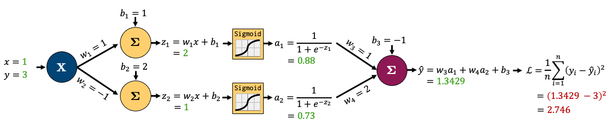
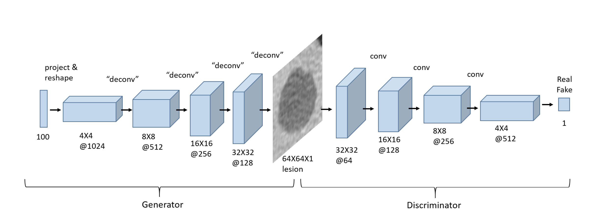

# Supervised Learning II

## Rounding Errors in Programming

- Infinite amount of numbers but finite amount of bits to represent them
- These small errors will accumulate and cause problems

### Why is this relevant in ML?

- large datasets with millions of params
- small errors can accumulate and cause problems

### Binary Numbers and Integers

- Binary numbers are represented as a sum of powers of 2
- e.g. 104 in binary is 1101000 = $1(2^6) + 1(2^5) + 0(2^4) + 1(2^3) + 0(2^2) + 0(2^1) + 0(2^0) = 64 + 32 + 8 = 104$
- **Unsigned Integers**: $2^n - 1$ is the largest number that can be represented with n bits
  - e.g. 8 bits can represent 0 to 255
  - `np.iinfo(np.uint8)` gives the min and max values
- **Signed Integers**: $2^{n-1} - 1$ is the largest positive number that can be represented with n bits
  - $-2^{n-1}$ is the smallest negative number that can be represented with n bits
  - e.g. 8 bits can represent -128 to 127 (0 is included in the positive numbers)
  - 1 bit is used to represent the sign
  - `np.iinfo(np.int8)` gives the min and max values

### Fractional Numbers in Binary

- 14.75 in binary is 1110.11

| 2^3 | 2^2 | 2^1 | 2^0 | 2^-1 | 2^-2 |
| --- | --- | --- | --- | ---- | ---- |
| 1   | 1   | 1   | 0   | 1    | 1    |
| 8   | 4   | 2   | 0   | 0.5  | 0.25 |

$ 8 + 4 + 2 + 0 + 0.5 + 0.25 = 14.75 $

### Fixed Point Numbers

- We typically have a fixed number of bits to represent the fractional part
- e.g. 8 bits total, 4 bits for the integer part and 4 bits for the fractional part
  - max value is 15.9375 ($2^3 + 2^2 + 2^1 + 2^0 + 2^{-1} + 2^{-2} + 2^{-3} + 2^{-4}$)
    - overflow if try a higher value
  - min value (bigger than 0) is 0.0625 ($2^{-4}$)
    - or precision of 0.0625 (any less => underflow)

### \*Floating Point Numbers\*

- Rather than having a fixed location for the binary point, we let it "float" around.
  - like how we write 0.1234 as 1.234 x 10^-1
- **Format**: $$(-1)^S \times 1. M \times 2^E$$
  - S is the sign bit
  - M is the mantissa, always between 1 and 2 (1.0 is implied)
  - E is the exponent

_Float 64_ (double precision)


_Float 32_ (single precision)


### Rounding Errors and Spacing

#### Spacing

- The spacing changes depending on the floating point number (because of the exponent)

##### Ways to calculate the spacing

```python
import numpy as np

np.spacing(1e16) # 1.0

np.nextafter(1e16, 2e16) - 1e16 # 1.0
```

### Examples

- `1.0 + 2.0 + 3.0 == 6.0` True
- `0.1 + 0.2 == 0.3` False
  - 0.1, 0.2, and 0.3 are not exactly representable in binary
- `1e16 + 1 == 1e16` True
  - 1 is less than the spacing, so it is rounded back
- `1e16 + 2.0 == 1e16` False
  - 2.0 is greater than the spacing, so it is rounded up
- `1e16 + 1.0 + 1.0  == 1e16` True
  - 1.0 is less than the spacing, so it is rounded back, then 1.0 is added, which is less than the spacing, so it is rounded back again

## Optimization

- In ML, we want to minimize a loss function
  - typically a sum of losses over the training set
- Can think of ML as a 3 step process:
  1. Choose **model**: controls space of possible functions that map X to y
  2. Choose **loss function**: measures how well the model fits the data
  3. Choose **optimization** algorithm: finds the best model

### Optimization Terminology

- **Optimization**: process to min/max a function
- **Objective Function**: function to be optimized
- **Domain**: set to search for optimal value
- **Minimizer**: value that minimizes the objective function

### Loss Function

Common loss function is MSE (mean squared error):

$$L(w) = \frac{1}{n} \sum_{i=1}^n (\hat{y}_i - y_i)^2$$

Using a simple linear regression model $y = w_0 + w_1x$, we can rewrite the loss function as:

$$L(w) = \frac{1}{n} \sum_{i=1}^n ((w_0 + w_1x_i) - y_i)^2$$

So optimization is finding the values of $w_0$ and $w_1$ that minimize the loss function, $L(w)$.

In vector format:

$$\text{MSE} = \mathcal{L}(\mathbf{w}) = \frac{1}{n}\sum^{n}_{i=1}(\mathbf{x}_i \mathbf{w} - y_i)^2$$

In full-matrix format

$$\text{MSE} = \mathcal{L}(\mathbf{w}) = \frac{1}{n}(\mathbf{X} \mathbf{w} - \mathbf{y})^T (\mathbf{X} \mathbf{w} - \mathbf{y}) $$

### Notation

$$
\mathbf{y}=
\left[
\begin{array}{c} y_1 \\
\vdots \\
y_i \\
\vdots\\
y_n
\end{array}
\right]_{n \times 1}, \quad
\mathbf{X}=
\left[
\begin{array}{c} \mathbf{x}_1 \\
\vdots \\
\mathbf{x}_i \\
\vdots\\
\mathbf{x}_n
\end{array}
\right]_{n \times d}
= \left[\begin{array}{cccc}
x_{11} & x_{12} & \cdots & x_{1 d} \\
\vdots & \vdots & \ddots & \vdots \\
x_{i 1} & x_{i 2} & \cdots & x_{i d}\\
\vdots & \vdots & \ddots & \vdots \\
x_{n 1} & x_{n 2} & \cdots & x_{n d}
\end{array}\right]_{n \times d},
\quad
\mathbf{w}=
\left[
\begin{array}{c} w_1 \\
\vdots\\
w_d
\end{array}
\right]_{d \times 1}
$$

- $n$: number of examples
- $d$: number of input features/dimensions

The goal is to find the weights $\mathbf{w}$ that minimize the loss function.

**Formulas:**

$$\mathbf{y} = \mathbf{X} \mathbf{w}$$

$$\hat{\mathbf{y}_i} = \mathbf{w}^T \mathbf{x}_i$$

## Gradient Descent

- One of the most important optimization algorithms in ML
- Iterative optimization algorithm
- Steps:

  1. start with some arbitrary $\mathbf{w}$

  2. calculate the gradient using all training examples
  3. use the gradient to adjust $\mathbf{w}$
  4. repeat for $I$ iterations or until the step-size is sufficiently small

- Cost: $O(ndt)$ for t iterations, better than brute force search $O(nd^2 + d^3)$

$$w_{t+1} = w_t - \alpha \nabla= L(w_t)$$

- $w_t$: current value of the weights
- $\alpha$: learning rate
- $\nabla L(w_t)$: gradient of the loss function at $w_t$

### GD with a Single Parameter

- Loss function: $L(w) = \frac{1}{n} \sum_{i=1}^n (\hat{y}_i - y_i)^2$
- Gradient: $\nabla L(w) = \frac{d}{dw} L(w) = \frac{2}{n} \sum_{i=1}^n x_{i1} (x_{i1} w_1 - y_i)$
  - Or in Matrix form: $\nabla L(w) = \frac{2}{n} \mathbf{X}^T (\mathbf{X} \mathbf{w} - \mathbf{y})$

### GD with Multiple Parameters

- Need to scale for the contour plot to be more "round"
  - better for gradient descent


- In real life, contour plots are not so nice

### General process


- **Initialization:** Start with an initial set of parameters, often randomly chosen.
- **Forward pass:** Generate predictions using the current values of the parameters. (E.g., $\hat{y_i} = x_{1}w_1 + Bias$ in the toy example above)
- **Loss calculation:** Evaluate the loss, which quantifies the discrepancy between the model's predictions and the actual target values.
- **Gradient calculation:** Compute the gradient of the loss function with respect to each parameter either on a batch or the full dataset. This gradient indicates the direction in which the loss is increasing and its magnitude.
- **Parameter Update**: Adjust the parameters in the opposite direction of the calculated gradient, scaled by the learning rate. This step aims to reduce the loss by moving the parameters toward values that minimize it.

### Other Optimization Algorithms

- Use `minimize` function from `scipy.optimize`

```python
from scipy.optimize import minimize

def mse(w, X, y):
    """Mean squared error."""
    return np.mean((X @ w - y) ** 2)

def mse_grad(w, X, y):
    """Gradient of mean squared error."""
    n = len(y)
    return (2/n) * X.T @ (X @ w - y)

out = minimize(mse, w, jac=mse_grad, args=(X_scaled_ones, toy_y), method="BFGS")
# jac: function to compute the gradient (optional)
# - will use finite difference approximation if not provided
```

- Other methods:
  - `BFGS`: Broyden–Fletcher–Goldfarb–Shanno algorithm
  - `CG`: Conjugate gradient algorithm
  - `L-BFGS-B`: Limited-memory BFGS with bounds on the variables
  - `SLSQP`: Sequential Least SQuares Programming
  - `TNC`: Truncated Newton algorithm

## Stochastic Gradient Descent

- Instead of updating our parameters based on a gradient calculated using all training data, we simply use **one of our data points** (the $i$-th one)

**Gradient Descent**

Loss function:

$$\text{MSE} = \mathcal{L}(\mathbf{w}) = \frac{1}{n}\sum^{n}_{i=1} (\mathbf{x}_i \mathbf{w} - y_i)^2$$

Update procedure:

$$\mathbf{w}^{j+1} = \mathbf{w}^{j} - \alpha \nabla_\mathbf{w} \mathcal{L}(\mathbf{w}^{j})$$

**Stochastic Gradient Descent**

Loss function:

$$\text{MSE}_i = \mathcal{L}_i(\mathbf{w}) = (\mathbf{x}_i \mathbf{w} - y_i)^2$$

Update procedure:
$$\mathbf{w}^{j+1} = \mathbf{w}^{j} - \alpha \nabla_\mathbf{w} \mathcal{L}_i(\mathbf{w}^{j})$$

### Mini-batch Gradient Descent

| Gradient Descent    | Stochastic Gradient Descent |
| ------------------- | --------------------------- |
| Use all data points | Use one data point          |
| Slow                | Fast                        |
| Accurate            | Less Accurate               |

- **Mini-batch Gradient Descent** is a (in-between) compromise between the two
- Instead of using a single data point, we use a small batch of data points d

#### Mini-batch Creation

1. Shuffle and divide all data into $k$ batches, every example is used once
   - **Default in PyTorch**
   - An example will only show up in one batch
2. Choose some examples for each batch **without replacement**
   - An example may show up in multiple batches
   - The same example cannot show up in the same batch more than once
3. Choose some examples for each batch **with replacement**
   - An example may show up in multiple batches
   - The same example may show up in the same batch more than once

### Terminology

Assume we have a dataset of $n$ observations (also known as _rows, samples, examples, data points, or points_)

- **Iteration**: each time you update model weights

- **Batch**: a subset of data used in an iteration

- **Epoch**: One full pass through the dataset to look at all $n$ observations

In other words,

- In **GD**, each iteration involves computing the gradient over all examples, so

$$1 \: \text{iteration} = 1 \: \text{epoch}$$

- In **SGD**, each iteration involves one data point, so

$$n \text{ iterations} = 1 \: \text{epoch}$$

- In **MGD**, each iteration involves a batch of data, so

$$
\begin{align}
\frac{n}{\text{batch size}} \text{iterations} &= 1 \text{ epoch}\\
\end{align}
$$

**\*Note**: nobody really says "minibatch SGD", we just say SGD: in SGD you can specify a batch size of anything between 1 and $n$

## Neural Networks

- Models that does a good job of approximating complex non-linear functions
- It is a sequence of layers, each of which is a linear transformation followed by a non-linear transformation

### Components

- **Node (or neuron)**: a single unit in a layer
- **Input layer**: the features of the data
- **Hidden layer**: the layer(s) between the input and output layers
- **Output layer**: the prediction(s) of the model
- **Weights**: the parameters of the model
- **Activation function**: the non-linear transformation (e.g. ReLU, Sigmoid, Tanh, etc.)


_X : (n x d), W : (h x d), b : (n x h), where h is the number of hidden nodes_
_b is actually 1 x hs, but we can think of it as n x hs because it is broadcasted_

$$\mathbf{H}^{(1)} = \phi^{(1)} (\mathbf{X}\mathbf{W}^{(1)\text{T}} + \mathbf{b}^{(1)})$$

$$\mathbf{H}^{(2)} = \phi^{(2)} (\mathbf{H}^{(1)}\mathbf{W}^{(2)\text{T}} + \mathbf{b}^{(2)})$$

$$\mathbf{Y} = (\mathbf{H}^{(2)}\mathbf{W}^{(3)\text{T}} + \mathbf{b}^{(3)})$$

- In a layer,
  $$\text{ num of weights} = \text{num of nodes in previous layer} \times \text{num of nodes in current layer}$$

$$\text{num of biases} = \text{num of nodes in current layer}$$

$$\text{num of parameters} = \text{num of weights} + \text{num of biases}$$

#### Activation Functions


#### Finding gradient of loss in a neural network

- **Backpropagation**: a method to calculate the gradient of the loss function with respect to the weights
- **Chain rule**: a method to calculate the gradient of a function composed of multiple functions
- It is pretty complicated, but PyTorch does it for us

### Deep Learning

- Neural networks with > 1 hidden layer
  - NN with 1 hidden layer: shallow neural network

## PyTorch for Neural Networks

- PyTorch is a popular open-source machine learning library by Facebook based on Torch
- It is a Python package that provides two high-level features:
  - Tensor computation (like NumPy) with strong GPU acceleration
  - Gradient computation through automatic differentiation

### Tensors

- Similar to `ndarray` in NumPy

```python
import torch

# Create a tensor
x = torch.tensor([1, 2, 3, 4, 5]) # int
x = torch.tensor([1, 2, 3, 4, 5.]) # float
x = torch.tensor([[1, 2], [3, 4], [5, 6]])

y = torch.zeros(3, 2)
y = torch.ones(3, 2)
y = torch.rand(3, 2)

# Check the shape, dimensions, and data type
x.shape
x.ndim
x.dtype

# Operations
a = torch.rand(1, 3)
b = torch.rand(3, 1)

a + b # broadcasting
a * b # element-wise multiplication
a @ b # matrix multiplication
a.mean()
a.sum()

# Indexing
a[0,:] # first row
a[0] # first row
a[:,0] # first column

# Convert to NumPy
x.numpy()
```

### GPU with PyTorch

```python
# Check if GPU is available
torch.backends.mps.is_available() # mac M chips
torch.cuda.is_available() # Nvidia GPU

# To activate GPU
device = torch.device('mps' if torch.backends.mps.is_available() else 'cpu')
# device = torch.device('cuda' if torch.cuda.is_available() else 'cpu')
x.to('cpu') # move tensor to cpu
```

#### Gradient Computation

- use `backward()` to compute the gradient, backpropagation

```python
X = torch.tensor([1.0, 2.0, 3.0], requires_grad=False)
w = torch.tensor([1.0], requires_grad=True)  # Random initial weight
y = torch.tensor([2.0, 4.0, 6.0], requires_grad=False)  # Target values
mse = ((X * w - y)**2).mean()
mse.backward()
w.grad
```

### Linear Regression with PyTorch

- Every NN model has to inherit from `torch.nn.Module`

```python
from torch import nn

class linearRegression(nn.Module):  # inherit from nn.Module

    def __init__(self, input_size, output_size):
        super().__init__()  # call the constructor of the parent class

        self.linear = nn.Linear(input_size, output_size,)  # wX + b

    def forward(self, x):
        out = self.linear(x)
        return out

# Create a model
model = linearRegression(1, 1) # input size, output size

# View model
summary(model)

## Train the model
LEARNING_RATE = 0.02
criterion = nn.MSELoss()  # loss function
optimizer = torch.optim.SGD(model.parameters(), lr=LEARNING_RATE)  # optimization algorithm is SGD

# DataLoader for mini-batch
from torch.utils.data import DataLoader, TensorDataset

BATCH_SIZE = 50
dataset = TensorDataset(X_t, y_t)
dataloader = DataLoader(dataset, batch_size=BATCH_SIZE, shuffle=True)

# Training
def trainer(model, criterion, optimizer, dataloader, epochs=5, verbose=True):
    """Simple training wrapper for PyTorch network."""

    for epoch in range(epochs):
        losses = 0

        for X, y in dataloader:

            optimizer.zero_grad()       # Clear gradients w.r.t. parameters
            y_hat = model(X).flatten()  # Forward pass to get output
            loss = criterion(y_hat, y)  # Calculate loss
            loss.backward()             # Getting gradients w.r.t. parameters
            optimizer.step()            # Update parameters
            losses += loss.item()       # Add loss for this batch to running total

        if verbose: print(f"epoch: {epoch + 1}, loss: {losses / len(dataloader):.4f}")

trainer(model, criterion, optimizer, dataloader, epochs=30, verbose=True)
```

### Non-linear Regression with PyTorch

- use `torch.nn.Sequential` to create a model

```python
class nonlinRegression(nn.Module):
    def __init__(self, input_size, hidden_size, output_size):
        super().__init__()

        self.main = torch.nn.Sequential(
            nn.Linear(input_size, hidden_size),  # input -> hidden layer
            nn.Sigmoid(),                        # sigmoid activation function in hidden layer
            nn.Linear(hidden_size, output_size)  # hidden -> output layer
        )

    def forward(self, x):
        x = self.main(x)
        return x
```

### Common Criteria and Optimizers for PyTorch

| Task                       | Criterion (Loss) | Optimizer |
| -------------------------- | ---------------- | --------- |
| Regression                 | MSELoss          | SGD       |
| Binary Classification      | BCELoss          | Adam      |
| Multi-class Classification | CrossEntropyLoss | Adam      |

- Input of CrossEntropyLoss doesn't need to be normalized (i.e. no need to sum to 1/ no need to use `nn.Softmax`)

```python
# criterions
from torch import nn
reg_criterion = torch.nn.MSELoss()
bc_criterion = torch.nn.BCEWithLogitsLoss()
mse_criterion = torch.nn.CrossEntropyLoss()

# optimizers
from torch import optim
reg_optim = torch.optim.SGD(model.parameters(), lr=0.2)
class_optim = torch.optim.Adam(model.parameters(), lr=LEARNING_RATE)
```

## Backpropagation

### Basic concept

- It is to calculate the gradient of the loss function with respect to the weights
- It is a special case of the chain rule of calculus

- **Process:**

  1. Do "forward pass" to calculate the output of the network (prediction and loss)

  

  2. Do "backward pass" to calculate the gradients of the loss function with respect to the weights. Below is an example of reverse-mode autmatic differentiation (backpropagation):

  

### Torch: Autograd

- `torch.autograd` is PyTorch's automatic differentiation engine that powers neural network training

```python
import torch

# Create model
class network(torch.nn.Module):
    def __init__(self):
        super(network, self).__init__()
        self.layer1 = torch.nn.Linear(1, 6)
        self.dropout = torch.nn.Dropout(0.2) # dropout layer
        ...

    def forward(self, x):
        x = self.layer1(x)
        ...
        return x

model = network()
criterion = torch.nn.MSELoss()

# Forward pass
loss = criterion(model(x), y)
# Backward pass
loss.backward()

# Access gradients
print(model.layer1.weight.grad) # or model.layer1.weight.bias.grad

# Update weights
model.state_dict() # get the current weights
optimizer = torch.optim.SGD(model.parameters(), lr=0.01)
optimizer.step() # update weights
```

### Vanishing and Exploding Gradients

- Backpropagation can suffer from two problems because of multiple chain rule applications:
  - **Vanishing gradients**: the gradients of the loss function with respect to the weights become very small
    - 0 gradients because of underflow
  - **Exploding gradients**: the gradients of the loss function with respect to the weights become very large
- Possible solutions:
  - Use **ReLU** activation function: but it can also suffer from the dying ReLU problem (gradients are 0)
  - **Weight initialization**: initialize the weights with small values
  - **Batch normalization**: normalize the input layer by adjusting and scaling the activations
  - **Skip connections**: add connections that skip one or more layers
  - **Gradient clipping**: clip the gradients during backpropagation

### Training Neural Networks in PyTorch

#### Preventing Overfitting

- Add validation loss to the training loop
- **Early stopping**: if we see the validation loss is increasing, we stop training
  - Define a patience parameter: if the validation loss increases for `patience` epochs, we stop training
- **Regularization**: add a penalty term to the loss function to prevent overfitting
  - See [573 notes](https://mds.farrandi.com/block_3/573_model_sel/573_model_sel#regularization) for more details
  - `weight_decay` parameter in the optimizer
- **Dropout**: randomly set some neurons to 0 during training
  - It prevents overfitting by reducing the complexity of the model
  - `torch.nn.Dropout(0.2)`

### PyTorch Trainer Code

```python
import torch
import torch.nn as nn

def trainer(model, criterion, optimizer, trainloader, validloader, epochs=5, patience=5):
    """Simple training wrapper for PyTorch network."""

    train_loss = []
    valid_loss = []

    for epoch in range(epochs):  # for each epoch
        train_batch_loss = 0
        valid_batch_loss = 0

        # Training
        for X, y in trainloader:

            optimizer.zero_grad()       # Zero all the gradients w.r.t. parameters

            y_hat = model(X).flatten()  # Forward pass to get output
            loss = criterion(y_hat, y)  # Calculate loss based on output
            loss.backward()             # Calculate gradients w.r.t. parameters
            optimizer.step()            # Update parameters

            train_batch_loss += loss.item()  # Add loss for this batch to running total

        train_loss.append(train_batch_loss / len(trainloader))

        # Validation
        with torch.no_grad():  # this stops pytorch doing computational graph stuff under-the-hood and saves memory and time

            for X_valid, y_valid in validloader:

                y_hat = model(X_valid).flatten()  # Forward pass to get output
                loss = criterion(y_hat, y_valid)  # Calculate loss based on output

                valid_batch_loss += loss.item()

        valid_loss.append(valid_batch_loss / len(validloader))

        # Early stopping
        if epoch > 0 and valid_loss[-1] > valid_loss[-2]:
            consec_increases += 1
        else:
            consec_increases = 0
        if consec_increases == patience:
            print(f"Stopped early at epoch {epoch + 1} - val loss increased for {consec_increases} consecutive epochs!")
            break

    return train_loss, valid_loss
```

- Using the `trainer` function:

```python
import torch
import torch.nn
import torch.optim

torch.manual_seed(1)

model = network(1, 6, 1)
criterion = torch.nn.MSELoss()
optimizer = torch.optim.Adam(model.parameters(), lr=0.05) # weight_decay=0.01 for L2 regularization
train_loss, valid_loss = trainer(model, criterion, optimizer, trainloader, validloader, epochs=201, patience=3)

plot_loss(train_loss, valid_loss)
```

### Universal Approximation Theorem

- Any continuous function can be approximated arbitrarily well by a neural network with a single hidden layer
  - In other words, NN are universal function approximators

## Convolutional Neural Networks (CNN)


- Drastically reduces the number of params (compared to NN):
  - have activations depend on small number of inputs
  - same parameters (convolutional filter) are used for different parts of the image
- Can capture spatial information (preserves the structure of the image)

### Convolution

- Idea: use a small filter/kernel to extract features from the image
  - Filter: a small matrix of weights (normally odd dimensioned -> for symmetry)


- Notice that the filter results in a smaller output image
  - This is because we are not padding the image
  - We can add padding to the image to keep the same size
    - Padding: add zeros around the image
  - Can also add stride to move the filter more than 1 pixel at a time

### CNN Structure


_[img src](https://towardsdatascience.com/a-comprehensive-guide-to-convolutional-neural-networks-the-eli5-way-3bd2b1164a53)_

### CNN in PyTorch

#### 1. Convolutional Layer

```python
conv_1 = torch.nn.Conv2d(in_channels=1, out_channels=6, kernel_size=(3,3))
```

- Arguments:
  - `in_channels`: number of input channels (gray scale image has 1 channel, RGB has 3)
  - `out_channels`: number of output channels (similar to hidden nodes in NN)
  - `kernel_size`: size of the filter
  - `stride`: how many pixels to move the filter each time
  - `padding`: how many pixels to add around the image


- Size of input image (e.g. 256x256) doesn't matter, what matters is: `in_channels`, `out_channels`, `kernel_size`

$$\text{total params} = (\text{out channels} \times \text{in channels} \times \text{kernel size}^2) + \text{out channels}$$

$$\text{output size} = \frac{\text{input size} - \text{kernel size} + 2 \times \text{padding}}{\text{stride}} + 1$$

##### Dimensions of images and kernel tensors in PyTorch

- Images: `[batch_size, channels, height, width]`
- Kernel: `[out_channels, in_channels, kernel_height, kernel_width]`

Note: before passing the image to the convolutional layer, we need to reshape it to the correct dimensions. Also if you want to `plt.imshow()` the image, you need to reshape it back to `[height, width, channels]`.

#### 2. Flattening

- `feature learning` -> `classification`
- Use `torch.nn.Flatten()` to flatten the image
- At the end need to either do regression or classification

#### 3. Pooling

- Idea: reduce the size of the image
  - less params
  - less overfitting
- Common types:
  - **Max pooling**: take the max value in each region
    - Works well since it takes the sharpest features
  - **Average pooling**: take the average value in each region

#### Putting it all together

```python
class CNN(torch.nn.Module):
    def __init__(self):
        super().__init__()
        self.main = torch.nn.Sequential(

            torch.nn.Conv2d(in_channels=1,
                out_channels=3,
                kernel_size=(3, 3),
                padding=1),
            torch.nn.ReLU(), # activation function
            torch.nn.MaxPool2d((2, 2)),

            torch.nn.Conv2d(in_channels=3,
                out_channels=2,
                kernel_size=(3, 3),
                padding=1),
            torch.nn.ReLU(),
            torch.nn.MaxPool2d((2, 2)),

            torch.nn.Flatten(),
            torch.nn.Linear(1250, 1)
        )

    def forward(self, x):
        out = self.main(x)
        return out
```

```python
# Trainer code
def trainer(
    model, criterion, optimizer, trainloader, validloader, epochs=5, verbose=True
):
    train_loss, train_accuracy, valid_loss, valid_accuracy = [], [], [], []
    for epoch in range(epochs):  # for each epoch
        train_batch_loss = 0
        train_batch_acc = 0
        valid_batch_loss = 0
        valid_batch_acc = 0

        # Training
        for X, y in trainloader:
            if device.type in ['cuda', 'mps']:
                    X, y = X.to(device), y.to(device)
            optimizer.zero_grad()  # Zero all the gradients w.r.t. parameters
            y_hat = model(X)  # Forward pass to get output
            idx = torch.softmax(y_hat, dim=1).argmax(dim=1) # Multiclass classification
            loss = criterion(y_hat, y)
            loss.backward()  # Calculate gradients w.r.t. parameters
            optimizer.step()  # Update parameters
            train_batch_loss += loss.item()  # Add loss for this batch to running total
            train_batch_acc += (
                    (idx.squeeze() == y).type(
                        torch.float32).mean().item()
                )
        train_loss.append(train_batch_loss / len(trainloader))
        train_accuracy.append(train_batch_acc / len(trainloader))

        # Validation
        with torch.no_grad():  # this stops pytorch doing computational graph stuff under-the-hood and saves memory and time
            for X, y in validloader:
                if device.type in ['cuda', 'mps']:
                    X, y = X.to(device), y.to(device)
                y_hat = model(X)
                idx = torch.softmax(y_hat, dim=1).argmax(dim=1)
                loss = criterion(y_hat, y)
                valid_batch_loss += loss.item()
                valid_batch_acc += (
                    (idx.squeeze() == y).type(
                        torch.float32).mean().item()
                )
        valid_loss.append(valid_batch_loss / len(validloader))
        valid_accuracy.append(valid_batch_acc / len(validloader))  # accuracy

        # Print progress
        if verbose:
            print(
                f"Epoch {epoch + 1}:",
                f"Train Loss: {train_loss[-1]:.3f}.",
                f"Valid Loss: {valid_loss[-1]:.3f}.",
                f"Train Accuracy: {train_accuracy[-1]:.2f}.",
                f"Valid Accuracy: {valid_accuracy[-1]:.2f}.",
            )

    results = {
        "train_loss": train_loss,
        "train_accuracy": train_accuracy,
        "valid_loss": valid_loss,
        "valid_accuracy": valid_accuracy,
    }
    return results
```

#### Using torchsummary

- To get a summary of the model
  - No need to manually calculate the output size of each layer

```python
from torchsummary import summary

model = CNN()
summary(model, (1, 256, 256))
```

### Preparing Data

#### Turning images to tensors

- Normally there are 2 steps:
  1. create a `dataset` object: the raw data
  2. create a `dataloader` object: batches the data, shuffles, etc.
- Use `torchvision` to load the data
  - `torchvision.datasets.ImageFolder`: loads images from folders
  - Assumes structure: `root/class_1/xxx.png`, `root/class_2/xxx.png`, ...

```python
import torch
from torchvision import datasets, transforms

IMAGE_SIZE = (256, 256)
BATCH_SIZE = 32

# create transform object
data_transforms = transforms.Compose([
    transforms.Resize(IMAGE_SIZE),
    transforms.ToTensor()
])

# create dataset object
train_dataset = datasets.ImageFolder(root='path/to/data', transform=data_transforms)

# check out the data
train_dataset.classes # list of classes
train_dataset.targets # list of labels
train_dataset.samples # list of (path, label) tuples

# create dataloader object
train_loader = torch.utils.data.DataLoader(
    train_dataset,          # our raw data
    batch_size=BATCH_SIZE,  # the size of batches we want the dataloader to return
    shuffle=True,           # shuffle our data before batching
    drop_last=False         # don't drop the last batch even if it's smaller than batch_size
)

# get a batch of data
images, labels = next(iter(train_loader))
```

#### Saving and loading PyTorch models

- [PyTorch documentation](https://pytorch.org/tutorials/beginner/saving_loading_models.html)
- Convention: `.pt` or `.pth` file extension

```python
PATH = "models/my_cnn.pt"

# load model
model = bitmoji_CNN() # must have defined the model class
model.load_state_dict(torch.load(PATH))
model.eval() # set model to evaluation mode (not training mode)

# save model
torch.save(model.state_dict(), PATH)
```

#### Data augmentation

- To make CNN more robust to different images + increase the size of the dataset
- Common augmentations:

  - Crop
  - Rotate
  - Flip
  - Color jitter

```python
data_transforms = transforms.Compose([
    transforms.Resize(IMAGE_SIZE),
    transforms.RandomVerticalFlip(p=0.5), # p=0.5 means 50% chance of applying this augmentation
    transforms.RandomHorizontalFlip(p=0.5),
    transforms.ToTensor()
])
```

### Hyperparameter Tuning

- NN has a lot of hyperparameters

  - Grid search will take a long time
  - Need a smarter approach: **Optimization Algorithms**

- Examples: Ax (we will use this), Raytune, Neptune, skorch.

### Transfer Learning

- Idea: use a pre-trained model and fine-tune it to our specific task
- Install from `torchvision.models`
  - All models have been trained on ImageNet dataset (224x224 images)
- See [here for code](https://pages.github.ubc.ca/MDS-2023-24/DSCI_572_sup-learn-2_students/lectures/07_cnns-pt2.html#using-pre-trained-models-out-of-the-box)

#### Approach 1: Adding layers to pre-trained model

```python
densenet = models.densenet121(weights='DenseNet121_Weights.DEFAULT')

for param in densenet.parameters():  # Freeze parameters so we don't update them
    param.requires_grad = False
# can fine-tune to freeze only some layers

list(densenet.named_children())[-1] # check the last layer

# update the last layer
new_layers = nn.Sequential(
    nn.Linear(1024, 500),
    nn.ReLU(),
    nn.Linear(500, 1)
)
densenet.classifier = new_layers
```

Then train the model as usual.

```python
densenet.to(device)
criterion = nn.BCEWithLogitsLoss()
optimizer = torch.optim.Adam(densenet.parameters(), lr=2e-3)
results = trainer(densenet, criterion, optimizer, train_loader, valid_loader, device, epochs=10)
```

#### Approach 2: Use Extracted Features in a New Model

- Idea:
  1. Take output from pre-trained model
  2. Feed output to a new model

```python
def get_features(model, train_loader, valid_loader):
    """
    Extract features from both training and validation datasets using the provided model.

    This function passes data through a given neural network model to extract features. It's designed
    to work with datasets loaded using PyTorch's DataLoader. The function operates under the assumption
    that gradients are not required, optimizing memory and computation for inference tasks.
    """

    # Disable gradient computation for efficiency during inference
    with torch.no_grad():
        # Initialize empty tensors for training features and labels
        Z_train = torch.empty((0, 1024))  # Assuming each feature vector has 1024 elements
        y_train = torch.empty((0))

        # Initialize empty tensors for validation features and labels
        Z_valid = torch.empty((0, 1024))
        y_valid = torch.empty((0))

        # Process training data
        for X, y in train_loader:
            # Extract features and concatenate them to the corresponding tensors
            Z_train = torch.cat((Z_train, model(X)), dim=0)
            y_train = torch.cat((y_train, y))

        # Process validation data
        for X, y in valid_loader:
            # Extract features and concatenate them to the corresponding tensors
            Z_valid = torch.cat((Z_valid, model(X)), dim=0)
            y_valid = torch.cat((y_valid, y))

    # Return the feature and label tensors
    return Z_train, y_train, Z_valid, y_valid
```

Now we can use the extracted features to train a new model.

```python
# Extract features from the pre-trained model
densenet = models.densenet121(weights='DenseNet121_Weights.DEFAULT')
densenet.classifier = nn.Identity()  # remove that last "classification" layer
Z_train, y_train, Z_valid, y_valid = get_features(densenet, train_loader, valid_loader)

# Train a new model using the extracted features
# Let's scale our data
scaler = StandardScaler()
Z_train = scaler.fit_transform(Z_train)
Z_valid = scaler.transform(Z_valid)

# Fit a model
model = LogisticRegression(max_iter=1000)
model.fit(Z_train, y_train)
```

## Advanced CNN

### Generative vs Discriminative Models

| Generative Models                                                         | Discriminative Models                                           |
| ------------------------------------------------------------------------- | --------------------------------------------------------------- |
| Directly model the joint probability distribution of the input and output | Model the conditional probability of the output given the input |
| Directly model $P(y\|x)$                                                  | Estimate $P(x\|y)$ to then deduce $P(y\|x)$                     |
| Build model for each class                                                | Make boundary between classes                                   |
| "Generate or draw a cat"                                                  | "Distinquish between cats and dogs"                             |
| Examples: Naibe bayes, ChatGPT                                            | Examples: Logistic Regression, SVM, Tree based models, CNN      |

### Autoencoders


- Designed to reconstruct the input
- Encoder and a decoder
- Why do we need autoencoders?
  - Dimensionality reduction
  - Denoising

#### Dimensionality Reduction

- Maybe the z axis is unimportant in the input space for classification

```python
from torch import nn

class autoencoder(torch.nn.Module):
    def __init__(self, input_size, hidden_size):
        super().__init__()
        self.encoder = nn.Sequential(
            nn.Linear(input_size, 2),
            nn.Sigmoid()
        )
        self.decoder = nn.Sequential(
            nn.Linear(2, input_size),
            nn.Sigmoid()
        )

    def forward(self, x):
        x = self.encoder(x)
        x = self.decoder(x)
        return x
```

```python
# Set up the training
BATCH_SIZE = 100
torch.manual_seed(1)
X_tensor = torch.tensor(X, dtype=torch.float32)
dataloader = DataLoader(X_tensor,
                        batch_size=BATCH_SIZE)
model = autoencoder(3, 2)
criterion = nn.MSELoss()
optimizer = optim.Adam(model.parameters())

# Train the model
EPOCHS = 5

for epoch in range(EPOCHS):
    for batch in dataloader:
        optimizer.zero_grad()           # Clear gradients w.r.t. parameters
        y_hat = model(batch)            # Forward pass to get output
        loss = criterion(y_hat, batch)  # Calculate loss
        loss.backward()                 # Getting gradients w.r.t. parameters
        optimizer.step()                # Update parameters

# Use encoder
model.eval()
X_encoded = model.encoder(X_tensor)
```

#### Denoising

- Remove noise from the input
- Use _Transposed Convolution Layers_ to upsample the input
  - Normal convolution: downsample (output is smaller than input)
  - Transposed convolution: upsample (output is larger than input)

```python
def conv_block(input_channels, output_channels):
    return nn.Sequential(
        nn.Conv2d(input_channels, output_channels, 3, padding=1),
        nn.ReLU(),
        nn.MaxPool2d(2)  # reduce x-y dims by two; window and stride of 2
    )

def deconv_block(input_channels, output_channels, kernel_size):
    return nn.Sequential(
        nn.ConvTranspose2d(input_channels, output_channels, kernel_size, stride=2),
        nn.ReLU()
    )

class autoencoder(torch.nn.Module):
    def __init__(self):
        super().__init__()
        self.encoder = nn.Sequential(
            conv_block(1, 32),
            conv_block(32, 16),
            conv_block(16, 8)
        )
        self.decoder = nn.Sequential(
            deconv_block(8, 8, 3),
            deconv_block(8, 16, 2),
            deconv_block(16, 32, 2),
            nn.Conv2d(32, 1, 3, padding=1)  # final conv layer to decrease channel back to 1
        )

    def forward(self, x):
        x = self.encoder(x)
        x = self.decoder(x)
        x = torch.sigmoid(x)  # get pixels between 0 and 1
        return x
```

````python
# Set up the training
EPOCHS = 20
criterion = nn.MSELoss()
optimizer = torch.optim.Adam(model.parameters())
img_list = []

for epoch in range(EPOCHS):
    losses = 0
    for batch, _ in trainloader:
        noisy_batch = batch + noise * torch.randn(*batch.shape)
        noisy_batch = torch.clip(noisy_batch, 0.0, 1.0)
        optimizer.zero_grad()
        y_hat = model(noisy_batch)
        loss = criterion(y_hat, batch)
        loss.backward()
        optimizer.step()
        losses += loss.item()
    print(f"epoch: {epoch + 1}, loss: {losses / len(trainloader):.4f}")
    # Save example results each epoch so we can see what's going on
    with torch.no_grad():
        noisy_8 = noisy_batch[:1, :1, :, :]
        model_8 = model(input_8)
        real_8 = batch[:1, :1, :, :]
    img_list.append(utils.make_grid([noisy_8[0], model_8[0], real_8[0]], padding=1))```
````

## Generative Adversarial Networks (GANs)

- Model used to generate new data (indistinguishable from real data)
- No need for labels (unsupervised learning)
- See [here](https://developers.google.com/machine-learning/gan/gan_structure)



- Two networks:
  - Generator: creates new data
  - Discriminator: tries to distinguish between real and fake data
- Both are battling each other:
  - Generator tries to create data that the discriminator can't distinguish from real data
  - Discriminator tries to distinguish between real and fake data

### Training GANs

1. Train the discriminator (simple binary classification)
   - Train the discriminator on real data
   - Train the discriminator on fake data (generated by the generator)
2. Train the generator
   - Generate fake images with the generator and label them as real
   - Pass to discriminator and ask it to classify them (real or fake)
   - Pass judgement to a loss function (see how far it is from the ideal output)
     - ideal output: all fake images are classified as real
   - Do backpropagation and update the generator
3. Repeat

### Pytorch Implementation

1. Creating the data loader

   ```python
   DATA_DIR = "../input/face-recognition-dataset/Extracted Faces"

   BATCH_SIZE = 64
   IMAGE_SIZE = (128, 128)

   data_transforms = transforms.Compose([
       transforms.Resize(IMAGE_SIZE), # uses CPU (bottleneck)
       transforms.ToTensor(),
       transforms.Normalize((0.5, 0.5, 0.5), (0.5, 0.5, 0.5))
   ])

   dataset = datasets.ImageFolder(root=DATA_DIR, transform=data_transforms)
   data_loader = torch.utils.data.DataLoader(dataset, batch_size=BATCH_SIZE, shuffle=True)
   ```

2. Creating the generator

   ```python

   class Generator(nn.Module):

    def __init__(self, LATENT_SIZE):
        super(Generator, self).__init__()

        self.main = nn.Sequential(
            nn.ConvTranspose2d(LATENT_SIZE, 1024, kernel_size=4, stride=1, padding=0, bias=False),
            nn.BatchNorm2d(1024),
            nn.LeakyReLU(0.2, inplace=True),

            nn.ConvTranspose2d(1024, 512, kernel_size=4, stride=2, padding=1, bias=False),
            nn.BatchNorm2d(512),
            nn.LeakyReLU(0.2, inplace=True),

            nn.ConvTranspose2d(512, 128, kernel_size=4, stride=2, padding=1, bias=False),
            nn.BatchNorm2d(128),
            nn.LeakyReLU(0.2, inplace=True),

            nn.ConvTranspose2d(128, 3, kernel_size=4, stride=2, padding=1, bias=False),
            nn.BatchNorm2d(3),

            nn.Tanh()
        )

    def forward(self, input):
        return self.main(input)
   ```

3. Creating the discriminator

   ```python

   class Discriminator(nn.Module):

    def __init__(self):
        super(Discriminator, self).__init__()

        self.main = nn.Sequential(
            nn.Conv2d(3, 128, kernel_size=4, stride=2, padding=1, bias=False),
            nn.BatchNorm2d(128),
            nn.LeakyReLU(0.2, inplace=True),

            nn.Conv2d(128, 512, kernel_size=4, stride=2, padding=1, bias=False),
            nn.BatchNorm2d(512),
            nn.LeakyReLU(0.2, inplace=True),

            nn.Conv2d(512, 1, kernel_size=4, stride=1, padding=0, bias=False),
            nn.Flatten(),
            nn.Sigmoid()
        )

    def forward(self, input):
        return self.main(input)
   ```

4. Instantiating the models

   ```python
   device = torch.device('mps' if torch.backends.mps.is_available() else 'cpu')

   LATENT_SIZE = 100
   generator = Generator(LATENT_SIZE).to(device)
   discriminator = Discriminator().to(device)

   criterion = nn.BCELoss()

   optimizerG = optim.Adam(generator.parameters(), lr=0.001, betas=(0.5, 0.999))
   optimizerD = optim.Adam(discriminator.parameters(), lr=0.001, betas=(0.5, 0.999))

    def weights_init(m):
        if isinstance(m, (nn.Conv2d, nn.ConvTranspose2d)):
            nn.init.normal_(m.weight.data, 0.0, 0.02)
        elif isinstance(m, nn.BatchNorm2d):
            nn.init.normal_(m.weight.data, 1.0, 0.02)
            nn.init.constant_(m.bias.data, 0)


    generator.apply(weights_init)
    discriminator.apply(weights_init);
   ```

5. Training the GAN

   ```python
    img_list = []
   fixed_noise = torch.randn(BATCH_SIZE, LATENT_SIZE, 1, 1).to(device)

    NUM_EPOCHS = 50
   from statistics import mean
   print('Training started:\n')

    D_real_epoch, D_fake_epoch, loss_dis_epoch, loss_gen_epoch = [], [], [], []

    for epoch in range(NUM_EPOCHS):
        D_real_iter, D_fake_iter, loss_dis_iter, loss_gen_iter = [], [], [], []

        for real_batch, _ in data_loader:

            # STEP 1: train discriminator
            # ==================================
            optimizerD.zero_grad()

            real_batch = real_batch.to(device)
            real_labels = torch.ones((real_batch.shape[0],), dtype=torch.float).to(device)

            output = discriminator(real_batch).view(-1)
            loss_real = criterion(output, real_labels)

            # Iteration book-keeping
            D_real_iter.append(output.mean().item())

            # Train with fake data
            noise = torch.randn(real_batch.shape[0], LATENT_SIZE, 1, 1).to(device)

            fake_batch = generator(noise)
            fake_labels = torch.zeros_like(real_labels)

            output = discriminator(fake_batch.detach()).view(-1)
            loss_fake = criterion(output, fake_labels)

            # Update discriminator weights
            loss_dis = loss_real + loss_fake
            loss_dis.backward()
            optimizerD.step()

            # Iteration book-keeping
            loss_dis_iter.append(loss_dis.mean().item())
            D_fake_iter.append(output.mean().item())

            # STEP 2: train generator
            # ==================================
            optimizerG.zero_grad()

            # Calculate the output with the updated weights of the discriminator
            output = discriminator(fake_batch).view(-1)
            loss_gen = criterion(output, real_labels)
            loss_gen.backward()

            # Book-keeping
            loss_gen_iter.append(loss_gen.mean().item())

            # Update generator weights and store loss
            optimizerG.step()

        print(f"Epoch ({epoch + 1}/{NUM_EPOCHS})\t",
            f"Loss_G: {mean(loss_gen_iter):.4f}",
            f"Loss_D: {mean(loss_dis_iter):.4f}\t",
            f"D_real: {mean(D_real_iter):.4f}",
            f"D_fake: {mean(D_fake_iter):.4f}")

        # Epoch book-keeping
        loss_gen_epoch.append(mean(loss_gen_iter))
        loss_dis_epoch.append(mean(loss_dis_iter))
        D_real_epoch.append(mean(D_real_iter))
        D_fake_epoch.append(mean(D_fake_iter))

        # Keeping track of the evolution of a fixed noise latent vector
        with torch.no_grad():
            fake_images = generator(fixed_noise).detach().cpu()
            #img_list.append(utils.make_grid(fake_images, normalize=True, nrows=10))

    print("\nTraining ended.")
   ```

6. Visualize training process
   ```python
    plt.plot(np.array(loss_gen_epoch), label='loss_gen')
    plt.plot(np.array(loss_dis_epoch), label='loss_dis')
    plt.xlabel("Epoch")
    plt.ylabel("Loss")
    plt.legend();
   ```
   ```python
    plt.plot(np.array(D_real_epoch), label='D_real')
    plt.plot(np.array(D_fake_epoch), label='D_fake')
    plt.xlabel("Epoch")
    plt.ylabel("Probability")
    plt.legend();
   ```

### Multi-Input Networks

```python
class multiModel(nn.Module):
    def __init__(self):
        super().__init__()
        ...

    def forward(self, image, data):
        x_cnn = self.cnn(image) # 1st model: CNN
        x_fc = self.fc(data) # 2nd model: Fully connected
        return torch.cat((x_cnn, x_fc), dim=1) # concatenate the two outputs
```
