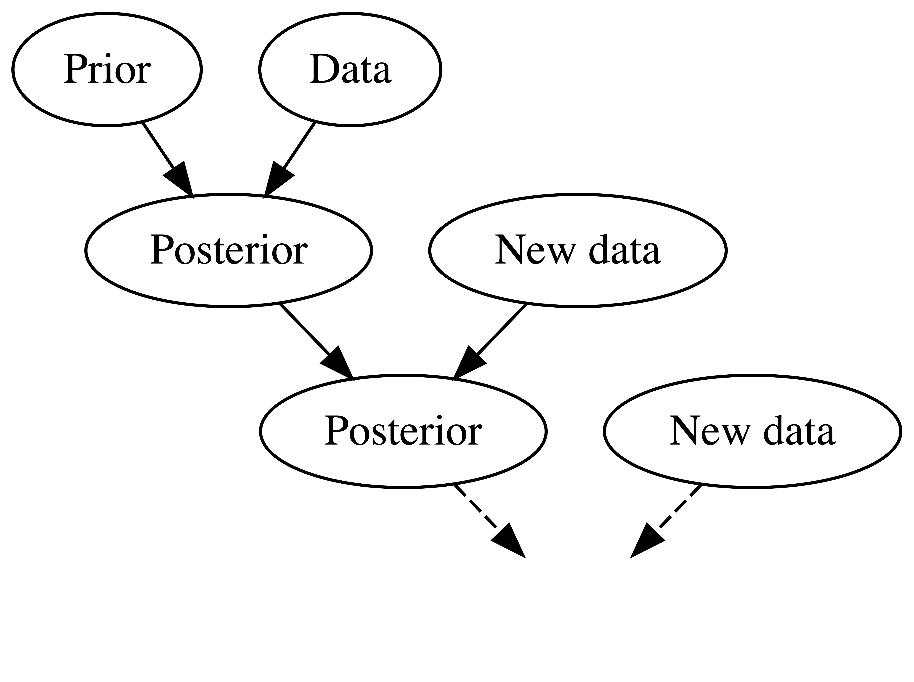
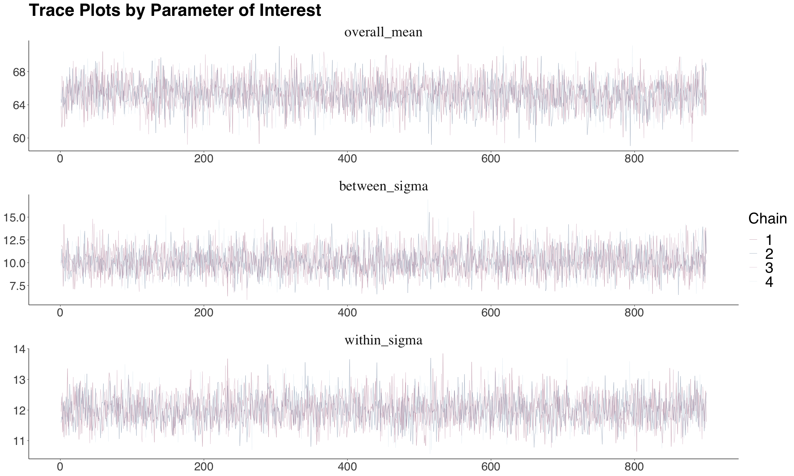
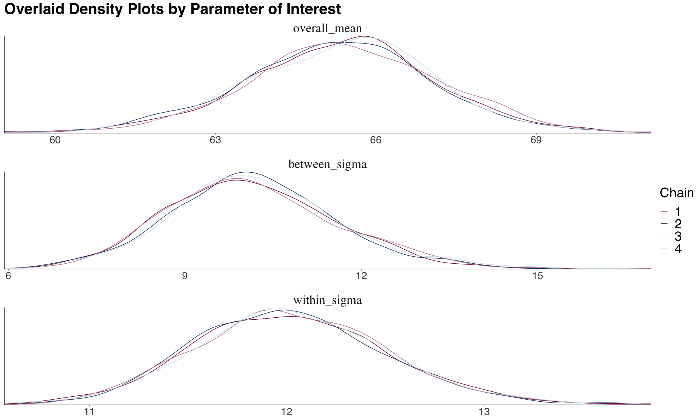
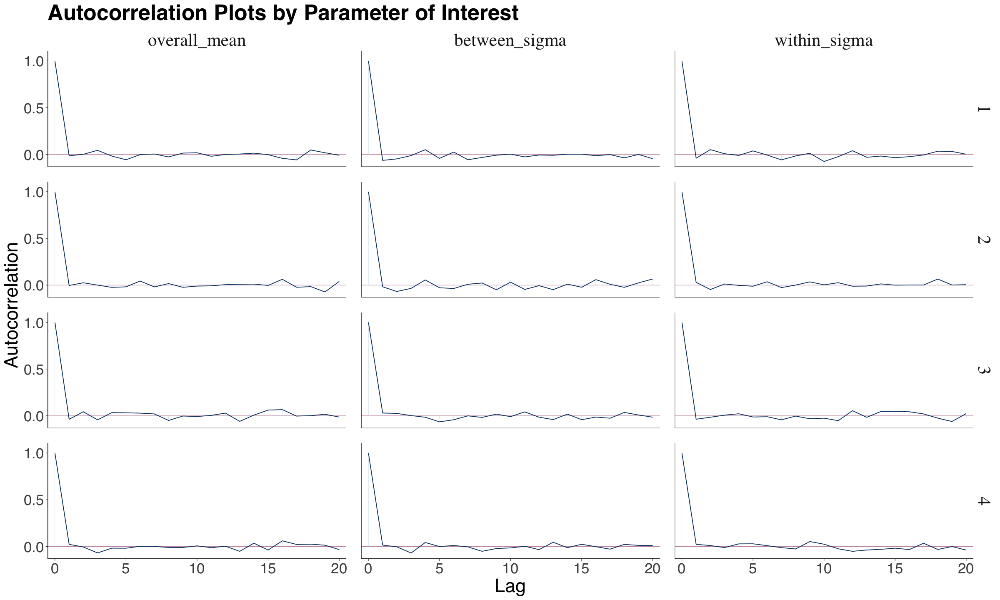
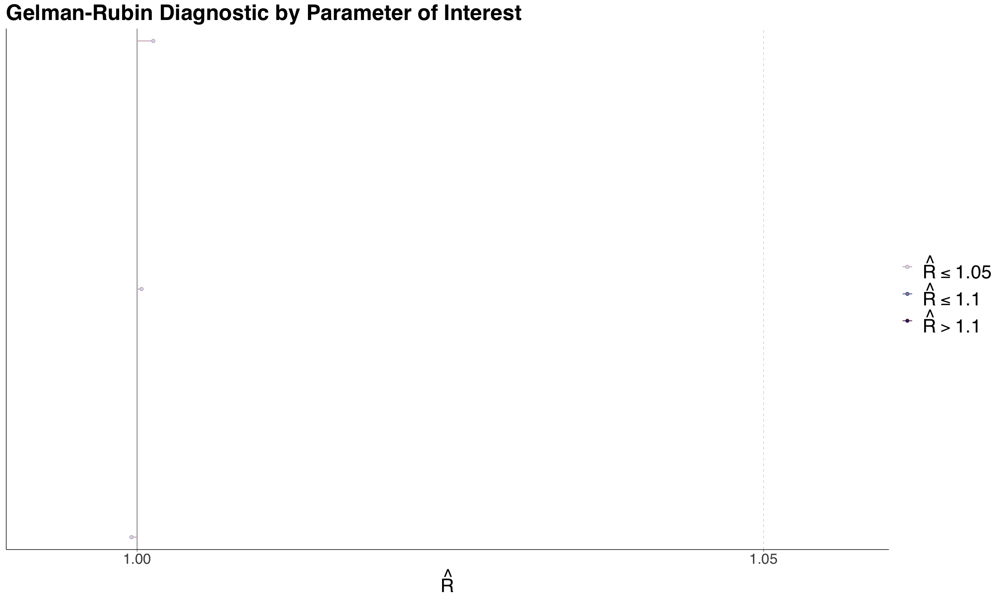

# Statistical Inference II

## Review of Frquentist Statistical Inference

Recall [DSCI 552: Statistical Interference I](https://mds.farrandi.com/block_2/552_stat_inter/552_stat_inter) and [Distribution Cheatsheet](https://pages.github.ubc.ca/MDS-2023-24/DSCI_553_stat-inf-2_students/notes/appendix-dist-cheatsheet.html)

- Use **Observed Data** (from random sample) to make **Inferences** about **Population Parameters**
  - e.g. $\mu$, $\sigma^2$, median, etc.
  - Find **Point Estimates** and **Confidence Intervals** for these parameters.
- **Latent Population vs. Observable Variables**
  - **Latent Population** is the population that we are interested in, but we can't observe it directly.
  - **Observable Variables** are the variables that we can observe directly.
  - e.g. Online ad click data to estimate the total lifetime revenue.

## Introduction to Bayesian Statistics

- Very flexible
  - Can handle: missing data, complex models, non-iid, etc.
- Valid inference for any (finite) amount of data
- The population parameters are treated as **random variables**
  - Easy to interpret uncertainty of the population parameters

---

$$\text{Posterier} \propto \text{Likelihood} \times \text{Prior}$$

- **Prior**: What we know about the parameter before we see the data (prior knowledge)
- **Likelihood**: How the data is generated given the parameter
- **Posterior**: What we know about the parameter after we see the data.
  - Good for _prediction, inference, and decision making_.

---

- **Recursive Updating**: As we get more data, we can update our prior to get a new posterior.



### Generative Models

- A simplified mathematical model for some reality (For both Frequentist and Bayesian)
- **Generative** because it can make synthetic data
- Examples:
  1. We can incorporate **noise in measurements** (e.g., outputs coming from the
     model).
  2. They can be **overly simplified models with incomplete measurements** (e.g., rainy day model).
  3. They can even incorporate **unobservable latent variables** (e.g., hypothetical tennis rankings).

### `Stan` and `rstan` Basics

- `Stan` is a probabilistic programming language for Bayesian inference
- `rstan` is an R interface to `Stan`
- List of common distributions in stan:
  - `bernoulli(theta)`
  - `bernoulli_logit(alpha)`
  - `binomial(n, theta)`
  - `beta_binomial(n, alpha, beta)`
  - `poisson(lambda)`
  - `neg_binomial(alpha, beta)`
  - `gamma_poisson(lambda, alpha)`

#### General Steps for Bayesian Modeling

1. Code the generative model in `Stan`
2. Specify observed values of data to estimate using `rstan`
3. Generate synthetic data from the model
4. Perform inference on the synthetic data
   - only data generated from the model is used for inference

_Note_: Generative model is all you need (and get).

### Likelihood Vs Probability

| Likelihood                                                                 | Probability                                                                       |
| -------------------------------------------------------------------------- | --------------------------------------------------------------------------------- |
| how plausible a given distributional parameter is given some observed data | chance that some outcome of interest will happen for a particular random variable |
| $P(\theta \| X = x)$                                                       | $P(X = x \| \theta)$                                                              |
| bounded to 0 and 1                                                         | unbounded to 0 and 1                                                              |

## Conditional Probability

$$P(A|B) = \frac{P(A \cap B)}{P(B)}$$

- $P(A^c|B) = 1 - P(A|B)$
- IF $A$ and $B$ are independent, then $P(A|B) = P(A)$
  - So $P(B|A) = P(B)$

## Bayes' Theorem

Let $\theta$ be a parameter of interest and $Y$ be the observed data.

- **Prior**: $P(\theta)$
  - $P(\theta^c) = 1 - P(\theta)$
- **Likelihood** of the data given the parameter:
  - $\ell(\theta|Y) = P(Y|\theta)$
- **Posterior** (what we want to find): $P(\theta|Y)$

$$P(\theta|Y) = \frac{P(Y|\theta)P(\theta)}{P(Y)}$$

$$\text{posterior} = \frac{\text{prior} \times \text{likelihood}}{\text{normalization constant}}$$

$$\text{posterior} \propto \text{prior} \times \text{likelihood}$$

- Once we have the **posterior**, we have everything we need to make decisions.

### Bayesian Inference

- **Properties**:
  1. Hidden variables of interest are random (prior distribution)
  2. Use **posterior** (conditional distribution of hidden variables given observation) to capture uncertainty
- E.g. posterior: $P(A|B) = 0.3$,
  - There is a 30% chance of $A$ if $B$ is true.

## Maximum a Posteriori Estimation (MAP) and Maximum Likelihood Estimation (MLE)

- MAP is a Bayesian approach to MLE

| MLE                                                               | MAP                                                               |
| ----------------------------------------------------------------- | ----------------------------------------------------------------- |
| Finding value that maximizes **likelihood**                       | Finding value that maximizes **posterior**                        |
| Only uses observed data                                           | Uses observed data and **prior**                                  |
| $\hat{\theta}_{\text{MLE}} = \text{argmax}_{\theta} P(D\|\theta)$ | $\hat{\theta}_{\text{MAP}} = \text{argmax}_{\theta} P(\theta\|D)$ |

## The Bayesian Modelling

- **Big advantage**:
  - It formulates every problem in one common framework
- **Final goal**: Take samples from the posterior distribution
- Computer does most of the heavy lifting
  - All we need to do is good model design and critical analysis of the results
- **Characteristics:**

### Big Idea

1. **Question**: Pose a scientific question
2. **Design**: Formulate variables and create a probabilistic model for them. **Prior knowledge** is included here!
3. **Inference**: Get **posterior** samples from the model
4. **Check**: If the samples are from your posterior
5. **Analyze**: Use the samples to answer the question

### Pose a Scientific Question

1. **Inferential**: Using observed data $Y$ to make inferences about the population/ latent variable $\theta$
2. **Predictive**: Using observed data $Y$ to make predictions about future data $Y'$

## Beta-Binomial Model

- One of the most foundational Bayesian models
- Recall $Posterior \propto Likelihood \times Prior$

  - **Binomial**: The likelihood function
    - $Y | \pi \sim Binomial(n, \pi) \text{ where } \pi \in [0,1]$
  - Bayesian thinking: $Y$ is a random variable (population parameters are no longer fixed)
  - **Beta**: Prior distribution of **parameter of interest** $\pi$
    - $\pi \sim Beta(a, b)$

### Beta Distribution (The Prior)

$$\pi \sim Beta(a, b)$$

- **PDF**: $f(\pi) = \frac{\Gamma(a + b)}{\Gamma(a)\Gamma(b)} \pi^{a - 1} (1 - \pi)^{b - 1} \text{  for  } 0 \leq \pi \leq 1$
- **Mean**: $\frac{a}{a + b}$
- **Variance**: $\frac{ab}{(a + b)^2(a + b + 1)}$
- **Mode**: $\frac{a - 1}{a + b - 2} \text{ when } a, b > 1$

### Choosing the right Beta Prior

- One of the biggest challenges in Bayesian statistics
- Need to rely on subject matter prior knowledge
- e.g. Collect information from previous studies and plot a histogram of the data, then fit a beta distribution to it

- `bayesrule` package in R has a function `summarize_beta_binomial(a, b)` to summarize the beta distribution

- PDF of binomial distribution:
  - $f(y | \pi) = \binom{n}{y} \pi^y (1 - \pi)^{n - y}$

### Bayes Rules in Action

$$ Posterior \propto Likelihood \times Prior $$

$$ f(\pi | Y) \propto f(Y | \pi) \times f(\pi) $$

using the beta-binomial model:

$$ f(\pi | Y) \propto \binom{n}{y} \pi^y (1 - \pi)^{n - y} \times \frac{\Gamma(a + b)}{\Gamma(a)\Gamma(b)} \pi^{a - 1} (1 - \pi)^{b - 1}$$

Simplify (remove non-$\pi$ terms):

$$ f(\pi | Y) \propto \pi^{y + a - 1} (1 - \pi)^{n - y + b - 1} $$

We recognize this as the **kernel of a beta distribution**:

$$ f(\pi | Y) \propto Beta(a + y, b + n - y) $$

- **Kernel**: The part of the expression that depends on the variable of interest

### Posterior Distribution

- **Posterior**: $f(\pi | Y) = Beta(a + y, b + n - y)$

  - **Mean**: $\frac{a + y}{a + b + n}$
  - **Variance**: $\frac{(a + y)(b + n - y)}{(a + b + n)^2(a + b + n + 1)}$
  - **Mode**: $\frac{a + y - 1}{a + b + n - 2}$
    - Mode is the value of $\pi$ that maximizes the posterior distribution/ peak (MAP/ Maximum A Posteriori)

- Can also use `summarize_beta_binomial(a, b, n, y)` to summarize the posterior distribution
  - `a` and `b` are the parameters of the prior beta distribution
  - `n` is the number of trials
  - `y` is the number of successes
- Can also use `plot_beta_binomial(a, b, n, y)` to plot the prior and posterior distributions (also from `bayesrule` package)

#### Posterior Credible Interval

- **Credible Interval**: Range of plausible values for the parameter.
  - Width: measures variability of the posterior distribution
- Use function `qbeta` in R to calculate the quantiles of the beta distribution
- For a given a,b,n,y, the 95% credible interval is `qbeta(c(0.025, 0.975), shape1 = a + y, shape2 = b + n - y)`
- **95% CI means**:
  - There is a 95% posterior probability that the true value of $\pi$ is between $L$ and $U$

## Designing the Model

- Bayesian model is a big joint probability distribution $P(Y, Y', \theta)$
  - Observations: $Y$
  - Latent variables: $\theta$
  - Predictions: $Y'$
- Did inferential approach in Beta-Binomial model (previous section). Now another approach:

$$P(Y, Y', \theta) = P(Y, Y' | \theta) \times P(\theta)$$

1. Generate $\theta$ from the **prior** $P(\theta)$
2. Generate $Y, Y'$ given $\theta$ from **likelihood** $P(Y, Y' | \theta)$

- **Constructing the Likelihood**:
  1. Formulate the data type (int, real, categorical, etc.) and support (positive, negative, etc.)
  2. Figure out which variables are fixed covariates and which are random variables
  3. Pick a distribution that match the type and support. The distribution will have some unknown parameters - need a prior for these parameters

## Markov Chain Monte Carlo (MCMC)

- **Goal**: Generate samples from the posterior distribution
- **Problem**: The posterior is often intractable (can't be solved analytically)
- **Solution**: Use MCMC to generate samples from the posterior

- **Monte Carlo Algorithm**
  - Need closed analytical form of the posterior $f(\theta | Y)$ (e.g. Beta-Binomial model or Gamma-Poisson model)
  - Build independent MC sample $\{\Theta_1, \Theta_2, \ldots, \Theta_n\}$ from $f(\Theta | Y)$ by:
    1. Drawing $\Theta_i$ from $f(\Theta | Y)$
    2. Go there
- Is a **random walk** in the space of $\theta$
- Called a Markov Chain because the next state depends only on the current state $\theta^{(t)} \rightarrow \theta^{(t+1)}$

### Metropolis-Hastings Algorithm

- Allows us to obtain an approximation of the posterior distribution $f(\Theta | Y)$ via MC $\{\Theta_1, \Theta_2, \ldots, \Theta_n\}$.
- Next $\Theta_{t+1}$ is selected by:
  1. Proposing a new value $\Theta'$ from a proposal distribution $q(\Theta' | \Theta_t)$ (e.g. Uniform, Normal, etc.)
  2. Decide whether to accept or reject $\Theta'$ based on acceptance probability $\alpha$:
     $$\alpha = min\left(1, \frac{f(\Theta') \ell(\Theta' | Y)}{f(\Theta_t) \ell(\Theta_t| Y)}\right)$$
     - Then obtain the next via bernoulli trial with probability $\alpha$ for success $\Theta^{(t+1)} = \Theta'$

### Sampling MCMC using rstan

- **Some considerations**:
  - **Warm-up**: Discard the first $n$ samples to allow the chain to converge
  - **Thinning**: Only keep every $n$th sample to reduce autocorrelation
    - skip the first $n$ samples and then keep every $n$th sample

$$\text{Num of approx posterior samples} = \frac{\text{iter} - \text{warmup}}{\text{thin}}$$

### Example: Gamma Poisson Model

- Prior: $\lambda \sim Gamma(s, r)$
- Likelihood: $Y_i | \lambda \sim Poisson(\lambda)$

$$\text{Posterior} \propto \text{Likelihood} \times \text{Prior}$$

$$f(\lambda | Y) \propto \ell(\lambda | Y) \times f(\lambda)$$

- Posterior: $\lambda | Y \sim Gamma(s + \sum Y_i, r + n)$
  </br>
- Our prior: $\lambda \sim Gamma(s=150, r=40)$

```r
{stan output.var='gamma_poisson_stan'}
data {
  int<lower=1> n; // number of rows in training data
  int<lower=0> count[n]; // array of observed counts (integer)
  real<lower=0> s; // prior shape Gamma parameter
  real<lower=0> r; // prior rate Gamma parameter

}

parameters {
  real<lower=0> lambda; // parameter of interest
}

model {
  lambda ~ gamma(s,r); // prior distribution of lambda
  count ~ poisson(lambda); // Poisson likelihood, can be complex formula too
}
```

```r
bird_dictionary <- list(
  n = nrow(observed_evidence),
  count = as.integer(observed_evidence$count),
  s = 150,
  r = 40
)

posterior_lambda <- sampling(
  object = gamma_poisson_stan,
  data = bird_dictionary,
  chains = 1,
  iter = 10000,
  warmup = 1000,
  thin = 5,
  seed = 553,
  algorithm = "NUTS"
)

posterior_lambda <- as.data.frame(posterior_lambda)
```

```r
library(ggplot2)
library(bayesplot)

# Plot the prior, likelihood, and posterior
plot <- plot_gamma_poisson(
    shape = 150, rate = 40,
    sum_y = sum(observed_evidence$count),
    n = nrow(observed_evidence),
)

# Plot the posterior distribution from stan
posterior_plot <- posterior_lambda %>%
  ggplot(aes(x = lambda)) +
  geom_histogram(aes(y = after_stat(count)),
                 bins = 30,
                 fill = "lightblue",
                 color = "black",
                 alpha = 0.5)
```

((See lab 2 for more examples))

## Bayesian Normal Linear Regression

- Comparable to OLS

### Example 1: `bikeshare` data

- This data is from `bayesrules` package in R.
- We want to consider the effects of `temp_feel` (numeric) and `weekend` (boolean) on `rides` (count).

---

For OLS would use Poisson regression since output is count data.

`lm(rides ~ temp_feel + weekend, data = bikeshare)`

---

#### Set up Priors

For Bayesian, we need to specify **priors** for the coefficients and the variance.

$$Y_i \sim \mathcal{N}(\beta_0 + \beta_1X_{i1} + \beta_2X_{i2}, \sigma^2)$$

where

- $X_{i1}$ is `temp_feel`
- $X_{i2}$ is `weekend`: 1 if weekend, 0 if not
- $\beta_0$ is the intercept ~ $Gamma(7.5, 1)$
- $\beta_1$ is the coefficient for `temp_feel` ~ $\mathcal{N}(0, 1000^2)$
- $\beta_2$ is the coefficient for `weekend` ~ $\mathcal{N}(0, 1000^2)$
- $\sigma^2$ is the variance ~ $IG(0.001, 0.001)$
  - Inverse Gamma distribution (popular for variance priors > 0)

#### MCMC Simulation

- Use `stan` to sample from the posterior distribution.

```r
{r bikerides_stan}

data {
  int<lower=0> n;                               // training sample size
  vector[n] y;                                  // response vector
  vector[n] x_1;                                // regressor 1 vector
  vector[n] x_2;                                // regressor 2 vector
  real pred_x_1;                                // fixed value for regressor 1
  real pred_x_2;                                // fixed value for regressor 2
}

parameters {
  real<lower=0> beta_0;                         // intercept with lower bound
  real beta_1;                                  // regression coefficient 1
  real beta_2;                                  // regression coefficient 2
  real<lower=0> sigma;                          // common standard deviation with lower bound
  }

model {
  beta_0 ~ gamma(7.5, 1);                       // alpha = 7.5 and beta = 1
  beta_1 ~ normal(0, 1000);                     // mu_b1 = 0 and sigma_b1 = 1000
  beta_2 ~ normal(0, 1000);                     // mu_b2 = 0 and sigma_b2 = 1000
  sigma ~ inv_gamma(0.001, 0.001);              // eta = 0.001 and lambda = 0.001
  y ~ normal(beta_0 + beta_1 * x_1 + beta_2 * x_2, sigma);
}
generated quantities {
  real y_pred = normal_rng(beta_0 + beta_1 * pred_x_1 + beta_2 * pred_x_2, sigma);
}
```

- `generated quantities` creates a posterior predictive distribution `y_pred` which takes into account:
  - **Posterior variablility** in the parameters (from joint posterior distribution of the parameters)
  - **Sampling variability** in the data (Each prediction should deviate from its posterior prediction) so add random noise
- It executes after obtaining the posterior samples for the parameters.

Then, in R need a dictionary to pass into stan.

```r
model_matrix <- as.data.frame(model.matrix(rides ~ temp_feel + weekend, data = bikeshare_data))
model_matrix

bikerides_dictionary <- list(
  n = nrow(bikeshare_data),
  y = bikeshare_data$rides,
  x_1 = bikeshare_data$temp_feel,
  x_2 = model_matrix$weekendTRUE,
  pred_x_1 = 75,
  pred_x_2 = 1
)
```

Now compile the `Stan` model:

```r
posterior_bikeshare <- stan(
  model_code = bikerides_stan,
  data = bikerides_dictionary,
  chains = 1,
  iter = 40000,
  warmup = 20000,
  thin = 60,
  seed = 553,
)

# view the posterior summary
round(summary(posterior_bikeshare)$summary, 2)[-6, c("mean", "sd", "2.5%", "97.5%")]
```

- The 2.5% and 97.5% quantiles are the 95% credible intervals.
  - If the interval **contains 0**, then the coefficient is **not significant**.
  - If the interval is **large**, then the model is **not very certain** about the coefficient (i.e. model is not capturing the right systematic component).
- There is also 2.5% and 97.5% quantiles for the `y_pred` which is the **posterior predictive distribution** for a 95% prediction interval.

## Bayesian Hypothesis Testing

- Using a Tinder example where we want to infer the prob of finding a partner if we use Tinder.
  - $X_i \sim \text{Bernoulli}(\pi)$ for each person $i$
    - $\pi$ is the probability of finding a partner
  - Prior: $\pi \sim \text{Beta}(a, b)$
  - Likelihood: $Y|\pi \sim \text{Binomial}(n, \pi)$
  - Posterior: $\pi|y \sim \text{Beta}(a', b') = \text{Beta}(a+y, b+n-y)$

### One-Sided Hypothesis Testing

- **Claim**: In any city like Vancouver, more than 15% of the single people who use the Tinder app will eventually find a partner.
  - **Null Hypothesis**: $\pi \leq 0.15$
  - **Alternative Hypothesis**: $\pi > 0.15$ (associated with the claim)
- In Bayesian, we use the _posterior_ and **get probability for each hypothesis** (unlike frequentist).
- Use `pbeta` function to get the probability
  - If posterior $Beta(a'=24, b'=192)$ from likelihood of 20 successes out of 200 trials
  - Then $H_0: P(\pi \leq 0.15 | y=20) = \int_0^{0.15} f(\pi | y=20) d\pi$
  - equal to `pbeta(0.15, 24, 192)`
    </br>
- In the Tinder example, we get 2 probabilities:
  - $P(H_0 | y=20) = P(\pi \leq 0.15 | y=20) = 0.957$
  - $P(H_a | y=20) = P(\pi > 0.15 | y=20) = 0.043$
- Can get **Posterior Odds** that $\pi > 0.15$ by dividing the two probabilities.

$$\text{Posterior Odds} = \frac{P(H_a | y=20)}{P(H_0 | y=20)} = \frac{0.043}{0.957} = 0.045$$

- **Interpretation**: For $y=20$, $\pi$ is 22 times($\frac{1}{0.045}$) more likely to be less than or equal to 0.15 compared to being greater than 0.15 using our **posterior model**.

### Bayes Factor

- Do the same for **prior odds**

$$\text{Prior Odds} = \frac{P(H_a)}{P(H_0)}$$

$$\text{Bayes Factor} = \frac{\text{Posterior Odds}}{\text{Prior Odds}}$$

- Bayes Factor = 1: Plausibility of $H_a$ stays the same even after new data
- Bayes Factor > 1: Plausibility of $H_a$ increases after new data
- Bayes Factor <br 1: Plausibility of $H_a$ decreases after new data

</br>

- If from MCMC, we cannot get analytical solution for Bayes Factor since no exact PDF to integrate.
- Can use `bayesfactor` package in R to get Bayes Factor.
  - **Solution:** Empirical cumulative distribution function (ECDF) of the posterior samples to approximate the posterior distribution. Use `ecdf` function in R.

### Two-Sided Hypothesis Testing

- Lets say we want to figure out: whether or not 15% of the single people who use the Tinder app will eventually find a partner (in any city like Vancouver)
  - $H_0: \pi = 0.15$
  - $H_a: \pi \neq 0.15$

$$P(\pi = 0.15 | y=20) = \int_{0.15}^{0.15} f(\pi | y=20) d\pi = 0$$

- Does not work since =0, so add a range of values (e.g. $\pm 0.10$)

  - $H_0: \pi \in [0.05, 0.25]$
  - $H_a: \pi \notin [0.05, 0.25]$

- Then find the **credible interval** for the posterior distribution of $\pi$.

```r
qbeta(c(0.025, 0.975), 24, 192)
```

Then based on the results:

- If **credible interval** falls within the range of $H_0$, then we are in favor of $H_0$, with 95% probability.

## Bayesian Binary Logistic Regression

- Comparable to [logistic regression](https://mds.farrandi.com/block_3/561_regression/561_regression#logistic-regression)

### The Likelihood

- Let $Y_i \in \{0, 1\}$
- Response is assumed as:
  $$Y_i | \beta_0 \beta_1 \sim \text{Bernoulli}(\pi_i) $$

with link function:

$$log(\frac{\pi_i}{1-\pi_i}) = \beta_0 + \beta_1 X_i$$

That is our likelihood.

### The Priors

- Parameter of interest: $\beta_0, \beta_1$
- Let us assume as follows:
  - $\beta_0 \sim N(\mu=0, \sigma^2=100^2)$
  - $\beta_1 \sim N(\mu=0, \sigma^2=100^2)$
- Assume 0 because we do not know if there is any association, also variace is high to reflect the uncertainty.

### Coding in Stan

#### Coding the Prior

- No need `warmup` and `thin` as it is only prior.

```r
prior_stan_climate_change <- "parameters {
real beta_0;
real beta_1;
}
model {
beta_0 ~ normal(0, 100);
beta_1 ~ normal(0, 100);
}"
```

```r
prior_climate <- stan(
  model_code = prior_stan_climate_change,
  chains = 1,
  iter = 1000,
  warmup = 0, # Can be 0 since it is only prior
  thin = 1, # No need to thin as well
  seed = 553
)
```

#### Coding the Posterior

```r
posterior_stan_climate_change <- "data {
int<lower=0> n;                          // number of observations
vector[n] income;                        // regressor income
int<lower=0,upper=1> climate_change[n];  // setting the response variable as binary
}
parameters {
real beta_0;
real beta_1;
}
model {
beta_0 ~ normal(0, 100);
beta_1 ~ normal(0, 100);
climate_change ~ bernoulli_logit(beta_0 + beta_1 * income);
}"
```

```r
climate_dictionary <- list(
  n = nrow(pulse_training),
  income = pulse_training$income,
  climate_change = as.integer(pulse_training$climate_change)
)

posterior_climate <- stan(
  model_code = posterior_stan_climate_change,
  data = climate_dictionary,
  chains = 1,
  iter = 21000,
  warmup = 1000,
  thin = 20,
  seed = 553
)
```

### Comparing Bayesian vs Frequentist BLR

| Frequentist BLR                                   | Bayesian BLR                         |
| ------------------------------------------------- | ------------------------------------ |
| Estimates the MLE (Maximum Likelihood Estimation) | Estimates the posterior distribution |
| Estimates the standard errors                     | Estimates the posterior distribution |
| Estimates the confidence intervals                | Estimates the credible intervals     |

- A big advantage of Bayesian: did not need to derive any Maximum Likelihood steps
- Meaning of Bayesian coefficients:
  - e.g. estimate of $\beta_1$ is 0.009, 95% credible interval is (0.005, 0.0134), since 0 is not in the posterior credible interval:
  - For each unit increase in income, a subject is 1.009 times more likely to believe in climate change
  - There is a 95% posterior probability that the true value of $\beta_1$ lies between 0.005 and 0.0134

## Complete Pooled Model

- **Complete Pooled Model**: A model that pools all the data together and estimates a single parameter for all the data
- e.g. have a dataset of multiple rocket types and their launchs, and want to estimate the probability of a rocket launch succeeding

  - Only 1 $\pi$ for all the rocket types

$$
\text{likelihood:} \qquad X_i|\pi \sim \text{Binomial}(n_i, \pi) \quad \text{for } i = 1, \dots, 367\\
\text{prior:} \qquad \pi \sim \text{Beta}(a = 1, b = 1).
$$

- Does not allow us to infer any probability of an individual group

## Non-pooled Model

- **Non-pooled Model**: A model that estimates a parameter for each group of data
- e.g. have a dataset of multiple rocket types and their launchs, and want to estimate the probability of a rocket launch succeeding
  - Have a $\pi_i$ for each rocket type

$$
\text{likelihood:} \qquad X_i|\pi_i \sim \text{Binomial}(n_i, \pi_i) \quad \text{for } i = 1, \dots, 367\\
\text{prior:} \qquad \pi_i \sim \text{Beta}(a = 1, b = 1).
$$

- Better when comparing groups with different sample sizes
  - Using MLE will not be reliable when sample sizes are small
  - e.g. Binomial distribution with $n=1$
- **Drawbacks**:
  - Cannot generalize to new groups
  - Cannot take valuable information from other groups

## Hierarchical Bayesian Model

- **Hierarchical Bayesian Model**: A model that estimates a parameter for each group of data, but also estimates a distribution of parameters for all the groups
- **Key feature**: Nesting of parameters over multiple levels
  - Common to have a variable in the model prior is itself a random variable (needs another prior)
    - Or a variable in the likelihood is itself a random variable (needs another prior)
- e.g. have a dataset of multiple rocket types and their launchs, and want to estimate the probability of a rocket launch succeeding
  - Have a $\pi_i$ for each rocket type
  - Also have random variables $\pi_i \sim \text{Beta}(a, b)$
    - $a$ and $b$ are parameters and no longer hyperparameters
    - new hyperparameters are the priors for $a$ and $b$

$$
\text{likelihood:} \qquad X_i|\pi_i \sim \text{Binomial}(n_i, \pi_i) \quad \text{for } i = 1, \dots, 367\\
\text{priors:} \qquad \pi_i \sim \text{Beta}(a, b) \\
\quad a \sim \text{Gamma}(0.001, 0.001) \\
\qquad b \sim \text{Gamma}(0.001, 0.001).
$$

- e.g2 dataset of number of freethrows made and attempts by a Basketball player for multiple seasons

  - Good because can predict free throw percentage for a new season
  - Have a $n_i$ as number of attempts that season and $\pi_i$ is free throw percentage for that season

  $$
  \text{likelihood:} \qquad X_i|\pi_i \sim \text{Binomial}(n_i, \pi_i) \quad \text{where i=season number}\\
  \text{prior:} \qquad \pi_i \sim \text{Beta}(a,b) \\
  \quad a \sim \text{Gamma}(0.001, 0.001) \\
  \qquad b \sim \text{Gamma}(0.001, 0.001).
  $$

- Basically **combines the best** of of the complete pooled model and the non-pooled model:
  - Use valuable info from all groups to infer the success probability of a specific group
  - Can get posterior predictive distribution for new group

### Why Gamma Prior?

- For the $a$ and $b$ we need continous and non-negative priors
- Hence, we use the Gamma distribution
  \_ this tends to assign **small values** to $a$ and $b$ which is good for the prior

### Why will the estimates be more precise?

- Using Heirarchical Bayesian, we will get narrower Credible Intervals compared to the non-pooled model
- **Borrowing Strength**: The estimates will be more precise because we are using information from all the groups
  - In the case of rockets, its the $a$ and $b$ that are being shared
- Helps learn parameters and reduce posterior variance

### Get Success for all Groups

- Use posterior means of $a$ and $b$ to get the posterior means of $\pi_i$ for all groups (in rocket example)

### Prediction for New Group

- In Stan, need to add a new block `generated quantities` to get the posterior predictive distribution for a new group

```stan
generated quantities {
  real<lower=0,upper=1> pi_pred = beta_rng(a, b);
}
```

- This generates a new $\pi$ for a new group from the posterior distribution of $a$ and $b$
- Mean of `pi_pred` (new group) is similar to the posterior mean of $\pi$ for all groups
  - because it is the best bayesian model we can obtain without further covariates/ features

## MCMC Diagnostics

- Common pitfalls of MCMC:
  - Not enough iterations
  - Not enough thinning
    - To make it semi-independent
  - Not enough burn-in
- Diagnostic to check if MCMC work and is giving "good" samples for the approx posterior dist

### Trace Plots

- Illustrate posterior sampling by a chain.
- All chains are overlaid on top of each other (without warm-up)
- Ideal:
  - No trend
  - No chain stuck in a local mode

```r
library(bayesplot)

traceplot <- mcmc_trace(mcmc_object,
                        pars = c("param1", "param2"),
                        size = 0.1,
                        facet_args = list(nrow = 3))
```



_Good example of no trend and no chain stuck in a local mode_

### Emperical Density Plots

- Overlays the density plot of the parameter of interest with the MCMC posterior samples.

```r
library(bayesplot)

densityplot <- mcmc_dens_overlay(mcmc_object,
                         pars = c("param1", "param2"),
                         facet_args = list(nrow = 3))
```



### Effective Sample Size (ESS)

- $N_{eff}$: Number of **independent** samples needed to give an accurate MCMC posterior approximation.
- Let $N$ be the length of the chain, then we expect:

  - $N_{eff} \leq N$ is normal and expected
  - $N_{eff} \approx N$ is ideal

- Compare with ratio of $N_{eff}/N$:
  - If $N_{eff}/N > 1$, Means need **more** samples to be as good as Monte Carlo simulation
    - Can increase iter OR increase thinning
  - If $N_{eff}/N < 1$, Means need **less** samples to be as good as Monte Carlo simulation
    - Can decrease iter OR decrease thinning

```r
library(bayesplot)

eff_sample_size <- neff_ratio(mcmc_object,
                    pars = c("param1", "param2"))

essplot <- mcmc_neff(eff_sample_size, size = 2)
```


### Autocorrelation Plots

- MCMC is not entirely independent, so we need to check the autocorrelation of the chain
- Want to see the autocorrelation drop to 0 quickly => shows semi-independence
  - Ideally before lag 5

```r
library(bayesplot)

acf <- mcmc_acf(mcmc_object,
                pars = c("param1", "param2"))
```



### Gelman-Rubin Diagnostic

- Evaluate within-chain and between-chain variance to check if they are roughly the same
- warning: Sometimes does not make sense for discrete variables

$$ \hat{R} = \sqrt{ 1 + \frac{b^2}{s^2} } \approx 1 $$

- $b^2$: Between-chain variance
- $s^2$: Within-chain variance

```r
library(bayesplot)

gelman_rubin <- mcmc_rhat(mcmc_object, size = 2)
```


