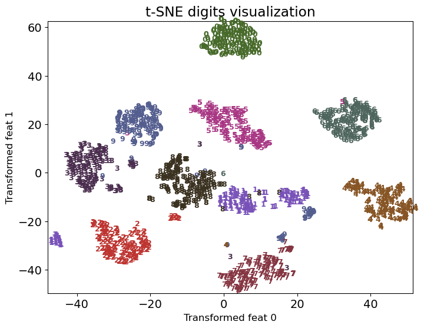

# Unsupervised Learning

## Unsupervised Learning Introduction

- Type of machine learning algorithm used to draw inferences from datasets consisting of input data **without labeled responses**

- Examples:
  - Clustering
  - Dimensionality Reduction

## K-Means Clustering

### Clustering Motivation

- Labeling data is expensive and time-consuming
- Clustering is a way to group based on similarity
  - Can get a sense of the structure of the data without labeled responses
- **Clustering**: Task of partitioning data into groups called clusters based on similarity
- Goal:
  - Points in the same cluster should be as similar as possible
  - Points in different clusters should be as different as possible
- Can have multiple different clusters in the same dataset
  - e.g. in dataset of food can have clusters of:
    - appetizers, main courses, desserts
    - cuisines
    - healthy vs unhealthy

---

**Comparisons with kNN**:
| k-Means | k-Nearest Neighbors |
| ------- | -------------------- |
| Unsupervised | Supervised |
| Clustering | Classification |
| Parametric | Non-parametric |
| k = number of clusters | k = number of neighbors |

---

#### Common Applications

1. Data Exploration
   - Summarize/ compress data
   - Partition data into groups
2. Customer Segmentation
   - Group customers based on purchasing behavior
   - Target marketing
3. Document Clustering
   - Group similar documents together
   - Topic modeling
     Other applications: Medical imaging, Anomaly detection, Image segmentation, Inputting missing data, data compression, etc.

### K-Means

- One of the most popular clustering algorithms
- Simple and easy to implement
- **Basic Algorithm**:
  1. Randomly initialize $K$ centroids
  2. Assign each data point to the nearest centroid
  3. Update the centroids to the mean of the data points assigned to it
  4. Repeat steps 2 and 3 until convergence
- **Properties**:
  - Will always converge (not necessarily to the right answer)
  - Sensitive to intialization
  - Terminates when centroids do not change
  - Makes _linear_ decision boundaries
  - **MUST SCALE DATA** before applying K-means
    - Because K-means uses distance
    - If features are on different scales, the clustering will be biased towards the features with larger scales

---

- **Input**:
  - $X$: Set of $n$ data points
  - $K$: Number of clusters
- **Output**:
  - $K$ clusters with centroids $\mu_1, \mu_2, \ldots, \mu_K$

```python
from sklearn.cluster import KMeans

kmeans = KMeans(n_clusters=3, n_init='auto')
kmeans.fit(X); # only need X

kmeans.labels_ # cluster assignments
kmeans.cluster_centers_ # cluster centroids
kmeans.predict(new_data) # predict cluster for new data
```

#### Choosing K

- K is a hyperparameter
  - As K increases -> smaller clusters
- No perfect way to choose K

1. **Elbow Method**:


- Specific to k-means
- $\text{Inertia} = \text{sum of intra-cluster distances}$
  - Sum of centroid to point distances of all points in the cluster of all clusters $\sum_{i=1}^{K} \sum_{x \in C_i} ||x - \mu_i||^2$
- Inertia decreases as K increases, until it reaches 0 when K = n
- Plot inertia vs K
  - Elbow point: point where inertia starts to decrease more slowly
- Choose K at elbow point

```python
from yellowbrick.cluster import KElbowVisualizer

 model = KMeans(n_init='auto')
 visualizer = KElbowVisualizer(model, k=(1, 10))

 visualizer.fit(XX)  # Fit the data to the visualizer
 visualizer.show();
```

2. **Silhouette Score**:
   

- **Not dependent on cluster centers** -> can be used to compare different clustering algorithms
- Gets worst as K increases, since being closer to neigouring clusters
  $$\text{Silhouette Score} = \frac{b - a}{\max(a, b)}$$

- $a$: Mean distance between a sample and all other points in the same cluster
- $b$: Mean distance between a sample and all other points in the next nearest cluster
- Range: $[-1, 1]$
  - **1**: Object is well matched to its own cluster and poorly matched to neighboring clusters (BEST)
  - **0**: Object is not matched to its own cluster and might be better in neighboring clusters
  - **-1**: Object is poorly matched to its own cluster and well matched to neighboring clusters (WORST)

```python
from yellowbrick.cluster import SilhouetteVisualizer

model = KMeans(2, n_init='auto', random_state=42)
visualizer = SilhouetteVisualizer(model, colors="yellowbrick")
visualizer.fit(XX)  # Fit the data to the visualizer
visualizer.show();
```

- **y-axis**: Sample number (similar thickness = balanced cluster sizes)
- **x-axis**: Silhouette score

## Gaussian Mixture Models (High-Level Overview)

- **Motivation**:
  - K-means makes _linear_ decision boundaries
  - GMMs can have more flexible cluster shapes


```python
from sklearn.mixture import GaussianMixture

gmm = GaussianMixture(n_components=3, covariance_type='full')

gmm.fit(X_train)
gmm_labels = gmm.predict(X_train)

# Get values
gmm.means_ # cluster means (size: K x n_features)
gmm.covariances_ # cluster covariances (size: K x n_features x n_features)
gmm.weights_ # cluster weights (size: K)
```

- `covariance_type`:
  - `full`: Each component has its own general covariance matrix
    - size: $K \times n\_features \times n\_features$
  - `tied`: All components share the same general covariance matrix
    - size: $n\_features \times n\_features$
  - `diag`: Each component has its own diagonal covariance matrix
    - size: $K \times n\_features$
  - `spherical`: Each component has its own single variance
    - size: $K$

### How GMMs Work

$$P(x) = \sum_{k=1}^{K} \pi_k \mathcal{N}(x | \mu_k, \Sigma_k)$$

- $P(x)$: Probability of observing $x$
- $\pi_k$: Weight of the $k$th Gaussian (between 0 and 1)
- $k$: Number of clusters
- $\mathcal{N}(x | \mu_k, \Sigma_k)$: Gaussian distribution with mean $\mu_k$ and covariance $\Sigma_k$

  <br/>

- **Generative Model**: models the probability of a data point being generated from the mixture of Gaussians
- The generative story of the model assumes that each data point in the dataset is generated from one of the Gaussian components
  - Choose $k$ with probability $\pi_k$
  - Generate data point from $\mathcal{N}(x | \mu_k, \Sigma_k)$
- **High Level Algorithm** (non-convex optimization):
  1. Initialize $\pi_k, \mu_k, \Sigma_k$ (sensitive to init, can init with k-means)
  2. E-step: Compute the probability of each data point belonging to each cluster
  3. M-step: Update $\pi_k, \mu_k, \Sigma_k$ to maximize the likelihood of the data
  4. Repeat steps 2 and 3 until convergence
- Under the hood, GMMs use the **Expectation-Maximization (EM)** algorithm.
  - Basic idea: treat cluster assignments as hidden variables and iteratively update them
  - **E-step**: for each point, compute the probability of it belonging to each cluster
  - **M-step**: for each cluster, update the parameters to maximize the likelihood of the data
- **Other Properties**:
  - Can constrain the covariance matrix
  - Number of clusters is a hyperparameter and has a significant impact on the model

## DBSCAN

- Density-Based Spatial Clustering of Applications with Noise
- **Idea**: Clusters are dense regions in the data space, separated by low-density regions
- Addresses K-Means' weaknesses:
  - No need to specify number of clusters
  - Can find clusters of arbitrary shapes
  - Can identify points that don't belong to any cluster (points don't have to belong to any cluster, label = `-1`)
  - Initialization is not a problem
- Comparison to K-means:
  - does not have to assign all points to clusters
  - no `predict` method unlike K-means
  - non-parametric

| Pros                                  | Cons                                          |
| ------------------------------------- | --------------------------------------------- |
| Can find clusters of arbitrary shapes | cannot predict new data                       |
| Can detect outliers                   | Needs tuning of 2 non-trivial hyperparameters |

- **DBSCAN Failure Cases**:
  - Different densities of clusters

```python
from sklearn.cluster import DBSCAN

dbscan = DBSCAN(eps=0.5, min_samples=5)
dbscan.fit(X)

dbscan.labels_
```

- `eps` (default=0.5): maximum distance between two samples for one to be considered as in the neighborhood of the other.
- `min_samples` (default = 5): number of samples in a neighborhood for a point to be considered as a core point

### How DBSCAN works

- **Kinds of points**:

  - **Core point**: A point that has at least `min_samples` points within `eps` of it
  - **Border point**: A point that is within `eps` of a core point, but has less than `min_samples` points within `eps` of it
  - **Noise point**: A point that is neither a core point nor a border point

- **Algorithm**:
  - randomly pick a point that has not been visited
  - Check if it's a core point
    - See `eps` distance around the point if there are `min_samples` points
  - If yes, start a cluster around this point
  - Check if neighbors are core points and repeat
  - Once no more core points, pick another random point and repeat

### Evaluating DBSCAN Clusters

1. Silhouette Method
   - Cannot use elbow method because no centroids

```python
from yellowbrick.cluster import SilhouetteVisualizer

model = DBSCAN(eps=0.5, min_samples=5)
model.fit(X)

# Silhoutte is designed for k-means, so we need to do this
n_clusters = len(set(model.labels_))
dbscan.n_clusters = n_clusters
dbscan.predict = lambda x: model.labels_

visualizer = SilhouetteVisualizer(dbscan, colors='yellowbrick')
visualizer.fit(X)
visualizer.show()
```

## Hierarchical Clustering

- Hard to decide how many clusters
  - So get complete picture of similarity between points then decide
- **Main idea**:
  - Start with each point as a cluster
  - Merge the closest clusters
  - Repeat until only a single cluster remains (n-1 steps)
- Visualized as a `dendrogram`

```python
from matplotlib import pyplot as plt
from scipy.preprocessing import StandardScaler
from scipy.cluster.hierarchy import dendrogram, ward

X_scaled = StandardScaler().fit_transform(X)

linkage_array = ward(X_scaled) # see below for linkage criteria

# Plot the dendrogram
ax = plt.subplot()
dendrogram(linkage_array, ax=ax, color_threshold=3)
```

### Dendrogram


- **x-axis**: data points
- **y-axis**: distance between clusters
- Is a tree like plot
  - New parent node for each 2 clusters that are merged
- Length of the vertical line at the point of merging is the distance between the clusters

### Linkage Criteria

- Linkage Criteria determines how to find similarity between clusters
- **Single Linkage**:
  - Merge smallest **min** distance between points in two clusters
  - Can lead to chaining
  - `scipy.cluster.hierarchy.single`
- **Complete Linkage**:
  - Merge smallest **max** distance between points in two clusters
  - Can lead to crowding (tight clusters)
  - `scipy.cluster.hierarchy.complete`
- **Average Linkage**:
  - Merge smallest **mean** distance between points in two clusters
  - `scipy.cluster.hierarchy.average`
- **Ward's Method**:
  - Minimizes the variance of the clusters being merged
  - Leads to equally sized clusters
  - `scipy.cluster.hierarchy.ward`

### Simplifying the Dendrogram

1. **Truncation**:

   - `scipy.cluster.hierarchy.dendrogram` has a `truncate_mode` parameter
   - Two levels:

     - `lastp`: show last p merged clusters (only p nodes are shown)
     - `level`: level is all nodes with `p` merges from the root


2. **Flatten**
   - Directly cut the dendogram at certain condition (e.g. distance or max number of clusters)

```python
from scipy.cluster.hierarchy import fcluster

# 3 is the max distance
hier_labels = fcluster(linkage_array, 3 , criterion='distance')

# Based on max number of clusters (4 max clusters)
hier_labels = fcluster(linkage_array, 4 , criterion='maxclust')
```

## Principal Component Analysis (PCA)

### Dimensionality Reduction Motivation

- **Curse of Dimensionality**
  - As the number of dimensions increases, the volume of the space increases so fast that the available data become sparse
- **Data Visualization**
  - It is difficult to visualize data in high dimensions
- **Computational Efficiency**
  - Many algorithms are computationally infeasible in high dimensions

### PCA Overview

- **Goal**
  - Find a low-dimensional representation of the data that captures as much of the variance as possible
- **Approach**
  - Find the lower dimension hyperplane that minimizes the reconstruction error
  - Model is the best-fit hyperplane

### PCA Terminology

$$X = ZW$$

$$(n \times d) = (n \times k) \cdot (k \times d)$$

Usually $k << d$

- $X$: original data, ($n \times d$)
- $Z$: coordinates in the lower dimension, ($n \times k$)
- $W$: lower dimension hyperplane, ($k \times d$)
  - $W$ is the principal components
  - Rows of $W$ are orthogonal to each other

Can **reconstruct** the original data with some error:

$$\hat{X} = ZW$$

_Note_: if $k = d$, then $Z$ is not necessarily $X$ but $\hat{X} = X$ (Frobenius norm)

- **Objective/ Loss Function**:
  - Minimize reconstruction error $\|ZW - X\|_F^2$
    - Frobeinus norm $||A||_F = \sqrt{\sum_{i=1}^m \sum_{j=1}^n a_{ij}^2}$
  - NOT the same as least squares
    - LS is vertical distance, PCA is orthogonal distance

### PCA Math

- Singular Value Decomposition (SVD)

  $$A = USV^T$$

  - $A$: original data, ($n \times d$)
  - $U$: **left singular vectors**, ($n \times n$)
    - orthonormal columns $U_i^TU_j = 0$ for all $i \neq j$
  - $S$: **diagonal matrix** of singular values, ($n \times d$)
    - square root of **eigenvalues** of $A^TA$ or $AA^T$
    - corresponds to the variance of the data along the principal components (in decreasing order)
  - $V$: **right singular vectors**, ($d \times d$)
    - orthonormal columns (**eigenvectors**)
    - principal components (get the first $k$ columns)

- For dimensionality reduction, we can use the first $k$ columns of $U$ and the first $k$ rows of $V^T$ (equal to first $k$ columns of $V$)

- **PCA Algorithm**

  1. Center the data (subtract the mean of each column)
  2. Compute the SVD of the centered data to get the principal components $W$.
     - $W$ is the first $k$ columns of $V$
  3. Variance of each PC is the square of the singular value $s_i^2$
  4. Drop the PCs with the smallest variance

- **Uniquess of PCA**

  - PCA are not unique, similar to eigenvectors
  - Can add constraints to make it closer to unique:
    - Normalization: $||w_i|| = 1$
    - Orthogonality: $w_i^Tw_j = 0$ for all $i \neq j$
    - Sequential PCA: $w_1^Tw_2 = 0$, $w_2^Tw_3 = 0$, etc.
  - The principal components are unique up to sign

### Choosing Number of Components

- No definitive rule
- Can look at:
  - Explained variance ratio
  - Reconstructions plot

```python
from sklearn.decomposition import PCA
pca = PCA()
pca.fit(samples)

# Plot the explained variances
plt.plot(np.cumsum(pca.explained_variance_ratio_))
```

### PCA and Multicollinearity

- PCA can be used to remove multicollinearity
- **Concept**: the principal components are orthogonal to each other so they should not be correlated

### PCA Applications

1. **Data Compression**
   - Can use the first $k$ principal components to represent the data
2. **Feature Extraction**
   - Can use the first $k$ principal components as features
3. **Visualization of High-Dimensional Data**
   - Can visualize the data in 2D or 3D by using the first 2 or 3 principal components
4. **Dimensionality Reduction**
5. **Anomaly Detection**
   - Can use the reconstruction error to detect anomalies/ outliers (if the error is too large)
   - Outliers = high reconstruction error

### PCA in Python

```python
from sklearn.decomposition import PCA
from sklearn.preprocessing import StandardScaler
from sklearn.pipeline import make_pipeline

pca = PCA(n_components=2)
pipeline = make_pipeline(StandardScaler(), pca)

# Fit the pipeline to 'samples'
Z = pipeline.fit_transform(samples)
X_hat = pipeline.inverse_transform(Z)

# Get the principal components
print(pca.components_)
```

### K-means and PCA

- PCA is a generalization of K-means
- K-means is a special case of PCA where the principal components are the cluster centers
- K-means each example is expressed with only one component (one-hot encoding) but in PCA it is a linear combination of all components

## LSA (Latent Semantic Analysis)

- Do not center the data and just use SVD
- Useful for sparse data (e.g. text data in a bag-of-words model)
- It is also referred to as **Latent Semantic Indexing (LSI)**
- `TruncatedSVD` in `sklearn` is used for LSA

```python
from sklearn.decomposition import TruncatedSVD
from sklearn.feature_extraction.text import CountVectorizer
from sklearn.pipeline import make_pipeline

lsa_pipe = make_pipeline(CountVectorizer(stop_words='english'),
                             TruncatedSVD(n_components=2))

lsa_transformed = lsa_pipe.fit_transform(df['text'])
```

## NMF (Non-Negative Matrix Factorization)

- Useful for when data is created with several independent sources
  - e.g. music with different instruments
- **Properties**:
  - Coefficients and basis vectors (components) are **non-negative**
    - Unlike in PCA you can subtract, e.g. $X_i = 14W_0 - 2W_2$
    - Since cannot cancel out => **more interpretable**
  - Components are neither orthogonal to each other nor are they sorted by the variance explained by them
  - Data is not centered
  - Will get **different results for different number of components**
    - `n_components=2` will point at extreme, `n_components=1` will point at mean
    - Unlike PCA, where first component points at the direction of maximum variance regardless of the number of components
  - Slower than PCA

## Comparison of PCA, LSA, and NMF

| Differenciating Feature | PCA                                                 | NMF                                               | LSA                                                            |
| ----------------------- | --------------------------------------------------- | ------------------------------------------------- | -------------------------------------------------------------- |
| Primary Use             | Dimensionality reduction, feature extraction        | Feature extraction, source separation             | Dimensionality reduction, semantic analysis                    |
| Data types/ constraints | Linear data, centered data                          | Non-negative data, non-centered data              | Sparse data (e.g., text data), not centered                    |
| Output components       | Orthogonal components, sorted by variance explained | Non-negative components, not orthogonal or sorted | Components from SVD, not necessarily orthogonal or sorted      |
| Interpretability        | Less interpretable due to orthogonality             | More interpretable due to non-negativity          | More interpretable, particularly in semantic analysis contexts |

## Word Embeddings

- **Motivation**: You can understand a word by the context/company it keeps.

### Introduction

- Standard approach: put words in vector space and the distance between words is the similarity between them.


- `word2vec` is unsupervised/ semi-supervised learning because:
  - closely related to dimensionality reduction + extracting meaninggful representation from raw data
  - do not need any labeled data
  - running text is used as supervision signal

### Word Representation

- **One-hot representation**:
  - Simplest way to represent a word
  - OHE vector is a vector of all 0s except for a 1 at the index of the word in the vocabulary
    - rows = words in sentence, columns = words in vocabulary
  - **Disadvantages**:
    - High dimensionality
    - No notion of similarity between words (dot product = 0)
    - No notion of context
- **Term-term co-occurrence matrix**:
  - A matrix where each row and column corresponds to a word in the vocabulary
  - The value in the i-th row and j-th column is the number of times word i and word j appear together in a context window
    - **Context window**: a fixed-size window that slides over the text (e.g. window size = 2 means 2 words to the left and 2 words to the right)
  - **Disadvantages**:
    - High dimensionality
    - Sparse
    - Does not capture polysemy (multiple meanings of a word)


#### Dense Word Representations

- Term-term co-occurrence matrix is sparse and high-dimensional
- Better to learn short and dense vectors for words
  - Easier to store and train
  - Better generalization
- Approaches:
  - **Latent Semantic Analysis (LSA)**: Use SVD to reduce the dimensionality of the term-term co-occurrence matrix
    - Works better for small datasets compared to word2vec
  - **Word2Vec**: Use neural networks to learn word embeddings

#### Word2Vec

- Create **short and dense** word embeddings using neural networks
- **Idea**: Predict the context of a word given the word itself
  - **Skip-gram**: Predict the context words given the target word
  - **Continuous Bag of Words (CBOW)**: Predict the target word given the context words
- Two moderately efficient training algorithms:
  - **Hierarchical softmax**: Use a binary tree to represent all words in the vocabulary
  - **Negative sampling**: Treat the problem as a binary classification problem

##### word2vec: Skip-gram

- Predict the context words given the target word
- NN to obtain short and dense word vectors
- **Architecture**:


- **Input layer**: one-hot encoded vector of the target word (size = $V \times 1$)

  > $W$ = input layer to hidden layer weights (size = $V \times d$)
  > $\text{hidden} = W^T \times \text{input}$

- **Hidden layer**: linear transformation (no activation function) to obtain the word vector (size = $d \times 1$)

  > $W_c$ = hidden layer to output layer weights (size = $V \times d$)
  > $\text{output} = W_c \times \text{hidden}$

- **Output layer**: softmax layer to predict the context words (size = $V \times 1$)

  - Returns a one-hot encoded vector of the context word

- The dense representation of the word:
  - $W$: **word embedding matrix** (size = $V \times d$)
    - This is the main output of the algorithm
  - $W_c$: shared context embedding matrix (size = $V \times d$)
- Train multiple target+context pairs until the weights converge
  </br>
- **Example**:
  - "Add freshly _squeezed_ [pineapple] _juice_ to your smoothie.
    - Target word: pineapple
    - NN outputs probability distribution of context words: {squeezed, juice}

###### Skip-Gram Objective Function

$$\arg \max\limits_\theta \prod\limits_{(w_c,w_t) \in D} P(w_c|w_t;\theta) \approx \prod\limits_{(w_c,w_t) \in D} \frac{e^{w_c.w_t}}{\sum\limits_{\substack{c' \in V}} e^{w_{c'}.w_t}}$$

- **Want to get the context word with the highest probability given the target word**
- $w_t$ &rarr; target word
- $w_c$ &rarr; context word
- $D$ &rarr; the set of all target and context pairs from the text
- $P(w_c|w_t;\theta)$ &rarr; probability of context word given the target word
- **Assumption**: maximizing this objective would lead to good word embeddings

###### Hyperparameters

- Dimensionality of word vectors ($d$)
- Window size:
  - Small window size: captures more syntactic information (e.g. verb-noun relationships)
  - Large window size: captures more semantic information (e.g. country-capital relationships)

#### Pre-trained Word Embeddings

- [word2vec](https://code.google.com/archive/p/word2vec/)
- [wikipedia2vec](https://wikipedia2vec.github.io/wikipedia2vec/pretrained/): for 12 languages
- [GloVe](https://nlp.stanford.edu/projects/glove/): based on GloVe algorithm (Stanford)
- [fastText pre-trained embeddings for 294 languages](https://fasttext.cc/docs/en/pretrained-vectors.html)

#### Success of word2vec

- Can do analogy tasks

  - e.g. man to king as women to (queen)
  - **MAN : KING :: WOMAN : ?**
  - solce by: $\vec{X} = \vec{\text{KING}} − \vec{\text{MAN}} + \vec{\text{WOMAN}}$

- There are some biases in the word embeddings because they are trained on biased data


### Other Word Embeddings

#### FastText

- NLP library by Facebook research
- Includes an algorithm which is an extension to word2vec
- Helps deal with unknown words elegantly
- Breaks words into several n-gram subwords
- Example: trigram sub-words for berry are ber, err, rry
  - Embedding(berry) = embedding(ber) + embedding(err) + embedding(rry)

#### gloVe (Global Vectors for Word Representation)

- Starts with the co-occurrence matrix
  - Co-occurrence can be interpreted as an indicator of semantic proximity of words
- Takes advantage of global count statistics
- Predicts co-occurrence ratios
- Loss based on word frequency

## Word Embedding Applications

- Using word embeddings for various ML (NLP) tasks
- Before using it for application, need to **evaluate quality** of word embeddings:
  - Examine a number of word pairs for similarity scores (use TOEFL MCQ dataset)
  - Examine different analogies for stereotypes and biases they encode
  - Visualize embeddings in two dimensions

### Document Similarity and Text Classification

- **Motivation**: You can understand a document by the context/company it keeps.
- Assuming we have reasonable representations of words, we can represent a paragraph/ document as:
  1. Average embeddings
  2. Concatenate embeddings

#### Averaging Embeddings

- Do it with `spacy`
- We do not necessarily get expected representation of text
  - e.g. "Machine Learning" and "Learning Machine" will have same representation
- For long sentences or documents, this can get very noisy (mix of different signals)

```python
import spacy
nlp = spacy.load('en_core_web_md')

nlp("empty").vector[0:10] # access word vector

doc = nlp("I like apples and oranges")
doc_vec = doc.vector # shape (300,)

doc2 = nlp("I like bananas and grapes")
doc.similarity(doc2) # check similarity by averaging word vectors
```

#### Concatenating Embeddings

- `spacy`'s `mlp.pipe()` takes iterable of texts and returns an iterable of `Doc` objects.

```python
X_train_embeddings = pd.DataFrame([text.vector for text in nlp.pipe(X_train)]) # shape (n, 300)
X_test_embeddings = pd.DataFrame([text.vector for text in nlp.pipe(X_test)])

lgr = LogisticRegression(max_iter=1000) # from sklearn.linear_model
lgr.fit(X_train_embeddings, y_train)
```

- spaCy uses corpus of text styles from telephone conversations, newswire, newsgroups, broadcast news, weblogs, and conversational telephone speech.
- Might need to train your own for medical, tweets, etc.

### word2vec for Product Recommendations

- Not so common, but it's possible
- Comparisons:
  - Words -> Products
  - Sentences -> Purchase history of users
  - Vocabulary -> Products

## Manifold Learning


[source](https://www.cs.ubc.ca/~schmidtm/Courses/340-F19/L31.pdf)

- **Manifold**: Lower-dimensional structure embedded within a higher-dimensional space (can be curved/ twisted)
- **Manifold Learning**: Techniques to learn the structure of the manifold from the data
  - Based on the idea of finding low dimensional representation that **preserves the distances between points** as best as possible
  - Real-world data often lies on a low-dimensional manifold
- Common methods:
  - [Multi-dimensional scaling (MDS)](https://scikit-learn.org/stable/modules/generated/sklearn.manifold.MDS.html)
  - [ISOMAP](https://scikit-learn.org/stable/modules/generated/sklearn.manifold.Isomap.html#sklearn.manifold.Isomap)
  - [Locally linear embedding (LLE)](https://scikit-learn.org/stable/modules/generated/sklearn.manifold.LocallyLinearEmbedding.html)
  - [t-SNE](https://scikit-learn.org/stable/modules/generated/sklearn.manifold.TSNE.html)
  - [UMAP [best one]](https://umap-learn.readthedocs.io/en/latest/)

### t-SNE (t-distributed Stochastic Neighbor Embedding)

- t-SNE applies **non-linear** transformation to the data
  - PCA is a linear dimensionality reduction technique
- Mostly used for visualization
- Does not construct an explicit mapping function from the high-dimensional space to the low-dimensional space
  - It **optimizes the position of the points in the low-dimensional space**
- Hyperparameters:
  - `perplexity`: Number of nearest neighbors to consider
  - `learning_rate`: Step size for gradient descent
  - `n_iter`: Number of iterations
- **Cons**:
  - slow and does not scale well to large datasets
  - random initialization can lead to different results
  - sensitive to hyperparameters (perplexity)
  - Need to re-run when new data is added

#### Example with `scikit-learn`

```python
from sklearn.manifold import TSNE
from sklearn.datasets import load_digits

digits = load_digits()

tsne = TSNE(n_components=2, random_state=42)
digits_tsne = tsne.fit_transform(digits.data)
```

- Input:
  

- PCA output:
  

- t-SNE output:
  

#### High-level Algorithm

- Idea: Preserve the similarity between points in high-dimensional space in the low-dimensional space

**In high-dimensional space,**

1. Compute pairwise similarity between points as probabilities
2. Similarity b/w $x_i$ and $x_j$ is $p_{ij}$
   - $p_{ij}$ is calculated using Gaussian distribution, centered at $x_i$
     - It is the density of $x_j$ under the Gaussian centered at $x_i$
     - $p_{ij}$ high if $x_i$ and $x_j$ are close to each other (and low if far)
   - Variance $\sigma^2$ of the Gaussian is influenced by `perplexity` hyperparameter
     - `perplexity` is a measure of effective number of neighbors to consider
     - Higher perplexity, larger variance, more neighbors

**In low-dimensional space,**

1. Randomly initialize points in low-dimensional space (e.g. PCA)
2. Calculates a similar set of pairwise probabilities $q_{ij}$ in the low-dimensional space
   - $q_{ij}$ is calculated using **t-distribution** (NOT Gaussian) to mitigate crowding problem
     - Makes sure points are not crowded together
   - t-distribution has heavier tails than Gaussian
     - Assigns a higher probability to points that are far apart

**Loss function**

- Minimize the difference between $p_{ij}$ and $q_{ij}$ using gradient descent (use Kullback-Leibler divergence)

$$KL(P||Q) = \sum_{i,j}p_{ij}\log\left(\frac{p_{ij}}{q_{ij}}\right)$$

#### Hyperparameter: Perplexity

- Perplexity is a measure of effective number of neighbors to consider

  - Low: consider fewer neighbors, smaller variance
  - High: consider more neighbors, larger variance

  

## Recommender Systems Introduction

- A recommender suggests a particular product or service to users they are likely to consume.
- **Why is it important?**
  - Everything we buy or consume is influenced by this (music, shopping, movies, etc.)
  - It is the core of success for many companies (e.g. spotify, amazon, netflix, etc.)
  - Tool **to reduce the effort of users** to find what they want
- **Ethical considerations**:
  - Can lead to **filter bubbles** (e.g. political views, etc.)
  - Can lead to **privacy issues** (e.g. tracking user behavior)

### Data and Approaches to Recommender Systems

- **Data**:
  - purchase history
  - user-system interactions (e.g. clicks, likes, etc.)
  - features of the items (e.g. genre, price, etc.)
- **Approaches**:
  - **Collaborative filtering**:
    - Unsupervised learning
    - Have labels $y_{ij}$ (ratings for user $i$ and item $j$)
    - Learn latent features of users and items
  - **Content-based filtering**:
    - Supervised learning
    - Extract features of items/ users to predict ratings
  - **Hybrid methods**:
    - Combine both approaches

## Recommender Systems Structure

### Utility Matrix

- Also referred to as the **$Y$ matrix**
- Not actually used in real life because it will be very large (also sparse)
- Train and validation will have same number of rows (users) and columns (items)
  - $N$ users and $M$ items
  - $Y_{ij}$ is the rating of user $i$ for item $j$


- **predict rating $\neq$ regression or classification**:
  - It is a different problem because we don't have a target variable
  - We have to predict the missing values in the utility matrix

#### Creating a Utility Matrix

```python
import pandas as pd
import numpy as np

ratings = pd.read_csv('ratings.csv')

N = len(np.unique(ratings[users]))
M = len(np.unique(ratings[items]))

user_mapper = dict(zip(np.unique(ratings['users']), list(range(N))))
item_mapper = dict(zip(np.unique(ratings['items']), list(range(M))))
user_inv_mapper = dict(zip(list(range(N)), np.unique(ratings['users'])))
item_inv_mapper = dict(zip(list(range(M)), np.unique(ratings['items'])))
```

- Map to get user/item id -> indices (utility matrix)
- Inverse map to get indices -> user/item id

```python
def create_Y_from_ratings(
    data, N, M, user_mapper, item_mapper, user_key="user_id", item_key="movie_id"):  # Function to create a dense utility matrix

    Y = np.zeros((N, M))
    Y.fill(np.nan)
    for index, val in data.iterrows():
        n = user_mapper[val[user_key]]
        m = item_mapper[val[item_key]]
        Y[n, m] = val["rating"]

    return Y

Y_mat = create_Y_from_ratings(toy_ratings, N, M, user_mapper, item_mapper)
```

### Evaluation

- No notion of "accurate" recommendations, but still need to evaluate
- Unsupervised learning but <u>split the data and evaluate </u>
  - **SPLIT TRAIN /VALID ON RATINGS, NOT UTILITY MATRIX**
  - Utility matrix of train and validation will be **the same**
  - Code shown below, not really going to use `y`

```python
from sklearn.model_selection import train_test_split

X = toy_ratings.copy()
y = toy_ratings[user_key]
X_train, X_valid, y_train, y_valid = train_test_split(
    X, y, test_size=0.2, random_state=42
)

train_mat = create_Y_from_ratings(X_train, N, M, user_mapper, item_mapper)
valid_mat = create_Y_from_ratings(X_valid, N, M, user_mapper, item_mapper)
```

- **RMSE**:
  - It is the most common metric
  - It compares the predicted ratings with the actual ratings

### Baseline Approaches

- **Global Average**:
  - Predict everything as the global average rating
  - It is a very simple model
- **Per-User Average**:
  - Predict everything as the average rating of the user
- **Per-Item Average**:
  - Predict everything as the average rating of the item
- **Per-User and Per-Item Average**:
  - Predict everything as the average of the user and the item
- **KNN**:

  - Calculate distance between examples usign features where neither value is missing

  ```python
  from sklearn.impute import KNNImputer

  # assume train_mat is the utility matrix
  imputer = KNNImputer(n_neighbors=2, keep_empty_features=True)
  train_mat_imp = imputer.fit_transform(train_mat)
  ```

#### Other possible approaches

1. **Clustering**:
   - Cluster the items, then recommend items from the same cluster
2. **Graphs and BFS**:
   - Create a graph of users and items
   - Use BFS to recommend items

## Collaborative Filtering

- Unsupervised learning
- **Intuition**:
  - People who agreed in the past are likely to agree again in future
  - Leverage social information for recommendations
- **PCA ?**:
  - To learn latent features of users and items
  - Run on utility matrix
  - **Problem**: missing values
    - PCA loss function $f(Z,W) = \sum_{i,j} ||W^TZ_{ij} - Y_{ij}||^2$
    - Cannot use SVD directly because have many missing values AND missing values make SVD undefined
  - **Solutions**:
    - Impute the values to do PCA
      - BUT, will introduce bias (distort the data)
      - Result will be dominated by the imputed values
    - Summing over only available values
      - Prone to overfitting
    - **Collaborative Filtering Loss Function**:
      - Only consider the available values
      - Add L2-reg to the loss function for W and Z
      - $f(Z,W) = \sum_{i,j} ||W^TZ_{ij} - Y_{ij}||^2 + \frac{\lambda_1}{2}||W||^2 + \frac{\lambda_2}{2}||Z||^2$
      - This accounts for the missing values and the regularization terms prevent overfitting (representations are not too complex)
      - This improved the RMSE score bby 7% in the Netflix competition
      - Optimize using SGD (stoachastic gradient descent) and WALS (weighted alternating least squares)
- **Other Notes**:
  - Result can be outside the range of the ratings
  - Will have problems with cold start (new users or items)

### Z and W in Collaborative Filtering


- $Z$ is no longer the points in the new hyperplane and $W$ is no longer the weights
- **$Z$**:
  - Each row is a user
  - Maps users to latent feature of items
- **$W$**:
  - Each col is an item
  - Maps items to latent feature of users

### Using `surprise` library

- https://surprise.readthedocs.io/en/stable/index.html

```python
import surprise
from surprise import SVD, Dataset, Reader, accuracy

# Load the data
reader = Reader()
data = Dataset.load_from_df(ratings[['users', 'items', 'ratings']], reader)

# Train-test split
trainset, validset = train_test_split(data, test_size=0.2, random_state=42)

# PCA-like model
k=2
algo = SVD(n_factors=k, random_state=42)
algo.fit(trainset)

# Predictions
preds = algo.test(validset.build_testset())

# RMSE
accuracy.rmse(preds)
```

- Can also cross-validate

```python
from surprise.model_selection import cross_validate

cross_validate(algo, data, measures=['RMSE', "MAE"], cv=5, verbose=True)
```

## Distance Metrics


Source: [Google ML](https://developers.google.com/machine-learning/recommendation/overview/candidate-generation)

- **Cosine**:
  - $d(x,y) = \frac{x \cdot y}{||x|| \cdot ||y||}$
  - Collinear = 1, orthogonal = 0 (want a value close to 1)
  - It is the angle between the two vectors
  - Rank (high to low): C, A, B
- **Euclidean**:
  - $d(x,y) = \sqrt{\sum_{i=1}^n (x_i - y_i)^2}$
  - It is the straight line distance between the two points (want smaller distance)
  - Rank (high to low): B, C, A
- **Dot Product**:
  - $d(x,y) = x \cdot y$
  - It is the projection of one vector onto the other
  - If vectors are normalized, it is the same as cosine similarity (want larger value)
  - Rank (high to low): A, B, C

## Content Based Filtering

- Supervised learning
- Does not make use of _social network / information_
- Solves the cold start problem (can recommend items to new users/items)
- Assumes that we have **features of items and/or users** to predict ratings
- Create a user profile for each user
  - Treat rating prediction as a regression problem
  - Have a regression model for each user

### Steps in Python (With a movie recommendation example)

0. Load `ratings_df` (contains `user_id`, `movie_id`, and `rating`)
   - Also make the user and movie mappers.

```python
toy_ratings = pd.read_csv("data/toy_ratings.csv")

N = len(np.unique(toy_ratings["user_id"]))
M = len(np.unique(toy_ratings["movie_id"]))

user_key = "user_id" # Name of user
item_key = "movie_id" # Name of movie

# Turns the name into a number (id)
user_mapper = dict(zip(np.unique(toy_ratings[user_key]), list(range(N))))
item_mapper = dict(zip(np.unique(toy_ratings[item_key]), list(range(M))))

# Turns the number (id) back into a name
user_inverse_mapper = dict(zip(list(range(N)), np.unique(toy_ratings[user_key])))
item_inverse_mapper = dict(zip(list(range(M)), np.unique(toy_ratings[item_key])))
```

1. **Load movie features**. This is a matrix of shape `(n_movies, n_features)`
   - Index of movie features is movie id/name
   - Features can be genre, director, actors, etc.

```python
import pandas as pd

movie_feats_df = pd.read_csv("data/toy_movie_feats.csv", index_col=0)
Z = movie_feats_df.to_numpy()
```


2. **Build a user profile**. For each user, we will get the ratings and the corresponding movie features.

   - Results in a dictionary (key: user, value: numpy array of size `(n_ratings, n_genres)`)
     - `n_ratings`: number of movies rated by the user

```python
from collections import defaultdict

def get_X_y_per_user(ratings, d=item_feats.shape[1]):
    """
    Returns X and y for each user.

    Parameters:
    ----------
    ratings : pandas.DataFrame
         ratings data as a dataframe

    d : int
        number of item features

    Return:
    ----------
        dictionaries containing X and y for all users
    """
    lr_y = defaultdict(list)
    lr_X = defaultdict(list)

    for index, val in ratings.iterrows():
        n = user_mapper[val[user_key]]
        m = item_mapper[val[item_key]]
        lr_X[n].append(item_feats[m])
        lr_y[n].append(val["rating"])

    for n in lr_X:
        lr_X[n] = np.array(lr_X[n])
        lr_y[n] = np.array(lr_y[n])

    return lr_X, lr_y

def get_user_profile(user_name):
  """
  Get the user profile based on the user name

  e.g. get_user_profile("user1")
  """
    X = X_train_usr[user_mapper[user_name]]
    y = y_train_usr[user_mapper[user_name]]
    items = rated_items[user_mapper[user_name]]
    movie_names = [item_inverse_mapper[item] for item in items]
    print("Profile for user: ", user_name)
    profile_df = pd.DataFrame(X, columns=movie_feats_df.columns, index=movie_names)
    profile_df["ratings"] = y
    return profile_df
```

```python
# Using the helper functions
Xt,yt = get_X_y_per_user(X_train)
Xv,yv = get_X_y_per_user(X_valid)

# Check the user profile
get_user_profile("Nando")
```

3. **Supervised learning**. Train a regression model for each user.

   - We will use `Ridge` regression model for this example.

```python
from sklearn.linear_model import Ridge

models = dict()
# Make utility matrix
pred_lin_reg = np.zeros((N, M))

for n in range(N):
  models[n] = Ridge()
  models[n].fit(Xt[n], yt[n])
  pred_lin_reg[n] = models[n].predict(item_feats)
```

## Collaborative vs Content Based Filtering

| Collaborative Filtering                                                                  | Content Based Filtering                                                                |
| ---------------------------------------------------------------------------------------- | -------------------------------------------------------------------------------------- |
| $\hat{y}_{ij} = w_j^T z_i$                                                               | $\hat{y}_{ij} = w_i^T x_{ij}$                                                          |
| $w_j^T$: "hidden" embedding for feature $j$ </br> $z_i$: "hidden" embedding for user $i$ | $w_i$: feature vector for user $i$ </br> $x_{ij}$: feature $j$ for user $i$            |
| (+) Makes use of social network / information                                            | (-) Does not make use of social network / information                                  |
| (-) Cold start problem                                                                   | (+) Solves the cold start problem                                                      |
| (+) No feature engineering required                                                      | (-) Requires feature engineering                                                       |
| (-) Hard to interpret                                                                    | (+) Easy to interpret                                                                  |
| (-) Cannot capture unique user preferences                                               | (+) Can capture unique user preferences (since each model is unique)                   |
| (+) More diverse recommendations                                                         | (-) Less diverse recommendations (hardly recommend an item outside the user’s profile) |

## Beyond Error Rate in Recommender Systems

- Best RMSE $\neq$ Best Recommender
- Need to consider simplicity, interpretatibility, code maintainability, etc.
  - The Netflix Prize: The winning solution was never implemented
- Other things to consider:
  - Diversity: If someone buys a tennis racket, they might not want to buy another tennis racket
  - Freshness: New items (new items need to be recommended for it to be successful)
  - Trust: Explain your recommendation to the user
  - Persistence: If the same recommendation is made over and over again, it might not be a good recommendation
  - Social influence: If a friend buys something, you might want to buy it too
- Also need to consider ethical implications
  - Filter bubbles
  - Recommending harmful content
