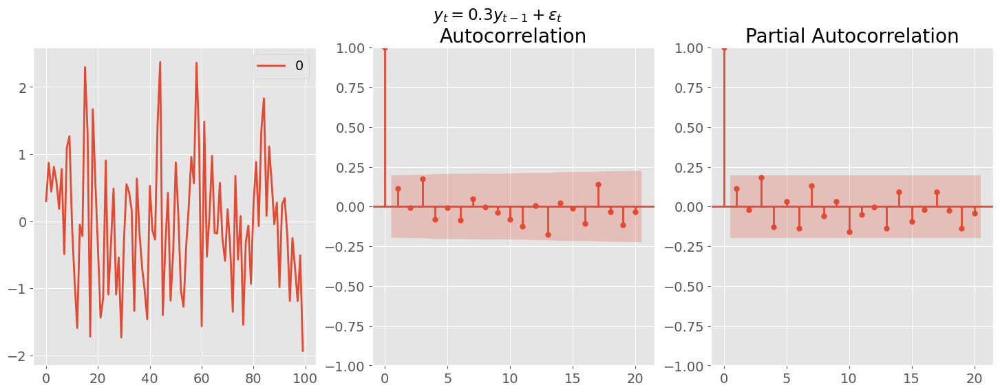
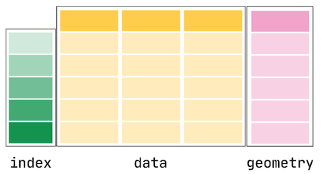

# Spatial and Temporal Models

## Time Series

- Collection of observations made sequentially in time
- Data Types:
  - **Univariate**: Single observation at each time point (e.g. bike sale over time)
  - **Multivariate**: Multiple observations at each time point (e.g. bike sale + profit over time)
  - **Heirarchical**: Multiple time series, each with a hierarchical structure (e.g. bike sale + profit for each store over time)
- Common Tasks:
  - **Prediction/ Forecasting** (Supervised Learning)
    - Difficult since many factors
  - **Clustering/ Anomaly Detection** (Unsupervised Learning)

### Features of Time Series

#### Visualizing

- Time plot: x-axis = time, y-axis = value

#### Temporal Dependence

- Observations close in time are often correlated
  - Can quanitify using **autocorrelation**
- **Autocorrelation**: Correlation of a time series with a lagged version of itself
  - **Lag**: Time difference between two observations
  - **ACF**: Autocorrelation function
    - Plots autocorrelation for different lags
  - **PACF**: Partial autocorrelation function
    - Plots correlation between two observations after removing the effect of other lags
  - e.g. `data[t (lag=1)] = data[t].shift(t)`

##### Correlogram

- Plot of ACF vs. lag
- Helps identify patterns in time series
- Use `statsmodels.graphics.tsaplots.plot_acf()`

```python
from statsmodels.graphics.tsaplots import plot_acf

fig, (ax1,ax2) = plt.subplots(nrows=1, ncols=2, figsize=(11, 5))
plot_acf(data, lags=20, title='ACF', ax=ax1)
ax1.set_xlabel("Lag (years)")
ax1.set_ylabel('ACF')
```


- Shading indicates if correlation is significantly different from 0

  - $CI = \pm z_{\alpha/2} SE(r_k)$, $z_{\alpha/2} \approx 1.96$ for 95% CI
  - $SE(r_k) = \frac{1}{\sqrt{T}}$, where $T$ is the number of observations - Or Bartlett's formula: $SE(r_k) = \sqrt{\frac{1 + 2\sum_{j=1}^{k-1}r_j^2}{T}}$
    </br>

- CO2 plot has a trend so ACF for smaller lags tend to be higher
- **General Key Observations**:
  1. ACF almost always decays with lag
  2. If a series alternates (oscillates about mean), ACF will alternates too
  3. If a series has seasonal or cyclical fluctuations, the ACF will oscillate at the same frequency
  4. If there is a trend, ACF will decay slower (due to high correlation of the consecutive observations)
  5. Experience is required to interpret ACF

#### Time Series Patterns

1. **Trend**: Long-term increase/ decrease
2. **Seasonality**: Regular pattern of up and down fluctuations (fixed interval)
   - typically over smaller time frame
3. **Cyclic**: Fluctuations not of fixed period (unknown and changing interval)
   - typically over larger time frame

#### White Noise

- Time series with:
  - 0 mean
  - Constant variance
  - No autocorrelation
- Further assumed that it is iid and gaussian: $N(0, \sigma^2)$

- **Why do we care?**
  - Cannot predict white noise
  - If residuals from time series for a forecast should resemble white noise
    - Implies that the model has captured all the information in the data

### Time Series Decomposition

- When we decompose, we split the time series into 3 components:

  1. **Trend-cycle (T)**: Long-term increase/ decrease
  2. **Seasonal (S)**: same as seasonal above
  3. **Residual**: Random fluctuations


- **Additive Model**: $Y_t = T_t + S_t + R_t$
  - When the magnitude of the seasonal fluctuations **does not change** with the level of the time series
- **Multiplicative Model**: $Y_t = T_t \times S_t \times R_t$
  - When the magnitude of the seasonal fluctuations **does change** with the level of the time series

#### Estimating the Trend

1. **Curve Fitting**: Fit a polynomial of degree $n$ to the time series

   ```python
   from statsmodels.tsa.tsatools import detrend

   detrended = data - detrend(data, order=2) # order=2 for quadratic
   ```

2. **Moving Average**: Smooths out short-term fluctuations and highlights longer-term trends

   ```python
   # rolling is a pandas function
   rolling_mean = df.rolling(window=5, center=True).mean()

   # For even window, common practice to do:
   window = 4
   df.rolling(window).mean().rolling(2).mean().shift(-window//2)
   ```

   - `window`: Number of observations used for calculating the statistic
   - `center`: Set the labels at the center of the window
     - if odd, the label is at the center
     - if even, the label is at the right

- The even code does this:
  

#### Estimating Seasonality

- Simple steps:
  1. Remove the trend from the data (the detrended data above)
  2. Estimate the seasonal component by averaging the detrended data over each season

#### Estimating the Residual

- The residual is the remainder after removing the trend and seasonal components
- If additive model: $R_t = Y_t - T_t - S_t$
- If multiplicative model: $R_t = \frac{Y_t}{T_t \times S_t}$

#### All Together

- Luckily, there exists a function to do all of this for us: `seasonal_decompose()`

```python
from statsmodels.tsa.seasonal import seasonal_decompose

decomposition = seasonal_decompose(data, model='additive', period=12)

decomposition.trend # the trend component
decomposition.seasonal # the seasonal component
decomposition.resid # the residual component

# plot the decomposition
fig = decomposition.plot()
```

## Forecasting

- **Forecasting**: Predicting future values of a time series

### Baseline Forecasting Methods

1. **Average**: Use average of all past observations


2. **Naive**: Use the last observation as the forecast
3. **Seasonally Adjusted Naive**: Same as Naive but with seasonally adjusted data (classical decomposition)


4. **Seasonally Naive**: Use the last observation from the same season (only one with seasonality)

```python
df["month"] = df.index.month
last_season = (df.drop_duplicates("month", keep="last")
                 .sort_values(by="month")
                 .set_index("month")["value"]
              )
df = df.drop(columns="month")
last_season
```


5. **Drift**: Linearly extrapolate the trend (only one that is not a straight horizontal line)


### Exponential Models

#### Simple Exponential Smoothing

- Forecast is a weighted average of all past observations
- Recursively defined: $\hat{y}_{t+1|t} = \alpha y_t + (1 - \alpha) \hat{y}_{t|t-1}$
- **$\alpha$: Smoothing parameter**
  - Close to 0: More weight to past observations
  - Close to 1: More weight to current observation (closer to Naive forecast)
- **Initial Forecast**:
  - $\hat{y}_{1|0} = y_1$
  - Heuristic: linear interpolation of the first few observations
  - Learn it by optimizing SSE
- Forecasts are flat
-

```python
 from statsmodels.tsa.holtwinters import SimpleExpSmoothing

 SES = SimpleExpSmoothing(data, initialization_method='heuristic')=

 # Fit the model
 model = SES.fit(smoothing_level=0.2, optimized=False)

 # Forecast
 forecast = model.forecast(steps=5)
```

#### Holt's Method

- Extend SES to include a trend component
  $$\hat{y}_{t+h|t} = \ell_t + h b_t$$

  $$\ell_t = \alpha y_t + (1 - \alpha)(\ell_{t-1} + b_{t-1})$$

  $$b_t = \beta(\ell_t - \ell_{t-1}) + (1 - \beta)b_{t-1}$$

- $\ell_t$: Level
- $b_t$: Smoothness of the trend
  - Close to 0: Trend is more linear
  - Close to 1: Trend changes with each observation
- $\alpha$: Smoothing parameter for level

#### Holt's Winter Method

- Extend Holt's method to include a seasonal component
  $$\hat{y}_{t+h|t} = \ell_t + h b_t + s_{t-m+h_m}$$

  $$b_t = \beta(\ell_t - \ell_{t-1}) + (1 - \beta)b_{t-1}$$

- For Additive Seasonal:
  $$\ell_t = \alpha(y_t - s_{t-m}) + (1 - \alpha)(\ell_{t-1} + b_{t-1})$$

  $$s_t = \gamma(y_t - \ell_{t-1} - b_{t-1}) + (1 - \gamma)s_{t-m}$$

- For Multiplicative Seasonal:
  $$\ell_t = \alpha\frac{y_t}{s_{t-m}} + (1 - \alpha)(\ell_{t-1} + b_{t-1})$$

  $$s_t = \gamma\frac{y_t}{\ell_{t-1} + b_{t-1}} + (1 - \gamma)s_{t-m}$$

| Trend component        | Seasonal Component   |
| ---------------------- | -------------------- |
| None `(N)`             | None `(N)`           |
| Additive `(A)`         | Additive `(A)`       |
| Additive Damped `(Ad)` | Multiplicative `(M)` |

- Simple Exponential Smoothing `(N,N)`
- Holt's Method `(A,N)`
- Holt's Winter Method `(A,A)`

```python
from statsmodels.tsa.holtwinters import ExponentialSmoothing

 model = ExponentialSmoothing(data,
     trend='add',
     damped_trend=True,
     seasonal='mul',
     seasonal_periods=12,
     initialization_method='estimated'
 ).fit(method="least_squares")
```

#### ETS (Error, Trend, Seasonal) Models

- Components:
  - Error: `{A, M}`
  - Trend: `{N, A, Ad}`
  - Seasonal: `{N, A, M}`

```python
from statsmodels.tsa.holtwinters import ETSModel

 model = ETSModel(data,
      error='add',
      trend='add',
      damped_trend=True,
      seasonal='add',
      seasonal_periods=12
 ).fit()

 # Forecast
 model.forecast(steps=5)

 # Summary
  model.summary()
```

- Can generate prediction intervals (confidence intervals):
  1. `model.get_prediction()` (analytical)
  2. `model.simulate()`

```python
pred = model.get_prediction(start=df.index[-1] + pd.DateOffset(months=1), end="2020").summary_frame()

# or
q = 0.975 # 95% CI
sim = model.simulate(anchor="end", nsimulations=348, repetitions=100, random_errors="bootstrap")
simu = pd.DataFrame({"median": simulations.median(axis=1),
                     "pi_lower": simulations.quantile((1 - q), axis=1),
                     "pi_upper": simulations.quantile(q, axis=1)},
                    index=simulations.index)
```

### Selecting a Model

- **Metrics**, Commonly used:
  - AIC, BIC
  - SSE/ MSE/ RMSE
  ```python
  # using ets model from above
  model.aic
  model.bic
  model.mse
  ```
- **Residuals**:
  - Visual inspection (should be uncorrelated, zero mean, normally distributed)
  - Running diagnostic Portmanteau tests:
    - **Ljung-Box Test**: $H_0$: Residuals are uncorrelated (white noise)
      - p-value < 0.05: Reject $H_0$ (bad)
    - **Jarque-Bera Test**: $H_0$: Residuals are normally distributed
      - p-value < 0.05: Reject $H_0$ (bad)

```python
# using ets model from above
model.summary().tables[-1]

# Ljung-Box Test
p = model.test_serial_correlation(method="ljungbox", lags=10)[0,1,-1]
# Jarque-Bera Test
p = model.test_normality(method="jarquebera")[0,1]
```

- **Out-of-sample Forecasting**:
  - Split data into training and testing
  - Fit model on training data
  - Forecast on testing data
  - Compare forecast with actuals

## ARIMA Models

- **ARIMA**: AutoRegressive Integrated Moving Average
- Commonly used for time series forecasting (other than exponential smoothing)
- Based on autocorrelation of data
- Do not model trend nor seasonality, so it is typically constrained to **stationary** data

### Stationarity

- Statistical properties of a time series do not change over time
  - Mean, variance is constant
  - Is roughly horizontal (no strong trend)
  - Does not show predictable patterns (no seasonality)
- DOES not mean that the time series is constant, just that the way it changes is constant
- It is one way of modelling dependence structure
  - Can only be independent in one way but dependent in many ways

#### Strong vs Weak Stationarity

| Property                                  | Strong Stationarity | Weak Stationarity        |
| ----------------------------------------- | ------------------- | ------------------------ |
| Mean, Variance, Autocovariance            | Constant            | Constant                 |
| Higher order moments (skewness, kurtosis) | Constant            | Not necessarily constant |

- Weak stationarity is often sufficient for time series analysis

### Checking for Stationarity

1. **Visual Inspection**: Plot the time series
   - Look for trends, seasonality, and variance (none of these should be present)
   - Make a correlogram plot (ACF plot should rapidly decay to 0)
2. **Summary Statistics**: Calculate mean, variance, and autocovariance
   - Mean and variance should be roughly constant over time
3. **Hypothesis Testing**: Use statistical tests
   - **Augmented Dickey-Fuller (ADF) test**
     - Null hypothesis: Time series is non-stationary
     - small p: it is stationary (reject null)
     - Use `statsmodels.tsa.stattools.adfuller`
   - **Kwiatkowski-Phillips-Schmidt-Shin (KPSS) test**
     - Null hypothesis: Time series is stationary
     - small p: it is non-stationary (reject null)

```python
from statsmodels.tsa.stattools import adfuller

# ADF test
result = adfuller(data)
print('ADF Statistic: %f' % result[0])
print('p-value: %f' % result[1])
```

### Making a Time Series Stationary

- **Stabilizing the variance using transformations**

  - Log or box-cox transformation

  $$w_t = \begin{cases} \frac{y_t^\lambda - 1}{\lambda} & \text{if } \lambda \neq 0 \\ \ln(y_t) & \text{if } \lambda = 0 \end{cases}$$

  ```python
  from scipy.stats import boxcox
  import numpy as np

  data = boxcox(data, lmbda=0)

  # log transformation
  data = np.log(data)
  ```

- **Stabilize the mean using differencing**

  - First difference: $y' = y_t - y_{t-1}$
  - Second difference: $y'' = y' - y'_{t-1} = y_t - 2y_{t-1} + y_{t-2}$
  - Seasonal difference: $y' = y_t - y_{t-m}$, where $m$ is the seasonal period

  ```python
  # First difference
  data1 = data.diff().dropna()
  # Second difference
  data2 = data.diff().diff().dropna()
  # Seasonal difference, m is the seasonal period
  data_m = data.diff(m).dropna()
  ```

### AR and MA Models

| AR (AutoRegressive) Model                                                      | MA (Moving Average) Model                                                                                 |
| ------------------------------------------------------------------------------ | --------------------------------------------------------------------------------------------------------- |
| Regression of the time series on its own lagged values                         | Regression of the time series on past forecast errors                                                     |
| $y_t = \phi_1 y_{t-1} + \phi_2 y_{t-2} + \ldots + \phi_p y_{t-p} + \epsilon_t$ | $y_t = \epsilon_t + \theta_1 \epsilon_{t-1} + \theta_2 \epsilon_{t-2} + \ldots + \theta_q \epsilon_{t-q}$ |
| $p$: order of the AR model                                                     | $q$: order of the MA model                                                                                |
| $\phi$: AR coefficients                                                        | $\theta$: MA coefficients                                                                                 |
| $\epsilon_t$: white noise                                                      | $\epsilon_t$: white noise                                                                                 |
| **Long memory model**: $y_1$ has a direct effect on $y_t$ for all $t$          | **Short memory model**: $y_t$ is only affected by recent values of $\epsilon$                             |
| Good for modeling time-series with dependency on past values                   | Good for modeling time-series with a lot of volatility and noise                                          |
| Less sensitive to choice of lag or window size                                 | More sensitive to choice of lag or window size                                                            |

- Both values are between -1 and 1
- AR value of 1 means that the time series is a random walk

### ARMA Model

- **ARMA**: AutoRegressive Moving Average
- Combines AR and MA models
- Key Idea: Parsimony
  - fit a simpler, mixed model with fewer parameters, than either a pure AR or a pure MA model

$$y_t = c + \phi_1 y_{t-1} + \phi_2 y_{t-2} + \ldots + \phi_p y_{t-p} + \epsilon_t + \theta_1 \epsilon_{t-1} + \theta_2 \epsilon_{t-2} + \ldots + \theta_q \epsilon_{t-q}$$

- $c$: constant
- $\phi$: AR coefficients
- $\theta$: MA coefficients
- Usually write it as `ARMA(p, q)`

### ARIMA Model

- **ARIMA**: AutoRegressive Integrated Moving Average
- Combines ARMA with differencing
- `ARIMA(p, d, q)`
  - `p`: order of the AR model
  - `d`: degree of differencing
  - `q`: order of the MA model
- Use `statsmodels.tsa.arima.model.ARIMA`

```python
from statsmodels.tsa.arima.model import ARIMA

# All with first order differencing
model_ar = ARIMA(data["col"], order=(3, 1, 0)).fit() # AR(3)
model_ma = ARIMA(data["col"], order=(0, 1, 1)).fit() # MA(1)
model_arima = ARIMA(data["col"], order=(3, 1, 3)).fit() # ARIMA(3, 3)

model_arma = ARIMA(data["col"], order=(3, 0, 3)).fit() # ARMA(3, 3)
```

#### ARIMA hyperparameter tuning

```python
import pmdarima as pm

autoarima = pm.auto_arima(data.col,
                          start_p=0, star_d=1, start_q=0,
                          max_p=5, max_d=3, max_q=5,
                          seasonal=False)

autoarima.summary()
```

#### SARIMA

- **SARIMA**: Seasonal ARIMA
- `SARIMA(p, d, q)(P, D, Q, m)`
  - `p`, `d`, `q`: ARIMA parameters
  - `P`, `D`, `Q`: Seasonal ARIMA parameters
  - `m`: seasonal period
- E.g. In a dataset with years and 12 months
  - $p=2$ means Jan is affected by Dec and Nov
  - $P=2$ means Jan is affected by Jan of the previous 2 years

```
sarima = ARIMA(data["col"], order=(3, 1, 3), seasonal_order=(1, 1, 1, 12)).fit()
```

- Also have **SARIMAX** (with exogenous variables)
  - adds exogenous variables (other time series) to the model
  - Not the most effective model

### Choosing Orders

- **ACF and PACF plots**
  - ACF: Autocorrelation Function
  - PACF: Partial Autocorrelation Function
  - Use these to determine the order of the AR and MA models

| ACF Plot                                                          | PACF Plot                                                                     |
| ----------------------------------------------------------------- | ----------------------------------------------------------------------------- |
| Measures correlation between an observation and its lagged values | same but removes intermediate correlations (kinda isolates the direct effect) |
| For **MA(q)**, cuts off after lag q                               | For **AR(p)**, cuts off after lag p                                           |
| Else, tails off (exp or like damped sin)                          | Else, tails off (no clear pattern)                                            |

- See the cutoff when the peaks are lower than the shaded region

#### Example AR

1. $y_t=-0.9y_{t-1}+\epsilon_t$
   
2. $y_t=0.3y_{t-1}+\epsilon_t$
   

3. $y_t=0.5y_{t-1}-0.8y_{t-2}+\epsilon_t$
   

```python
from statsmodels.graphics.tsaplots import plot_acf, plot_pacf
from statsmodels.tsa.arima_process import ArmaProcess

# Simulate 1
df = pd.DataFrame(ArmaProcess(ar=[1, -0.9]).generate_sample())
# Simulate 2
df = pd.DataFrame(ArmaProcess(ar=[1, 0.3]).generate_sample())
# Simulate 3
df = pd.DataFrame(ArmaProcess(ar=[1, -0.5, 0.8]).generate_sample())

# Plot
fig, axes = plt.subplots(nrows=1, ncols=3, figsize=(18, 5))
fig.suptitle("y_t = 0.9y_{t-1} + e_t")
df.plot(ax=axes[0])
plot_acf(df, ax=axes[1])
plot_pacf(df, ax=axes[2]);
```

#### Example MA

1. $y_t = \epsilon_t + 0.9\epsilon_{t-1}$
   

```python
df = pd.DataFrame(ArmaProcess(ma=[1, -0.9]).generate_sample())

fig, axes = plt.subplots(nrows=1, ncols=3, figsize=(18, 6))
fig.suptitle("$y_t = \epsilon_t - 0.9 \epsilon_{t-1} $")
df.plot(ax=axes[0])
plot_acf(df, ax=axes[1])
plot_pacf(df, ax=axes[2])
```

#### Whole process with ARIMA

(Based on lab 2 q4)

1. **Load Data**

   ```python
   import pandas as pd

   # turns first col into index + parses dates
   df = pd.read_csv('data.csv', index_col=0, parse_dates=True)
   ```

2. **EDA** with plot + ACF + PACF (Stationarity check)

   ```python
   import matplotlib.pyplot as plt
   from statsmodels.graphics.tsaplots import plot_acf, plot_pacf

   fig, axes = plt.subplots(nrows=1, ncols=3, figsize=(18, 5))
   df.plot(ax=axes[0])
   plot_acf(df, ax=axes[1])
   plot_pacf(df, ax=axes[2]);
   ```

   - Can also check with ADF test (p>0.05 means non-stationary)

   ```python
   from statsmodels.tsa.stattools import adfuller

   # ADF test
   result = adfuller(data)
   ```

3. **Make the time series stationary**

   ```python
   # Difference
   data1 = data.diff().dropna()

    # Log transformation
    data = np.log(data)
   ```

   - Repeat step 2 and check, also use ACF and PACF to find the AR and MA orders

4. **ARIMA Model**

   ```python
   from statsmodels.tsa.arima.model import ARIMA

   model = ARIMA(train, order=(2, 1, 2), seasonal_order=(0, 1, 0, 12)).fit()

   model.summary()
   model.plot_diagnostics()
   ```

   - Can also use `auto_arima` from `pmdarima` for hyperparameter tuning

   ```python
   import pmdarima as pm

   autoarima = pm.auto_arima(data.col,
                             start_p=0, star_d=1, start_q=0,
                             max_p=5, max_d=3, max_q=5,
                             seasonal=False)

   autoarima.summary()
   autoarima.plot_diagnostics()
   ```

5. **Forecast**

   ```python
   forecast = model.forecast(steps=len(valid))
   ```

   - Can also use `predict` for in-sample prediction

   ```python
   pred = model.predict(start=len(train), end=len(train)+len(valid)-1)

   fig, ax = plt.subplots()
   ax.plot(valid, label='Valid')
   ax.plot(pred, label='Prediction')
   ax.legend()
   ```

## Time Series Forecasting in ML

### Key Differences vs. Traditional ML

| Traditional ML          | Time Series ML                   |
| ----------------------- | -------------------------------- |
| Data is IID             | Data is ordered                  |
| CV is random            | Use sliding window CV            |
| Use feature engineering | Use lags, rolling windows, etc.  |
| Predict new data        | Predict future (specify horizon) |

### `sktime` Library

#### 1. Load Data

```python
import pandas as pd

# turns first col into index + parses dates
df = pd.read_csv('data.csv', index_col=0, parse_dates=True)
```

#### 2. Feature Engineering

```python
from sktime.transformations.series.lag import Lag
# Make a new column with lag
df['col-1'] = df['col'].shift(1)
# or use sktime
t = Lag(lags=[1,2,3], index_out="original")
pd.concat([df, t.fit_transform(df)], axis=1)
```

#### 3. Train-Test Split

- Never use random shuffling
- Need to keep temporal order

```python
from sktime.split import temporal_train_test_split
from sklearn.model_selection import train_test_split

y_train, y_test = temporal_train_test_split(y, test_size=0.2)

# or use sklearn
df_train, df_test = train_test_split(df.dropna(), test_size=0.2, shuffle=False)
```

##### Cross-Validation for Time Series

1. **Expanding Window**: start with small training set and increase it
   
2. **Fixed/sliding Window**: use a fixed window size
   

#### 4. Model Fitting

```python
from sktime.forecasting.model_evaluation import evaluate
from sktime.forecasting.naive import NaiveForecaster
from sktime.forecasting.arima import AutoARIMA

forecaster = NaiveForecaster(strategy="last", sp=12) # seasonal naive
# forecaster = AutoARIMA(sp=12)

results = evaluate(forecaster=forecaster, y=y_train, cv=cv, strategy="refit", return_data=True)
```

### Forecasting

1. **One-step forecasting**: one step ahead
2. **Multi-step forecasting**: multiple steps ahead
   a. **Recursive strategy**: predict `t`, then it becomes part of the input for `t+1`
   b. **Direct strategy**: have a model for each step (model for `t+1`, another for `t+2`, etc)
   c. **Hybrid strategy**: is dumb and bad
   d. **Multi-output strategy**: 2 different series (e.g. temperature and humidity)

```python
from sklearn.neighbors import KNeighborsRegressor
from sktime.forecasting.compose import make_reduction

regressor = KNeighborsRegressor()


forecaster = make_reduction(regressor,
   window_length=12,
   strategy="recursive") # or "direct" or "dirrec" or "multioutput"
```

### Feature Preprocessing and Engineering

#### Preprocessing

1. Coerce to stationary (via diff or transforms)
2. Smoothing (e.g. moving average)
3. Impute missing value (e.g. linear interpolation)
4. Removing outliers

#### Feature Engineering

1. Lagging features/ responses
2. Adding time stamps (e.g. day of week, month, etc)
   3, Rolling Statistics (e.g. rolling mean, rolling std)

### Multivariate Time Series

- Means time series with multiple variables (e.g. temperature and humidity)

## Probabilistic Forecasting

- We have been dealing with **point forecasts** (modelling averages)
- Want to estimate the **uncertainty** of our forecasts
  - or the extreme (e.g. 90% or 95% quantiles)
    - example: find upper quantile of electricity demand so that we can plan for the maximum demand
  - or predict the variance of the forecast (how volatile a metric will be in the future)

### Analytical

- Assume distribution of forecasts are normal

$$
\hat{y}_{T+h|T} \pm c \hat{\sigma}_{h}
$$

- $\hat{\sigma}_{h}$ is the standard deviation of the forecast
- $c$: coverage factor (e.g. 1.96 for 95% confidence interval)

$$
\hat{\sigma}_{h} = \sqrt{\frac{1}{T-K}\sum_{t=1}^{T} e_{t}^{2}}
$$

- Focus is finding $\hat{\sigma}_{h}$
  - $K$: number of parameters
  - $T$: total length of time series
  - $e_{t} = y_{t} - \hat{y}_{t|t-1}$
- Methods that have been derived mathematically:
  | Method | Forecast sd |
  |--------|--------------|
  | Mean | $\hat{\sigma}_{h} = \hat{\sigma_1} \sqrt{1 + \frac{h}{T}}$ |
  |Naive | $\hat{\sigma}_{h} = \hat{\sigma_1} \sqrt{h}$ |
  | Seasonal Naive | $\hat{\sigma}\_{h} = \hat{\sigma_1} \sqrt{\frac{h-1}{m}+1} $ |
  | Drift | $\hat{\sigma}_{h} = \hat{\sigma_1} \sqrt{h(1+\frac{h}{T})}$ |
- _Recall: $h$ is the forecast horizon (steps ahead), $m$ is the seasonal period_

```python
from pandas import pd

c = 1.96 # 95% confidence interval

train['pred'] = train['y'].shift(1)
train['residuals'] = train['y'] - train['pred']
sigma = train['residuals'].std()

h = np.arange(1, len(forecast_index) + 1)
naive_forecast = train['y'].iloc[-1]

# create lower and upper bound
naive = pd.DataFrame({"y": naive_forecast,
                      "pi_lower": naive_forecast - c * sigma * np.sqrt(horizon),
                      "pi_upper": naive_forecast + c * sigma * np.sqrt(horizon),
                      "Label": "Naive"},
                     index=forecast_index)
plot_prediction_intervals(train["y"], naive, "y", valid=valid["y"])
```

```python
# ETS
model = ETSModel(train["y"], error="add", trend="add", seasonal="add").fit(disp=0)

ets = model.get_prediction(start=forecast_index[0], end=forecast_index[-1]).summary_frame()
plot_prediction_intervals(train["y"], ets, "mean", valid=valid["y"], width=800)

# ARIMA
model = ARIMA(train["y"], order=(3, 1, 0), seasonal_order=(2, 1, 0, 12)).fit()

arima = model.get_prediction(start=forecast_index[0], end=forecast_index[-1]).summary_frame()
plot_prediction_intervals(train["y"], arima, "mean", valid=valid["y"], width=800)
```


### Simulation and Bootstrapping

- Assume future errors will be similar to past errors
- Draw from the distribution of past errors to simulate future errors

$$y_{T+h} = \hat{y}_{T+h|T} + \epsilon_{T+h}$$

```python
# Fit an ETS model
model = ETSModel(train["y"], error="add", trend="add").fit(disp=0)

# simulate predictions
ets = model.simulate(anchor="end", nsimulations=len(forecast_index),
                     repetitions=n_simulations,
                     random_errors="bootstrap")
# plot
ax = train["y"].plot.line()
ets.plot.line(ax=ax, legend=False, color="r", alpha=0.05,
              xlabel="Time", ylabel="y", figsize=(8,5));

# get quantiles
ets = pd.DataFrame({"median": ets.median(axis=1),
                    "pi_lower": ets.quantile(1-0.975, axis=1),
                    "pi_upper": ets.quantile(0.975, axis=1)},
                   index=forecast_index)
```


### Quantile Regression

- Wish to predict particular quantile instead of mean
  - e.g $q=0.9$ so we expect 90% of the future values to be below the forecast
- Pinball loss/ Quantile loss:
  $$
  \mathcal{L}=
       \left\{
  \begin{array}{ll}
        (1-q)(\hat{y}_{t,q}-y_t) \text{,} \;\; \text{ if } y_t < \hat{y}_{t,q} \\
        q(y_t-\hat{y}_{t,q}) \text{,} \;\;\;\;\;\;\;\;\;\; \text{ if } y_t \ge \hat{y}_{t,q} \\
  \end{array}
  \right.
  $$

| High Quantile                          | Low Quantile                            |
| -------------------------------------- | --------------------------------------- |
| Higher penalty for predicting **OVER** | Higher penalty for predicting **UNDER** |

#### Quantile Regression in PyTorch

see [here](https://pages.github.ubc.ca/MDS-2023-24/DSCI_574_spat-temp-mod_instructors/lectures/lecture5_uncertainty.html#quantile-regression)

Quantile loss is not currently a supported criterion in pytorch but it’s easy to define ourselves. We really have two options:

- Train a network for each quantile we want to predict; or
- Train a network to output multiple quantiles at once

### Evaluating Distributional Forecast Accuracy

- There are 4 main sources of uncertainty:

  1. Random error term
  2. Uncertainty in model parameter estimates
  3. Uncertainty in model selection
  4. Uncertainty about consistency of data generating process in the future

- Most methods only consider the first source of uncertainty
- Simulation tries to consider 2 and 3
- 4 is practically impossible to consider

## Anomaly Detection

- Outliers are observations that are significantly different from the rest of the data
  - Can be due to measurement error, data entry error, or just unique observations

### Rolling Median

- **Methodology**:
  1. Subtract the rolling median from data (with suitable window size)
  2. Calculate standard deviation of the residuals ($\hat{\sigma_r}$)
  3. Assume normally distributed residuals then identify outliers as outside the 95% confidence interval ($\pm 1.96 \hat{\sigma_r}$)

### STL Decomposition

- **Methodology**:
  1. Decompose time series to find residuals:
     - Non-seasonal data: use LOESS
     - Seasonal data: use STL (Seasonal-Trend decomposition using LOESS)
  2. Calculate $q_{0.1}$ and $q_{0.9}$ of the residuals
  3. Identify outliers as $\pm2 \times (q_{0.9} - q_{0.1})$

### Model-based

- **Methodology**:
  1. Fit a model to the data
  2. Identify outliers as significant deviations from model predictions (e.g. 95% confidence interval)

### ML approaches

- Train an ML model to predict outliers
- A few common packages: pyod, sklearn, luminaire, sklyline, etc.

#### Isolation Forest

- Built on basis of decision trees
- **High-level idea**:
  - randomly select a feature
  - randomly splits that feature into 2 values
  - repeat until all data points are isolated
- Less splits to isolate a data point = more likely to be an outlier
- Score = [0, 1] where 1 is an outlier, > 0.5 are normal observations.


- Example of sklearn's `IsolationForest`:

```python
from sklearn.ensemble import IsolationForest

outliers = IsolationForest(contamination=0.05).fit_predict(df) == -1
```

#### K-NN

- For each data point, calculate the distance to its k-th nearest neighbor
  - Large distance = outlier
- Supports 3 kNN detectors:
  1. Largest: distance to the k-th neighbor
  2. Mean: average distance to k neighbors
  3. Median: median distance to k neighbors
- pyod's `KNN()` outlier detection

```python
from pyod.models.knn import KNN

outliers = KNN(contamination=0.05).fit_predict(df).labels_ == 1
```

### Global vs Local Outliers

- **Global outliers**: A data point with its value is far outside of the entirety of the data set (e.g., billionaires)

- **Local/Contextual outliers**: A data point is considered a contextual outlier if its value significantly deviates from the rest the data points in the same context. (e.g., earning 50K income in a developing countries)

## Imputation

- **Imputation**: Filling in missing values/ outliers in a dataset
- Overarching techniques:
  1. Remove (`.dropna()`)
  2. Fill manually based on some expert-interpreted values (`.fillna()`)
  3. Fill with mean/median/mode (`.fillna()`)
  4. Fill based on rolling statistic, e.g. rolling mean/median
  5. Polynomial interpolation
  6. Fill based on temporal dependence
     - i.e. use same value from the same period last season, or average of all periods in the past season
  7. Fill with model fitted values
  8. Use `MICE` (Multiple Imputation by Chained Equations) from `statsmodels` or `IterativeImputer` from `sklearn`.

## Deep Learning with Time Series

- Classical time series (ARIMA, Exponential Smoothing) limitations:

  - They are linear models
  - Inputs must be specified, not learned automatically
  - Focus on univariate time series (lack support for multivariate time series)
  - Focus on regression (lack support for classification)
  - Assumes complete, non-missing data

- Deep learning models can address these limitations, as NNs are:
  - robust to noise
  - can learn complex, non-linear relationships
  - support multivariate time series
  - feature learning (learn the inputs)
  - temporal dependencies can be learned

### Neural Networks

- NN allows us so that the features do not need to be ordered
  - e.g. target, lag1. lag2, lag3 is the same as lag2, lag3, target, lag1
- Need to take into account inherent temporal dependencies (approach above does not)
- Do something similar like CNN (retain spatial information) but for time series

### Convolutional Neural Networks (CNN)

- Can work with 3D data (channels, height, width)
- Can also do 2D data (features, time)
- Use `Conv1D` from `pytorch` to work with time series data
  - Looks at local groups of data (filter of some size)
  - Missing memory (does not remember previous values, only looks at local groups of data)
    - can be solved with RNN


_Image with sequence of 20 values, filtered with 4 kernels of size 3_

```python
import torch.nn.Conv1d
import pandas as pd
import plotly.express as px
from sktime.utils.data_processing import lag_df

conv_layer = nn.Conv1d(in_channels=1, out_channels=4, kernel_size=3, padding=1)

# Load data
train = (pd.read_csv("data/unemployed_train.csv", index_col=0, parse_dates=True)
           .resample("1M").mean()
           .assign(Label="Train")
        )
test = (pd.read_csv("data/unemployed_valid.csv", index_col=0, parse_dates=True)
           .resample("1M").mean()
           .assign(Label="Test")
        )

# Plot train and test data
px.line(pd.concat((train, test)), y="Unemployed persons", color="Label", width=600, title="Australian Unemployment")

# Make lag features
SEQUENCE_LENGTH = 24
BATCH_SIZE = 16
cnn_data = lag_df(train, lags=SEQUENCE_LENGTH, dropna=True)
cnn_data = cnn_data[cnn_data.columns[::-1]]  # Reverse columns to have lag0 at the end
```

- Then make CNN with optimizer `Adam` and loss function `MSE`

### Recurrent Neural Networks (RNN)

- Reasonable results with CNN because preserve structure of data
- **Structure**: - Split up and process one time-step at a time

   

- Great video on [RNNs](https://www.youtube.com/watch?v=LHXXI4-IEns&t=585s)
- Draw back: **Vanishing Gradient Problem**
  - Gradient becomes so small that it does not update the weights
  - Early time steps are not updated (long-term dependencies are not learned), they "forget"
  - Can be solved with LSTM and GRU

### Long Short-Term Memory (LSTM)


- Another great video on [LSTM](https://www.youtube.com/watch?v=8HyCNIVRbSU)
- All the yellow boxes (LSTM cells) are identical (same weights and architecture)

- **Components**:
  - **Cell State**: The horizontal line running through the top of the diagram
    - It runs straight down the entire chain, with only some minor linear interactions
  - **Forget Gate**: Decides what information to throw away from the cell state
  - **Input Gate**: Decides what new information to store in the cell state
  - **Output Gate**: Decides what to output based on the cell state

```python
from torch import nn

class LSTM(nn.Module):
    def __init__(self, input_size, output_size, hidden_dim):
        super().__init__()

        self.hidden_dim = hidden_dim
        self.lstm = nn.LSTM(input_size, hidden_dim, batch_first=True, num_layers=1)
        self.fc = nn.Linear(hidden_dim, output_size)

    def forward(self, x, hidden):
        # x :           (batch_size, seq_length, input_size)
        # hidden :      (short_mem, long_mem), each (n_layers, batch_size, hidden_dim)
        # output :  (batch_size, seq_length, input_size)
        # note that the output will have the same shape as the input because
        # it makes a forecast for each time step in the sequence
        # but we only care about the last prediction (the forecast after the sequence)
        # so I'll only take the last value of the output

        prediction, (short_mem, long_mem) = self.lstm(x, hidden)
        output = self.fc(prediction)
        return output[:, -1, :], short_mem, long_mem
```

- GRU is similar to LSTM, but has less parameters and is faster to train

### Useful Time Series Packages

#### Prophet (Facebook)

- Frankenstein of classical time series models (decomposition, regression, exponential smoothing, etc)

```python
import pandas as pd
from prophet import Prophet

# Sample data
data = pd.read_csv('example_data.csv')
data['ds'] = pd.to_datetime(data['ds'])

# Initialize Prophet model
model = Prophet(interval_width=0.95, yearly_seasonality=True, weekly_seasonality=True, daily_seasonality=True)

# Fit the model
model.fit(data)

# Make future predictions
test_dates = model.make_future_dataframe(periods=len(test), freq='M', include_history=False)
forecast = model.predict(test_dates)

# Visualize the forecast
fig = model.plot(forecast)
```

#### Other ML based time series packages

- GluonTS: alternative to pytorch.
- PyTorch Forecasting: built on top of pytorch, but with more focus on time series forecasting.
- sktime: scikit-learn for time series data.
- Tidyverts: R package for time series forecasting.

### Additional Topics

- **Heirarchical Time Series**: Forecasting at different levels of aggregation (e.g. product sales at store level, then at regional level, then at national level)
  - Bottom-up: Forecast at the lowest level and aggregate up
  - Top-down: Forecast at the highest level and disaggregate down
- **Multiple Seasonalities**: e.g. daily and weekly seasonality
  - decompose independently
  - decompose simultaneously (e.g. propher/ statsmodels)
- **Multivariate Time Series**: e.g. sales and advertising spend
  - VAR (Vector Auto Regression)
  - LSTM with multiple inputs
- **Explanatory variables**:
  - easy to add features to ML models
  - ARIMA can but using `exog` parameter
- **Time Series Classification**:
  - Hidden Markov Models

## Spatial Data

- Data with location information
- Has spacial dependence
- **Main Tasks**:
  - Wrangling
  - Visualization
  - Modelling
- **Representation**:
  - Vector
  - Raster

### Working with Vector Data

- Collection of discrete locations/ vertices `(x, y)` to form:
  - **Points**: single location
  - **Lines**: series of points
  - **Polygons**: series of lines (closed shape)
- Stored in `.shp` (shapefile) format
  - `.shp`: geometry
  - `.shx`: index (how geometry relates to one another)
  - `.dbf`: attributes (e.g. population, area)

#### Geopandas Intro

- To read and write vector data
- Built off of `pandas` and `shapely`
- Similar to `pandas` it has:
  - `GeoSeries`: series of geometries
  - `GeoDataFrame`: dataframe with geometry column
    - Geometry column contains vector data



```python
import geopandas as gpd

# Read data
gdf = gpd.read_file(“path/to/shp_dir”)

# Plot data
gdf.plot()
```

#### Making data with Geopandas

```python
import geopandas as gpd

lat = [49.2827, 49.2827, 49.2827, 49.2827]
lon = [-123.1207, -123.1207, -123.1207, -123.1207]

gdf = gpd.GeoDataFrame(geometry=gpd.points_from_xy(lon, lat))
gdf.plot()
```

#### Loading from OpenStreetMap

- It is like the wikipedia of geospacial data
- Use `osmnx` to get data from OpenStreetMap

```python
import osmnx as ox

vancouver = ox.geocode_to_gdf("Vancouver, Canada")
vancouver.plot(edgecolor="0.2")
plt.title("Vancouver");
```


```python
# get higher resolution
van_bc = gpd.clip(bc, vancouver)
van_bc.plot(edgecolor="0.2")
```


```python
# Plot stanley park in vancouver
stanley_park = ox.geocode_to_gdf("Stanley Park, Vancouver")
ax = van_bc.plot(edgecolor="0.2")
stanley_park.plot(ax=ax, edgecolor="0.2", color="tomato")
```


```python
# Graph bike network in vancouver
bike_network = ox.graph_from_place("Stanley Park, Vancouver",
    network_type="bike")

ax = stanley_park.plot(edgecolor="0.2")
bike_network.plot(ax=ax, edgecolor="0.2", color="tomato")

# can be interactive
bike_network.explore()
```


#### Wrangling with Geopandas

- **Add width to line**: `gdf.buffer(2)` to add a 2m to left and right of the line (4m total)
- **Get Length of line**: `gdf.length.sum()` to get the length of the line
  - Need to convert to linear meters first
- **Get Area of polygon**: `gdf.area.sum()` to get the area of the polygon
  - Need to convert to linear meters first
- **Joining**: `gpd.sjoin(gdf1, gdf2, how=‘left’, predicate=‘intersects’)`
  - `how`: left, right, inner, outer
  - `predicate`: intersects, contains, within, touches, crosses, overlaps
- **Grouping**: `gdf.groupby(by=‘column’).sum().sort_values("length", ascending=False)`

### Working with Raster Data


- Each pixel has 4 bands: Red, Green, Blue, and Infrared
- **Resolution**: size of each pixel (e.g. 1m x 1m)
  - smaller resolution = more detailed
- Most common format: GeoTIFF (`.tif`)
- Use Python library `rasterio` to read and write raster data

```python
import rasterio

dataset = rasterio.open(“path/to/raster.tif”)
```

### Coordinate Reference Systems (CRS)

- Typically identified by EPSG (European Petroleum Survey Group) code
- **Common CRS**:
  - **Angular units** (latitude and longitude): `EPSG:4326`
  - **Linear units** (meters): Most common is UTM which is divided into zones. For British Columbia, it’s `EPSG:32610`
  - **Minimize distortion** by choosing the right CRS, for Canada, it’s `EPSG:3347` ("Lambert projection")
- **Change code in geopandas:**`gdf.to_crs(“EPSG:3347”)`


## Spatial Visualization

### Geopandas Plotting

- Easy to use and quick

1. Get data of UBC buildings from `osmnx`

```python
import osmnx as ox
import geopandas as gpd

ubc = (ox.features.features_from_place("University of British Columbia, Canada",
                                tags={'building':True}) # Just keep building footprints
         .loc[:, ["geometry"]]                 # just keep the geometry column for now
         .query("geometry.type == 'Polygon'")  # only what polygons (buidling footprints)
         .assign(Label="Building Footprints")  # assign a label for later use
         .reset_index(drop=True)               # reset to 0 integer indexing
        )
```

2. Get the building footprint of a specific building from its coordinates

```python
point_coord = Point(-123.25203756532703,49.26314716306668)

ubc[ubc.contains(point_office)] # get the building that contains the point

ubc.loc[47, "Label"] = "Earth Science Building" # change the label
```

3. Plot the GeoDataFrame

```python
ax = ubc.plot(figsize=(8, 8), column="Label", legend=True,
edgecolor="0.2", markersize=200, cmap="rainbow")
plt.title("UBC");

```

4. Add map to the background

```python
import contextily as cx

ax = (ubc.to_crs("EPSG:3857")
         .plot(figsize=(10, 8), column="Label", legend=True,
               edgecolor="0.2", markersize=200, cmap="rainbow")
     )

cx.add_basemap(ax, source=cx.providers.OpenStreetMap.Mapnik)  # I'm using OSM as the source. See all provides with ctx.providers
plt.axis("off")
plt.title("UBC");
```


### Plotly Express

- To add interactivity to the map
- Backed by MapBox (mapping and location data cloud platform)

```python
import plotly.express as px

# Does the same thing as the previous cell, but with plotly express (interactive)
fig = px.choropleth_mapbox(ubc,
                            geojson=ubc.geometry,
                            locations=ubc.index,
                            color="Label",
                            center={"lat": 49.261, "lon": -123.246},
                            zoom=12.5,
                            mapbox_style="open-street-map")
fig.update_layout(margin=dict(l=0, r=0, t=30, b=10))
```

- Can also plot the buildings with different colours based on building area

```python
# Calculate area
ubc["Area"] = ubc.to_crs(epsg=3347).area  # (https://epsg.io/3347)

# Make plot
fig = px.choropleth_mapbox(ubc,
                            geojson=ubc.geometry,
                            locations=ubc.index,
                            color="Area",
                            center={"lat": 49.261, "lon": -123.246},
                            zoom=12.5,
                            mapbox_style="carto-positron")
fig.update_layout(margin=dict(l=0, r=0, t=30, b=10))
```


### Kepler.gl

- Web-based geospatial analysis tool
- Even more powerful than Plotly Express
- How it works:
  1. Create instance of map with `keplergl.KeplerGl()`
  2. Add as much data with `.add_data()` method
  3. Customize and configure the map using GUI

```python
from keplergl import KeplerGl

ubc_map = keplergl.KeplerGl(height=500)
ubc_map.add_data(data=ubc.copy(), name="Building heights")

ubc_map
```

- Can also make a 3d map with building heights
  - Load the building heights data
  - Join the data with the building footprints
  - Plot the 3d map + addjust the GUI settings

## Spatial Modeling


Source: https://www.neonscience.org/resources/learning-hub/tutorials/spatial-interpolation-basics

- Two common ways to model spatial data:
  1. **Spatial interpolation**: use a set of observations in space to estimate the value of a spatial field
  2. **Areal interpolation**: project data from one set of polygons to another set of polygons
- “everything is related to everything else, but near things are more related than distant things” (Tobler, 1970)

### Deterministic Interpolation

- Use `scipy` module `interpolate` to do deterministic interpolation
- Common Techniques:

  1. **Inverse Distance Weighting (IDW)**: estimate the value of a point based on the values of its neighbours (farther neighbours have less weight)

  $$\hat{z}(x) = \frac{\sum_{i=1}^{n} w_i(x)z_i}{\sum_{i=1}^{n} w_i(x)}$$

  where $w_i(x) = \frac{1}{d_i(x)^p}$, $d_i(x)$ is the distance between $x$ and $i$, and $p$ is the power parameter

  2. **Nearest Neighbour**: estimate the value of a point based on the value of the nearest point (does not consider weights)

  - Less smooth than IDW (more jagged)

  3. **Polynomial Interpolation**: estimate the value of a point based on the values of its neighbours using a polynomial function
  4. **Radial Basis Function**: estimate the value of a point based on the values of its neighbours using a radial basis function

```python
from scipy.interpolate import NearestNDInterpolator

# Get the geodataframe
gpm25 = (gpd.GeoDataFrame(
            pm25,
            crs="EPSG:4326", # angular CRS
            geometry=gpd.points_from_xy(pm25["Lon"], pm25["Lat"])) # create geometry from coordinates
        .to_crs("EPSG:3347") # convert to one for Canada
        )

# Creates points to interpolate
gpm25["Easting"], gpm25["Northing"] = gpm25.geometry.x, gpm25.geometry.y

# Create a grid
resolution = 25000  # cell size in meters, smaller cell size = smaller pixel = higher resolution
gridx = np.arange(gpm25.bounds.minx.min(), gpm25.bounds.maxx.max(), resolution)
gridy = np.arange(gpm25.bounds.miny.min(), gpm25.bounds.maxy.max(), resolution)

# Interpolate
interpolator = NearestNDInterpolator(gpm25[["Easting", "Northing"]], gpm25["PM25"])
z = model(*np.meshgrid(gridx, gridy))
plt.imshow(z);
```

- Plot it back to map:

```python
# Helper function:
def pixel2poly(x, y, z, resolution):
    """
    x: x coords of cell
    y: y coords of cell
    z: matrix of values for each (x,y)
    resolution: spatial resolution of each cell
    """
    polygons = []
    values = []
    half_res = resolution / 2
    for i, j  in itertools.product(range(len(x)), range(len(y))):
        minx, maxx = x[i] - half_res, x[i] + half_res
        miny, maxy = y[j] - half_res, y[j] + half_res
        polygons.append(Polygon([(minx, miny), (minx, maxy), (maxx, maxy), (maxx, miny)]))
        if isinstance(z, (int, float)):
            values.append(z)
        else:
            values.append(z[j, i])
    return polygons, values
```

```python
polygons, values = pixel2poly(gridx, gridy, z, resolution)

pm25_model = (gpd.GeoDataFrame({"PM_25_modelled": values}, geometry=polygons, crs="EPSG:3347")
                 .to_crs("EPSG:4326")
             )

fig = px.choropleth_mapbox(pm25_model, geojson=pm25_model.geometry, locations=pm25_model.index,
                           color="PM_25_modelled", color_continuous_scale="RdYlGn_r", opacity=0.5,
                           center={"lat": 52.261, "lon": -123.246}, zoom=3.5,
                           mapbox_style="carto-positron")
fig.update_layout(margin=dict(l=0, r=0, t=30, b=10))
fig.update_traces(marker_line_width=0)
```

### Probabilistic Interpolation

- **Kriging** differs from deterministic because we interpolate using statistical models that include estimates of spatial autocorrelation

$$\hat{Z}(s_0) = \sum_{i=1}^{n} \lambda_i Z(s_i)$$

- $\lambda_i$ are the weights
- $Z(s_i)$ are observations at locations $s_i$
- $N$ is the size of $s$ (number of observations)
  </br>
- Kriging uses spatial autocorrelation to estimate the weights
  - Looking at the variance between points to estimate the weights

#### Variogram

- Defines the spatial variance/ autocorrelation between points (as a function of distance)
  - Similar to ACF but for spatial data
- Used to estimate the weights in kriging
- e.g. of a function: $\gamma(s_i, s_j) = \frac{1}{2}(Z(s_i) - Z(s_j))^2$
  - semi-variance because of a factor of 1/2
  - Each pair is calculated twice
- Plot this function to get the variogram (x-axis: distance, y-axis: semivariance)


- **Nugget**: variance at distance 0
  - Ideally should be 0 (no variance at distance 0), higher nugget = more noise
  - Can be thought of as Random error/ measurement error
- **Sill**: maximum variance of spatial process
  - represents the amount of spatial autocorrelation that exists at large enough distances to capture the underlying trend of the process
- **Range**: where the semivariance reaches the sill


#### Kriging with `pykrige`

```python
from pykrige.ok import OrdinaryKriging

RESOLUTION = 250  # m

# 1. Convert to meter-based
van_listings_gdf = van_listings_gdf.to_crs("EPSG:3347")

# 2. Add Easting and Northing columns
van_listings_gdf["Easting"] = van_listings_gdf.geometry.x
van_listings_gdf["Northing"] = van_listings_gdf.geometry.y

# 3. Create a grid of points
gridx = np.arange(
    van_listings_gdf.bounds.minx.min(), van_listings_gdf.bounds.maxx.max(), RESOLUTION
)
gridy = np.arange(
    van_listings_gdf.bounds.miny.min(), van_listings_gdf.bounds.maxy.max(), RESOLUTION
)

# 4. Kriging
krig = OrdinaryKriging(
    x=van_listings_gdf["Easting"],
    y=van_listings_gdf["Northing"],
    z=van_listings_gdf["price"],
    variogram_model="spherical",
    verbose=False,
    enable_plotting=False,
)

# 5. Execute and plot
z, ss = krig.execute("grid", gridx, gridy)
plt.imshow(z)
```

### Areal Interpolation

- Project data from one set of polygons to another set of polygons
- E.g. Map air pollution data fo FSA (“forward sortation area”, which are groups of postal codes) polygons

```python
# Load the FSA data
van_fsa = gpd.read_file("data-spatial/van-fsa")

# Kriging (similar to previous cell)
resolution = 10_000  # cell size in meters
gridx = np.arange(gpm25.bounds.minx.min(), gpm25.bounds.maxx.max(), resolution)
gridy = np.arange(gpm25.bounds.miny.min(), gpm25.bounds.maxy.max(), resolution)
krig = OrdinaryKriging(x=gpm25["Easting"], y=gpm25["Northing"], z=gpm25["PM_25"], variogram_model="spherical")
z, ss = krig.execute("grid", gridx, gridy)
polygons, values = pixel2poly(gridx, gridy, z, resolution)
pm25_model = (gpd.GeoDataFrame({"PM_25_modelled": values}, geometry=polygons, crs="EPSG:3347")
                 .to_crs("EPSG:4326")
                 )
z, ss = krig.execute("grid", gridx, gridy)

# Areal Interpolation
areal_interp = area_interpolate(pm25_model.to_crs("EPSG:3347"),
                                van_fsa.to_crs("EPSG:3347"),
                                intensive_variables=["PM_25_modelled"]).to_crs("EPSG:4326")
areal_interp.plot(column="PM_25_modelled", figsize=(8, 8),
                  edgecolor="0.2", cmap="RdBu", legend=True)
plt.title("FSA Air Pollution");
```


### Shortest Path Analysis

- Use **Dijkstra's algorithm** to find the shortest path between two points
- Condition:
  - The graph must be weighted with non-negative weights
- **Algorithm**:
  1. Label start node with 0, all others with infinity
  2. Label current node as visited
  3. Go to all connected nodes (to current) and update label with `min(current_label, previous_label + weight)`
  - If updated, then keep track of the previous node (for backtracking later)
  4. Once all nodes around the current node are visited, go to the unvisited node with the smallest label and repeat step 2
  5. Backtrack from end node to start node using the previous node
- Time complexity: $O(V^2)$ but its $O(E + V \log V)$ with a min-priority queue/ binary heap
- Space complexity: $O(V)$

```python
import osmnx as ox
import networkx as nx

# Origin
orig_address = "UBC bookstore, Vancouver"
orig_y, orig_x = ox.geocode(orig_address)  # notice the coordinate order (y, x)!

# Destination
dest_address = "Orchard Commons Student Residence, Vancouver"
dest_y, dest_x = ox.geocode(dest_address)

# Find the nearest nodes
orig_node_id, dist_to_orig = ox.distance.nearest_nodes(G, X=orig_x, Y=orig_y, return_dist=True)
dest_node_id, dist_to_dest = ox.distance.nearest_nodes(G, X=dest_x, Y=dest_y, return_dist=True)

# Find the shortest path
route = nx.shortest_path(G, orig_node_id, dest_node_id, weight="length")

# Plot the shortest path
ox.plot.plot_graph_route(G, route)
```
