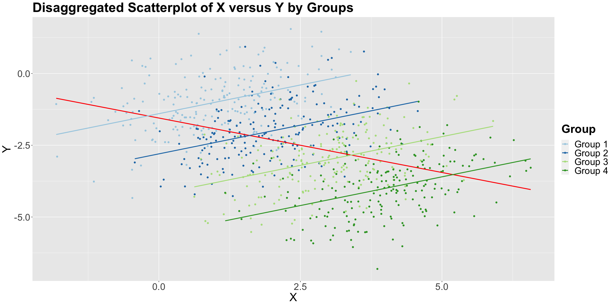
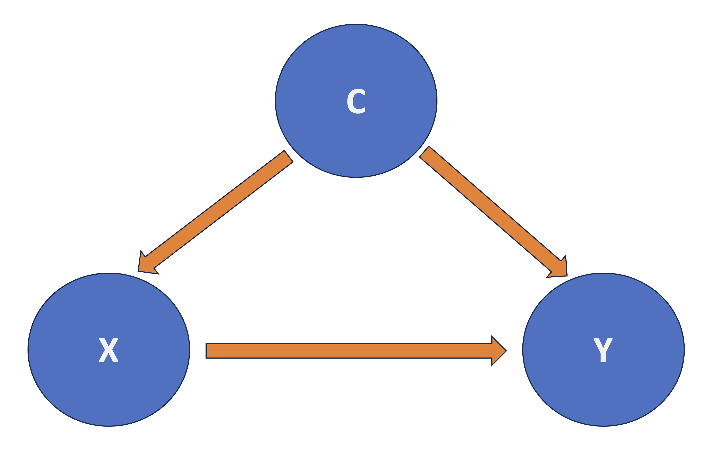
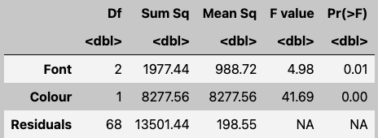
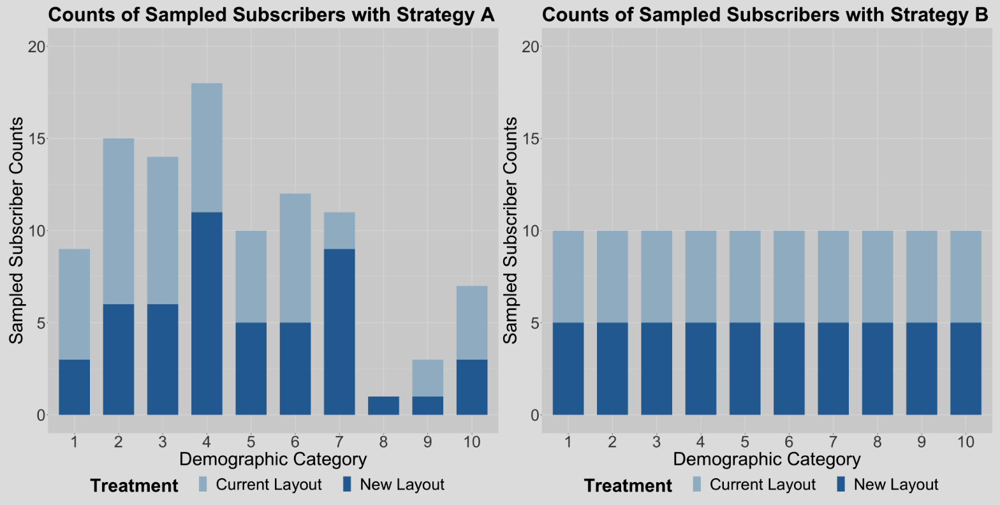
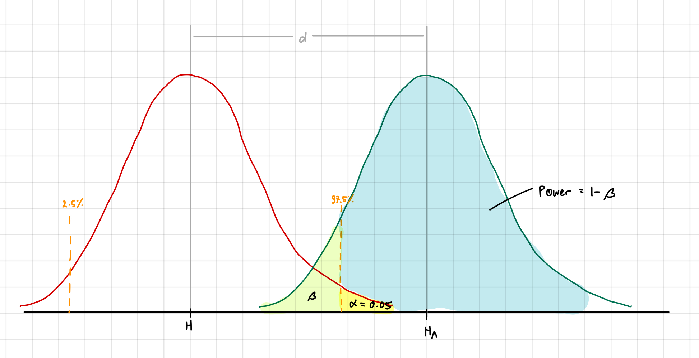
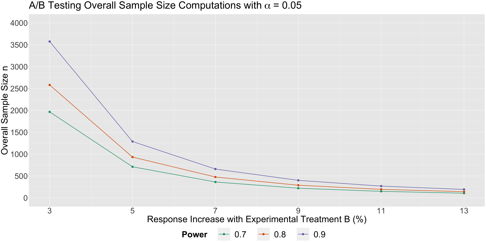
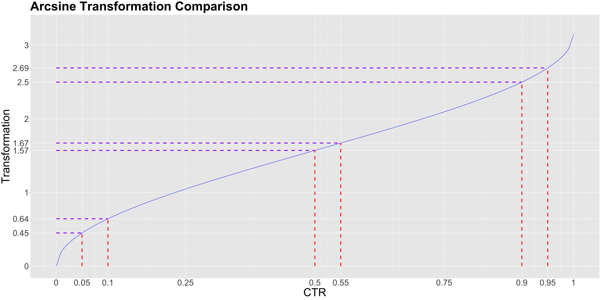
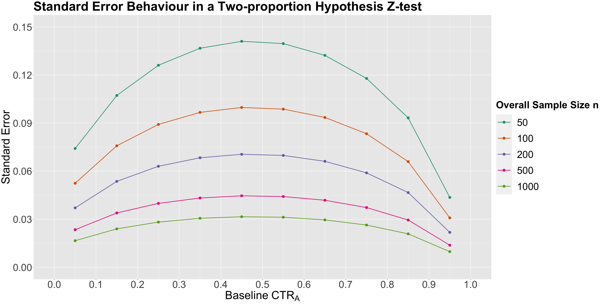
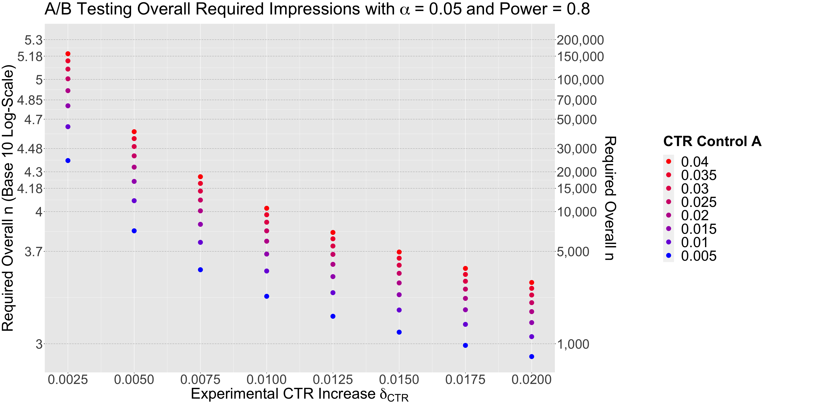

# Experimentation and Causal Inference

Want to address causality from:

- Randomized studies
  - Can **randomly** allocate control (placebo) and treatment groups
- Non-randomized studies

  - Treatment randomization is impossible
  - Need to apply statistical methods to address it

## Observational vs Experimental Studies

- **Experimental**: The researcher **manipulates** the independent variable and observes the effect on the dependent variable.
  - E.g See if new gym class reduces body fat percentage, so **randomly assign** people to new and old class
- **Observational**: The researcher observes the effect of the independent variable on the dependent variable without manipulating the independent variable.
  - E.g. See if new gym class reduces body fat percentage, so **select** people who signed up for new and old class

## Hypothesis Testing Review

- Recall [552 Hypothesis Testing](https://mds.farrandi.com/block_2/552_stat_inter/552_stat_inter#hypothesis-testing)

- Tolerance to **Type I Error** is $\alpha$
  - $\alpha = P(\text{reject null} | \text{null is true})$
  - Reject $H_0$ when $p < \alpha$

### Why is it Important in Science?

- Easier to publish paper if findings are significant at $\alpha = 0.05$
- By Construction:
  - $H_0$ is "conservative"/ "boring"/ "status quo"
  - $H_a$ is "exciting"/ "new"/ "interesting"
- When $p > \alpha$, we fail to reject $H_0$
  - Does not mean $H_0$ is true
  - Just means we do not have enough evidence to reject it
  - Makes bad headlines: (e.g. "Null Hypothesis Not Rejected")
- **P-Hacking**: Repeatedly testing until $p < \alpha$
  - Inflate Type I Error Rate
  - Does not always mean if $p < \alpha$, the result is significant
    - BE SCEPTICAL OF PAPERS, DO NOT BELIEVE EVERYTHING
  - Need **Bonferroni Correction** to adjust for multiple comparisons

### Example: Finding out Food to Health Relationship

- Have 20 foods to test and 20 body parts to test
- In total get 400 tests (20 foods \* 20 body parts)
- Simulate that the food is NOT related to any body part
- However, when we randomly test, we will get around 40% of the tests significant at $\alpha = 0.05$
  - 162 tests is significant of the 400
- This is because of **Multiple Comparisons**
  - We inflate the Type I Error Rate ($\alpha$ is too high)
  - Need to adjust (decrease) $\alpha$ to account for multiple comparisons

#### Why is this the case?

$$
E_ i = \text{Committing Type I error in the } i \text{th test} \\
P(E_ i) = \alpha.
$$

The probability of NOT committing Type I error in the $i$th test is the following:
$$P\left(E_ i^c\right) = 1 - \alpha$$

Probability of NOT committing Type I error in any of the tests is:
$$P\left(\bigcap_{i=1}^n E_ i^c\right) = \left(1 - \alpha\right)^n$$

Probability of committing at least one Type I error in the tests is:
$$P\left(\bigcup_{i=1}^n E_ i\right) = 1 - P\left(\bigcap_{i=1}^n E_ i^c\right) = 1 - \left(1 - \alpha\right)^n$$

The inflated probability corresponds to committing AT LEAST one Type I error in the $m$ tests.

## Multiple Comparisons

### Bonferroni Correction

- Conservatively guard against p-hacking
- Idea: If we do $m$ tests, then $\alpha$ should be $\frac{\alpha}{m}$

```r
pval # Matrix of p-values

# Bonferroni Correction
pval_corrected = p.adjust(pval, method = "bonferroni")
```

### Bonferroni Guarantee

Let $R_i$ be the event of rejecting $H_0$ when $H_0$ is true for the $i$th test. Then:

$$
P\left(E_ i^c\right) \leq \sum_{i=1}^m P\left(R_i\right)
$$

This leads to the **Family-Wise Error Rate (FWER)**

- The chance that **one or more** of the true null hypotheses is rejected

$$
FWER \leq \sum_{i=1}^m \frac{\alpha}{m} = \alpha
$$

- The Bonferroni Correction guarantees that we **wrongly reject** the null hypothesis with probability less than $\alpha$

- **Drawback: Very Conservative**

$$P(R_1 \; \cup \; R_2) \leq P(R_1) + P(R_2)$$

Works if $R_1$ and $R_2$ are _mutually exclusive_.

- If not, then $P(R_1 \; \cup \; R_2) =  P(R_1) + P(R_2) - P(R_1 \; \cap \; R_2)$

So then the there will be too much correction -> TOO CONSERVATIVE / More Type II Errors

### False Discovery Rate (FDR)

- We cannot just look at p-value and see if study is significant
- Need to find out how much "hunting" they did
- There is a trade-off between **false discoveries** (FP) and **missing real effects** (FN)

$$FDR = \frac{FP}{FP + TP}$$

- **LESS STRICT** than Bonferroni Correction
  - It is a method to control the **Expected Proportion of False Positives** instead of the probability of **one or more** false positives

#### Benjamini-Hochberg (BH) Procedure

- One method to control FDR
- Method:

  1. Specify a _maximum acceptable FDR_ $\alpha$
  2. Order the p-values from smallest to largest
  3. Find the largest $k$ such that $p_{(k)} \leq \frac{k}{m} \alpha$
     - $p_{(k)}$ is the $k$th smallest p-value
  4. Take the $k$ smallest p-values as significant

- Get **BH adjusted p-values** as: $\min \Big\{ \frac{p\text{-value}_i \times m}{i}, \text{BH adjusted } p\text{-value}_{i + 1} \Big\}$

```r
# Benjamini-Hochberg Procedure
pval_corrected = p.adjust(pval, method = "fdr")
```

### When to Use FWER vs. FDR

| FWER                                | FDR                                    |
| ----------------------------------- | -------------------------------------- |
| When there is high confidence to TP | When there is certain proportion of FP |
| Want to be conservative             | Want to be less conservative           |
| Prefer **False Negatives**          | Prefer **False Positives**             |
| `TukeyHSD`                          | `pairwise.prop.test(method="BH")`      |

## Simpson's Paradox

- Arises when the association/trend between two variables is reversed when a third variable (**confounder**) is taken into account
  - Leads to deceptive statistical conclusions



### Confounding Factors

- Criteria to be a confounder:
  1. Related to the outcome by prognosis/ susceptibility
  2. the distribution of the confounding factor is different in the groups being compared
- Confounder is a variable related to both the explanatory and response variables
- Important to consider because without considering them, we may unkowingly observe a false demonstration of an association or the masking of an association between the explanatory and response variables.



### Strategies to Address Confounding

1. **Stratification**: good for observational data
   - Implies checking the association between $X$ and $Y$ within each stratum of the confounder
   - **Drawback**: need to know all possible confounders
2. **Analysis of Variance (ANOVA)**: good for experimental data
   - Randomize each subject to a level of $X$
     - **Randomization** breaks the dependency between exploratory/ response variables and confounders
   - Then compare $Y$ across levels of $X$
     </br>

- The **second strategy** is the golden standard in causal inference and design and analysis of experiments
  - The regressor $X$ is guaranteed to be independent of all possible confounders (known and unknown)
  - No longer need to be concerned with confounding
  - Can interpret the association between $X$ and $Y$ in a causal manner

## Foundations of A/B and A/B/n Testing

- **A/B Testing**: randomized experiment between **control** and **treatment** groups
- **A/B/n Testing**: randomized experiment between **control** for more than 2 groups (n is not the same as n samples)
- Recall: randomization makes variables independent of any confounding variables
- Hence we can infer causality instead of just association

### A/B Testing with Continuous Response

#### Common Terminology

- Example: Have two categorical variables: `color`: blue/red and `font_size`: small/ medium/ large to predict `duration` of stay on a website
- **Variables**: `color`, `font_size`
  - 6 possible treatment groups: 3 font sizes \* 2 colors
  - If all 6 are used -> **Full Factorial Design**, specifically **2x3 Factorial Design**
- Each user is **experimental unit**
- Each treatment group involves **replicates** (multiple experimental units)
  - The experimental units are randomly assigned to treatment groups

| Terms               | Definitions                                                                                                                                                                                                                                 |
| ------------------- | ------------------------------------------------------------------------------------------------------------------------------------------------------------------------------------------------------------------------------------------- |
| Stratification      | Process of splitting the population into homogenous subgroups and sampling observational units from the population independently in each subgroup.                                                                                          |
| Factorial Design    | Technique to investigate effects of several variables in one study; experimental units are assigned to all possible combinations of factors.                                                                                                |
| Cofounder           | A variable that is associated with both the explanatory and response variable, which can result in either the false demonstration of an association, or the masking of an actual association between the explanatory and response variable. |
| Blocking            | Grouping experimental units (i.e., in a sample) together based on similarity.                                                                                                                                                               |
| Factor              | Explanatory variable manipulated by the experimenter.                                                                                                                                                                                       |
| Experimental Unit   | The entity/object in the sample that is assigned to a treatment and for which information is collected.                                                                                                                                     |
| Replicate           | Repetition of an experimental treatment.                                                                                                                                                                                                    |
| Balanced Design     | Equal number of experimental units for each treatment group.                                                                                                                                                                                |
| Randomization       | Process of randomly assigning explanatory variable(s) of interest to experimental units (e.g., patients, mice, etc.).                                                                                                                       |
| Treatment           | A combination of factor levels.                                                                                                                                                                                                             |
| A/B Testing         | Statistically comparing a key performance indicator (conversion rate, dwell time, etc.) between two (or more) versions of a webpage/app/add to assess which one performs better.                                                            |
| Observational Study | A study where the researcher does not randomize the primary explanatory variables of interest.                                                                                                                                              |

#### Two-way ANOVA with main effects only

- Typically initial analysis in A/B testing
- main effects: standalone regressors (e.g. `color`, `font_size`)

$$
Y_{i,j,k} = \mu_{i} + \tau_{j} + \varepsilon_{i, j, k}
$$

- For $i$th `font` and $j$th `color`, for the $k$th experimental unit

```R
OLS_ABs_main_effects <- lm(formula = Duration ~ Font + Color, data = data)
anova(OLS_ABs_main_effects)
```

- ANOVA tables go hand-in-hand with randomized experiments



- p-values tests the hypothesis that:
  - $H_0$: $\mu_{1} = \mu_{2} = \mu_{3}$ (no effect of `font`)
  - $H_a$: at least one $\mu_{i}$ is different
- Recall: If p-value < 0.05, we reject the null hypothesis
- `Df` represents the degrees of freedom
  - It is of the formula: `# of levels - 1`

#### Two-way ANOVA with interaction effects

$$
Y_{i,j,k} = \mu_{i} + \tau_{j} + (\mu\tau)_{i,j} + \varepsilon_{i, j, k}
$$

- Adds the interaction term $(\mu\tau)_{i,j}$ to the model
  - Does not indicate they are multiplied

```R
OLS_ABs_interaction <- lm(formula = Duration ~ Font * Color, data = data)
anova(OLS_ABs_interaction)
```

- `Df` for interaction term is the product of `Df1` and `Df2`

#### Post-hoc tests

- Done if any factor is significant
- Compares all possible pairs among the levels
  - Involves multiple testing corrections
- Will use Tukey's HSD test
  - Keeps the Family-Wise Error Rate (FWER) at $\alpha$ or less
  - Only for ANOVA models

```R
# Need aov: basically lm but for ANOVA
OLS_aov_ABn <- aov(formula = Duration ~ Font * Color, data = data)
TukeyHSD(OLS_aov_ABn, conf.level = 0.95) |> tidy()
```

## Blocking

- **Blocking Factor**: a variable that is not of primary interest (and cannot be controlled) but is known to affect the response variable
  - Consider as grouping factor
  - Examples: time period when A/B testing is conducted, user demographics, etc.
- **“Block what you can, randomize what you cannot.”**
  - **Blocking**: removing the effect of secondary measurable variables from the response
    - This is so our model could get statistical association/ causation between the secondary variable and the response variable
  - **Randomization**: removing the effect of unmeasurable variables



_Strategy A: Just Randomize, Strategy B: Randomize and Block_

### Blocking Procedure

1. Stratify experimental units into homogenous blocks. Each stratum is a block
2. Randomize the experimental units into the treatment groups within each block

### Randomization and Blocking Recap

Sorted Best to Worst:

1. Model with blocking for blocking factors + Post-Hoc adjustments
2. Normal data with Post-Hoc adjustments for blocking factors (Treat blocking as a covariate)
   - **covariate**: a variable that is possibly predictive of the response variable
3. Raw model with no blocking nor Post-Hoc adjustments

## Increasing Sample Size

- Increasing sample size would:
  - Increase the **accuracy** of the estimates
  - Increase the **power** of the test
    - **Power**: probability of rejecting the null hypothesis when it is false (predict correctly)
      - High power means our A/B test is robust enough to detect and estimate experimental treatment effects
    - In class had example: Need 10x the sample size for raw to perform equal to covariate/ blocking
- But this model would not capture the right systematic component of the population, including the **stratum effect** (demographic categories)
- Using covariate and blocking would still be more precise
- Need to consider that increasing sample size is also expensive

### Power in Sample Size Computations

- Recall that sample size computations involve playing around with three concepts:
  1. **effect size**: how much we want the experimental treatment to differ from the control treatment in terms of the mean response
  2. **significance level** $\alpha$
     - Lower = more strict (less prone to Type I error/ false positive)
     - $P(\text{reject } H_0 | H_0 \text{ is true}) = \alpha$
  3. **power** of the test $1 - \beta = 1 - P(\text{Type II error})$,
     - Typically 0.8
     - larger = less prone to Type II error
     - $P(\text{reject } H_0 | H_a \text{ is true}) = 1 - \beta = 1 - P(\text{accept } H_0 | H_a \text{ is true})$



| Decision                     | True Condition Positive ($H_a$ True) | True Condition Negative ($H_0$ True) |
| ---------------------------- | ------------------------------------ | ------------------------------------ |
| Test Positive (Reject $H_0$) | Correct (True Positive)              | Type I Error (False Positive)        |
| Test Negative (Accept $H_0$) | Type II Error (False Negative)       | Correct (True Negative)              |

_see more in [my statistical inference notes](https://mds.farrandi.com/block_2/552_stat_inter/552_stat_inter.html#visual-representation-of-errors)_

#### Example case

- Lets say we want to see if changeing website design from "X" to "Y" will increase the average time spent on the website.
- We know:
  - Current average is between 30s to 2 min
  - We want to see a 3% increase in time spent
- Calculation:
  - $\mu_x = 0.5 + \frac{2-0.5}{2} = 1.25 \text{ min}$
  - Using 95% CI, $Z_i = \frac{Y_i - \mu_A}{\sigma} \sim \mathcal{N}(0, 1)$
    - $1.96 = \frac{2 - \mu_A}{\sigma}$
    - $\sigma = \frac{2 - 1.25}{1.96} = 0.383$
  - $\delta = 0.03 \times 1.25 = 0.0375$ (desired difference)
    </br>
- Use `pwr.t.test` function in R to calculate sample size needed
  - will give `n` (sample size) needed for **each** group

```R
pwr.t.test(
  d = 0.0375 / 0.383, # delta / sigma
  sig.level = 0.05,
  power = 0.8,
  type = "two.sample",
  alternative = "greater" # we want to see an increase
)
```



_Lower power means need less sample size_


_Higher response increase means more power for a given sample size_

### Block Homogeneity and Power

- We want to ensure that the blocks are **homogeneous**:
  - As **much** variation in $\mu$ as possible is **across** the blocks
  - As **little** variation in $\mu$ as possible is **within** the blocks
- If not homogenous: blocking can be worse than raw
- The blocking setup needs to be carefully planned before running the experiment.

### Sample size computation in proportion tests

- Earlier was test with mean duration (continouous response) -> use t-test
- We use **z-test** for **proportion tests**
  - proportion means value between 0 and 1
- E.g. see the click through rate (CTR) of a website between control "X" and treatment "Y"
  - CTR $\in [0, 1]$

#### Effect size $h$

- No need $\sigma$ nor $\mu$ for proportion test
- Need to know the effect size $h$ (difference in proportions)
  - Use `ES.h(data_control, data_treatment)` to calculate
- Effect size has an **arcsine transformation**:

$$h = 2 \arcsin(\sqrt{p_Y}) - 2 \arcsin(\sqrt{p_X})$$

- This means:
  - Smaller transformed effect (y-axis) in the middle
  - Larger transformed effect (y-axis) at the ends



- This behaviour is related to the **statistic's standard error** of the two-proportion z-test
  - $\delta = p_Y - p_X$
  - $H_0: \delta < some\_value$, $H_a: \delta \geq some\_value$

$$
Z = \frac{\hat{\delta}_{\text{CTR}} - some\_value}{\sqrt{\frac{\hat{\text{CTR}}_A (1 - \hat{\text{CTR}}_A)}{n/2} + \frac{\hat{\text{CTR}}_B (1 - \hat{\text{CTR}}_B)}{n/2}}} = \frac{\hat{\delta}_{\text{CTR}} - some\_value}{\text{SE}\left(\hat{\delta}_{\text{CTR}}
\right)}
$$



_More error in the middle, less error at the ends. Smaller sample size = more error_

#### Using function `pwr.2p.test`

```R
CTR_effect_size = ES.h(data_control, data_treatment)

pwr.2p.test(
  h = CTR_effect_size,
  sig.level = alpha,
  power = pow,
  alternative = "greater"
)
```



We can see that we need more sample size when:

- $\delta$ is smaller
- $CTR_X$ is closer to 0.5, more error in the middle

### Early stopping in A/B Testing

- **Peeking**: looking at the data before the experiment is over/ through the experiment
- Still compute overall sample size to get $n_{max}$
- If at some peek, **updated test statistic** is significant, we can stop the experiment

</br>

- **Aggresive Peeking**: look at the data after every new experimental unit
  - If test $P_Y > P_X$ (and in fact it is true), aggressive peeking will improve power of the test if:
    - $P_Y > 1.5 * P_X$
    - Otherwise, it gives a concerning power decrease
  - If test $P_Y = P_X$,
    - the proportion of replicates where $z_{test} > z_{1- \alpha}$ correspond to type I error rate
    - will lead to **inflating the type I error rate**

## Observational Studies

- We **do not** have control of the variable of interest.
- **Without randomization, life is harder**. Strategy includes:
  1. Recording potential confounders
  2. Use confounders as part of the analysis
  3. Tempering the causal strength in light of inherent challenges in (i) and (ii)

### Example: Pharmaco-epidemiology

- Response $Y$: binary indicator of disease state. (1: disease, 0: no disease)
- $X$: binary indicator of behavior (1: type A, 0: type B)
  - Type A: more agressive personality, competitive, etc
  - Type B: more laid back personality, relaxed, etc
- Confounders $C_j$ (e.g. age, sex, BMI, cholesterol level, etc.)

</br>

- Since it is binary => binary logistic regression
  - Use log-odds $logit(p) = \log(\frac{p}{1-p})$
  - odds-ratio: $\text{OR} = \frac{\frac{n_{X = 1, Y = 1}/ n}{n_{X = 1,Y = 0} / n}}{\frac{n_{X = 0, Y = 1}/ n}{n_{X = 0,Y = 0} / n}} = \frac{\frac{n_{X = 1, Y = 1}}{n_{X = 1,Y = 0}}}{\frac{n_{X = 0, Y = 1}}{n_{X = 0,Y = 0}}} = \frac{n_{X = 1, Y = 1} \times n_{X = 0,Y = 0}}{n_{X = 1,Y = 0} \times n_{X = 0, Y = 1}}$
    - OR = 1: X does not effect Y
    - OR > 1: X increases the odds of Y
    - OR < 1: X decreases the odds of Y
  - $\text{SE} = \sqrt{\frac{1}{n_{X = 1, Y = 1}} + \frac{1}{n_{X = 1,Y = 0}} + \frac{1}{n_{X = 0, Y = 1}} + \frac{1}{n_{X = 0, Y =0}}}$
- Can also just use binary logistic regression in R

```R
glm(Y ~ X, data = data, family = binomial) |>
  tidy(conf.int = 0.95)
```

#### Adding confounders

- Turn a continous confounder (e.g. age) into discrete categories and add to the model
  - `data |> mutate(age_bins = cut(age, breaks = c(min(age), quantile(age, (1:3) / 4), max(age)), include.lowest = TRUE)`
- By making **stratum-specific inference** with multiple confounders, we aim to infer causality between X and Y
  - However, there will be few observations in each strata (not enough data)
  - **Solution**: use binomial logistic regression (**Overall Model-Based Inference**) with interaction terms

```R
glm(Y ~ X * C1 * C2, data = data, family = binomial) |>
  tidy(conf.int = 0.95)
```

_recall: odds ratio is $exp(\beta)$ where $\beta$ is the coefficient/ estimate_

#### Assumptions for Causal Model-based Inference (binary logistic regression)

1. **Simple/ smooth structure in how the Y-specific log-OR varies across the strata**
   - Check using ANOVA comparing the simple model (all additive terms) and the complex model (with interaction terms of all confounders with each other)
   - `complex_model <- glm(Y ~ X + C1 * C2, data = data, family = binomial)`
   - `anova(simple_model, complex_model, test = "LRT")`
2. **Strength of $(X, Y)$ association is constant across the strata** (i.e. no interaction between X and C)
   - complex model: all simple terms + double interactions of X and confounders
   - `complex_model_c1 <- glm(Y ~ X + C1 + C2 + X:C1, data = data, family = binomial)`
   - `complex_model_c2 <- glm(Y ~ X + C1 + C2 + X:C2, data = data, family = binomial)`
   - Compare all models with simple model using ANOVA
3. **No unmeasured confounders** (All confounders are included in the model)
   - Add new model with unmeasured confounder
   - `new_model <- glm(Y ~ X + C1 + C2 + CU, data = data, family = binomial)` where CU is the unmeasured confounder

## Sampling Schemes in Observational Data

- Must Explore how to select our sample **before** executing the study
- Analysis must also account for the sampling scheme

### Sampling Assesment via the Ground Truth

- **Ground Truth**: checking the results of the study in terms of its estimation accuracy against the **real-world**
- Ground truth is hard to get/ not available in many cases
  - Frequentist paradigm: we **do not** have access to true population parameters
  - Need to reply on sample to estimate the population parameters

#### Simulation: Proxy for Ground Truth

- A better simulation technique than Monte Carlo
- **Core Idea**:
  - **Use a relevant sample dataset**: assumes previous sample data is representative of the population
  - **Fit a model** with `Y ~ X + C_j` (where $C_j$ are a determined set of confounders)
  - **Simulate a proxy ground truth** by generating new data from the model
- Still use the 3 assumptions for the causal model-based inference

- Steps:
  1.  Get a dataset and generate multiple rows of data (break continuous variables into quartile bins)
  2.  Fit a model with the data
  3.  Simulate a proxy ground truth by generating new data from the model

### Sampling Schemes using Proxy Ground Truth

- Three Sampling Schemes:
  1. **Cross-Sectional Sampling**
  2. **Case-Control Sampling**
  3. **Cohort Sampling**
- These schemes will imply different **temporalities**

#### Cross-Sectional (CS) Sampling Scheme

- **Contemporaneous**: all data is collected at the same time
  - Grab a simple random sample of size n from the population
  - Similar to an instantaneous snapshot of all study variables
- **Ideal** in **early research stages** to get a sense of the data
  - Fast to run

```R
set.seed(123) # for reproducibility

CS_sample_index <- sample(1:n, size = n_sample, replace = FALSE)
CS_data <- data[CS_sample_index, ]
```

#### Case-Control (CC) Sampling Scheme

- **Retrospective**: data is collected after the event of interest has occurred
  - Sample into cases `Y=1` and controls `Y=0` (Equal sample sizes for both)
  - Then ask the subjects "have you been exposed to `X` in the past?"
- **Ideal** where outcome `Y=1` is rare
  - Not have have a lot of cases of `Y=1` so recruit a lot of patients with `Y=1` for study
- It will **oversample** $Y=1$ cases and **undersample** $Y=0$ controls
  - Leads to a second statistical inquiry: "Is it a winning strategy to oversample cases?"
    - Do **modified Power Analysis** using Case:Control ratio
    - If ratio = 1, then control = case
    - If ratio > 1, then case > control
    - If ratio < 1, then case < control
  - According to SE behaviors, in populations when $Y=1$ is rare, get **more precise** estimates by oversampling cases and undersampling controls

```R
set.seed(123) # for reproducibility

CC_sample_index <- c(sample((1:n)[data$Y == 1], size = n_sample/2, replace = FALSE),
                      sample((1:n)[data$Y == 0], size = n_sample/2, replace = FALSE))
CC_data <- data[CC_sample_index, ]
```

#### Cohort (CO) Sampling Scheme

- **Prospective**: data is collected over time
  - Sample into exposed `X=1` and unexposed `X=0` (Equal sample sizes for both)
  - Then follow the subjects over time to see if they develop the disease `Y=1`
- `Y` is assumed as the recorded outcome at the end of the study
- **Ideal** for when exposure `X=1` is rare
  - Not have have a lot of cases of `X=1` so recruit a lot of patients with `X=1` for study

```R
set.seed(123) # for reproducibility

CO_sample_index <- c(sample((1:n)[data$X == 1], size = n_sample/2, replace = FALSE),
                         sample((1:n)[data$X == 0], size = n_sample/2, replace = FALSE))
CO_data <- data[C0_sample_index, ]
```

### Sampling Scheme Assesment

- Need to run multiple simulations to get a sense of the variability of the estimates
- Use function `sim_study` to run the simulation

```R
sim_study <- function(pop_data, n, alpha, log_OR, num_replicates) {
  res <- list(NULL) # Setting up matrix with metrics
  res[[1]] <- res[[2]] <- res[[3]] <- matrix(NA, num_replicates, 3)

  suppressMessages(for (lp in 1:num_replicates) { # Otherwise, we get "Waiting for profiling to be done..."
    # Obtaining samples by scheme
    # CS
    CS_sampled_subjects <- sample(1:nrow(pop_data), size = n, replace = F)
    CS_sample <- pop_data[CS_sampled_subjects, ]
    # CC
    CC_sampled_subjects <- c(
      sample((1:nrow(pop_data))[pop_data$chd69 == "0"],
        size = n / 2, replace = F
      ),
      sample((1:nrow(pop_data))[pop_data$chd69 == "1"],
        size = n / 2, replace = F
      )
    )
    CC_sample <- pop_data[CC_sampled_subjects, ]
    # CO
    CO_sampled_subjects <- c(
      sample((1:nrow(pop_data))[pop_data$dibpat == "Type B"],
        size = n / 2, replace = F
      ),
      sample((1:nrow(pop_data))[pop_data$dibpat == "Type A"],
        size = n / 2, replace = F
      )
    )
    CO_sample <- pop_data[CO_sampled_subjects, ]

    # Do the three analyses
    # CS
    CS_bin_log_model <- glm(chd69 ~ dibpat + age_bins + smoke + bmi_bins + chol_bins,
      family = "binomial", data = CS_sample
    )
    # CC
    CC_bin_log_model <- glm(chd69 ~ dibpat + age_bins + smoke + bmi_bins + chol_bins,
      family = "binomial", data = CC_sample
    )
    # CO
    CO_bin_log_model <- glm(chd69 ~ dibpat + age_bins + smoke + bmi_bins + chol_bins,
      family = "binomial", data = CO_sample
    )

    # and the takeaways
    res[[1]][lp, ] <- c(coef(CS_bin_log_model)["dibpatType A"], confint(CS_bin_log_model)["dibpatType A", ])
    res[[2]][lp, ] <- c(coef(CC_bin_log_model)["dibpatType A"], confint(CC_bin_log_model)["dibpatType A", ])
    res[[3]][lp, ] <- c(coef(CO_bin_log_model)["dibpatType A"], confint(CO_bin_log_model)["dibpatType A", ])
  })

  # Summaries
  BIAS <- sapply(
    res,
    function(mat) {
      mean(mat[, 1]) - log_OR
    }
  )
  vrnc <- sapply(res, function(mat) {
    var(mat[, 1])
  })
  CVRG <- sapply(res,
    function(mat, trg) {
      mean((mat[, 2] < trg) & (trg < mat[, 3]))
    },
    trg = log_OR
  )
  PWR <- sapply(res, function(mat) {
    mean(mat[, 2] > 0)
  })
  RMSE <- sqrt(BIAS^2 + vrnc)

  opt <- cbind(BIAS, RMSE, CVRG, PWR)
  rownames(opt) <- c("Cross-Sectional (CS)", "Case-Control (CC)", "Cohort (CO)")

  return(opt)
}
```

- Function inputs:
  - `pop_data`: the dataset where we will sample from
  - `n`: sample size
  - `alpha`: significance level $\alpha$
  - `log_OR`: true log odds ratio
  - `num_replicates`: number of simulations to run
- The function `sim_study` will return a matrix with the following metrics:
  - **BIAS**: difference between the estimated and true log odds ratio
  - **RMSE**: root mean squared error
  - **CVRG**: coverage of the 95% confidence interval (as a proportion of `num_replicates`)
  - **PWR**: power of the test

## Matched Case-Control Studies

- All our previous sampling schemes used a **binary logistic regression** model
- Recall we checked that CC is the best compared to the other 2 designs (CS and CO) in terms of power when $Y=1$ is rare

### Alternative Data Collection

- Using CC is acceptable because:
  - We assumed $Y|X, C_1, ..., C_p$
  - Create artificial population by "cloning subjects"
    - This is done using the estimated model from (previous reperesentative sample) + induced random noise
    - AKA Proxy Ground Truth
- CC is useful when $Y=1$ is rare and sampling is costly

### CC Matching

- Need to have artificial population to be representative of the true population
- Then will sample to get a sample size of $n$
- Record the confounders of interest as **strata**
- Sample $n/2$ cases then $n/2$ controls
  - Keep Case:Control ratio = 1
  - Match **exactly** on the confounder to the case counterpart
    - e.g. case has confounder $C_1=1$, then control must have $C_1=1$
- **Important**: Cannot fit Binary Logistic Regression model since we have matched pairs
  - Can get a sparse data problem
  - Use **McNemar's Test** instead
- CC-matched will show a smaller average bias compared to CC-unmatched
  - Power is the same once $n$ increases

|            | Control $X=0$ | Control $X=1$ |
| ---------- | ------------- | ------------- |
| Case $X=0$ | $n_{00}$      | $n_{01}$      |
| Case $X=1$ | $n_{10}$      | $n_{11}$      |

- $n_{00}$ and $n_{11}$ are the **concordant pairs**
- $n_{01}$ and $n_{10}$ are the **discordant pairs**
- Estimator of the **odds ratio** is based on discordant pairs: $OR = \frac{n_{10}}{n_{01}}$
  - $OR = 1$ implies no association
  - $OR > 1$ implies positive association
  - $OR < 1$ implies negative association

#### McNemar's Test

- $H_0: log(OR) = 0$, $H_a: log(OR) \neq 0$
- $log(OR) = log{n_{10}} - log{n_{01}}$
- It is approximately normally distributed with an SE of:
  - $SE = \sqrt{\frac{1}{n_{10}} + \frac{1}{n_{01}}}$
- Test statistic: $Z = \frac{log(OR)}{SE}$

## Ordinal Regressors

- The numerical confounding strata we have been using are ordinal

### Example

- $Y$ is continuous, $X$ is ordinal

1. Need to convert the variable $X$ to ordinal

```R
data$X_ord <- ordered(data$X, levels=c("low", "medium", "high"))
```

2. Fit a **one-way analysis of variance (ANOVA)** model

- R uses **polynomial contrasts** in ordered type factors
  - Elements of vectors sum to 0
  - Roughly, if have `k` levels, then `k-1` polynomials
  - E.g. `l=4`, we will have linear, quadratic, cubic contrasts
  - Use `contr.poly(l)` to get the contrasts when `l` levels
    - Gives design matrix for the contrasts
    - Cols sum to 0
    - Rows are the contrasts and are orthogonal

```R
OLS <- lm(Y ~ X_ord, data=data)

# Get contrasts
OLS |> model.matrix()
```

3. Hypothesis test:
   - $H_0$: there is no GIVEN trend in the ordered data
   - $H_1$: there is a GIVEN trend in the ordered data
   - GIVEN will be replaced with linear, quadratic, cubic, etc

```R
plot <- eda_plot +
    geom_smooth(aes(x=unclass(X_ord), color=1),
        formula=y~x, method="lm", se=FALSE) +
    geom_smooth(aes(x=unclass(X_ord), color=2),
        formula=y~poly(x, 2), method="lm", se=FALSE) +
    geom_smooth(aes(x=unclass(X_ord), color=3),
        formula=y~poly(x, 3), method="lm", se=FALSE)
```

#### Successive Difference Constrasts

- Alternative to make inferential interpretations more straightforward
- Want to answer whether differences exist between ordered levels

```R
options(contrasts = c("contr.treatment", "contr.sdif"))

OLS_sdif <- lm(Y ~ X_ord, data=data) |> tidy()
```

- Interpretation is very straightforward
