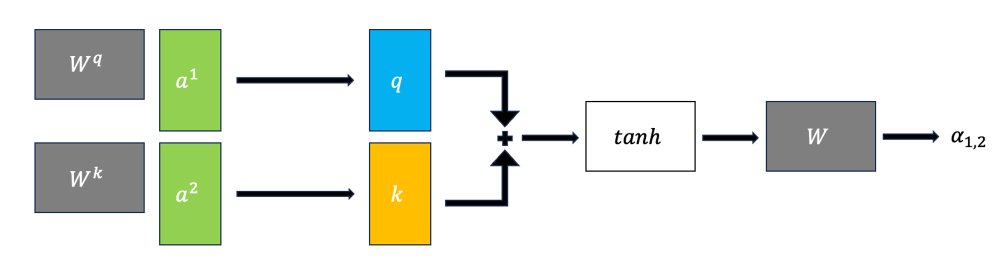

# Advanced Machine Learning (Large Language Models)

## Language Models

- It computes the probability distribution of a sequence of words.
  - $P(w_1, w_2, ..., w_t)$
  - E.g. P("I have read this book) > P("Eye have red this book")
- Can also get the probability of the upcoming word.
  - $P(w_t | w_1, w_2, ..., w_{t-1})$
  - E.g. P("book" | "I have read this") > P("book" | "I have red this")

### Large Language Models

- Large language models are trained on a large corpus of text.

## Markov Model

- **High-level**: The probability of a word depends only on the previous word (forget everything written before that).
- **Idea**: Predict future depending upon:
  - The current state
  - The probability of change

### Markov Assumption

Naive probability of a sequence of words:
$$P(w_1, w_2, ..., w_t) = P(w_1)P(w_2|w_1)P(w_3|w_1, w_2)...P(w_t|w_1, w_2, ..., w_{t-1})$$

e.g. $$P(\text{I have read this book}) = P(\text{I})P(\text{have}|\text{I})P(\text{read}|\text{I have})P(\text{this}|\text{I have read})P(\text{book}|\text{I have read this})$$

Or simply:
$$P(w_1, w_2, ..., w_t) = \prod_{i=1}^{t} P(w_i|w_{1:i-1})$$

But this is hard, so in Markov model (n-grams), we only consider the `n` previous words. With the assumption:

$$P(w_t|w_1, w_2, ..., w_{t-1}) \approx P(w_t| w_{t-1})$$

### Markov Chain Definition

- Have a set of states $S = \{s_1, s_2, ..., s_n\}$.
- A set of discrete initial probabilities $\pi_0 = \{\pi_0(s_1), \pi_0(s_2), ..., \pi_0(s_n)\}$.
- A transition matrix $T$ where each $a_{ij}$ is the probability of transitioning from state $s_i$ to state $s_j$.

$$
T =
\begin{bmatrix}
    a_{11}       & a_{12} & a_{13} & \dots & a_{1n} \\
    a_{21}       & a_{22} & a_{23} & \dots & a_{2n} \\
    \dots \\
    a_{n1}       & a_{n2} & a_{n3} & \dots & a_{nn}
\end{bmatrix}
$$

- **Properties**:
  - $0 \leq a_{ij} \leq 1$
  - **rows sum to 1**: $\sum_{j=1}^{n} a_{ij} = 1$
  - columns do not need to sum to 1
  - This is assuming **Homogeneous Markov chain** (transition matrix does not change over time).

### Markov Chain Tasks

1. Predict probabilities of sequences of states
2. Compute probability of being at a state at a given time
3. Stationary Distribution: Find steady state after a long time
4. Generation: Generate a sequences that follows the probability of states

#### Stationary Distribution

- Steady state after a long time.
- Basically the eigenvector of the transition matrix corresponding to the eigenvalue 1.

$$\pi T = \pi$$

- Where $\pi$ is the stationary probability distribution
  </br>
- **Sufficient Condition for Uniqueness**:
  - Positive transitions ($a_{ij} > 0$ for all $i, j$)
- **Weaker Condition for Uniqueness**:
  - **Irreducible**: Can go from any state to any other state (fully connected)
  - **Aperiodic**: No fixed period (does not fall into a repetitive loop)

### Learning Markov Models

- Similar to Naive Bayes, Markov models is just counting
- Given $n$ samples/ sequences, we can find:
  - Initial probabilities: $\pi_0(s_i) = \frac{\text{count}(s_i)}{n}$
  - Transition probabilities: $a_{ij} = \pi(s_i| s_j) = \frac{\text{count}(s_i, s_j)}{\text{count}(s_i)} = \frac{\text{count of state i to j}}{\text{count of state i to any state}}$

### n-gram language model

- Markov model for NLP
- `n` in n-gram means $n-1$ previous words are considered
  - e.g. `n=2` (bigram) means consider current word for the future
  - DIFFERENT from Markov model definition bigram= markov model with `n=1` (we normally use this definition in NLP)
- We extend the definition of a "state" to be a sequence of words
  - e.g. "I have read this book" -> bigram states: "I have", "have read", "read this", "this book"
- example: "I have read this book"
  - trigram (n=2): $P(\text{book} | \text{read this})$
  - n=3: $P(\text{book} | \text{have read this})$

_Note: n we use above is not the same as n in n-gram_

#### Evaluating Language Models

- Best way is to embed it in an application and measure how much the application improves (**extrinsic evaluation**)
- Often it is expensive to run NLP pipeline
- It is helpful to have a metric to quickly evaluate performance
- Most common **intrinsic evaluation** metric is **perplexity**
  - **Lower perplexity is better** (means better predictor of the words in test set)

#### Perplexity

Let $W = w_1, w_2, ..., w_N$ be a sequences of words.

$$
\text{Perplexity}(W) = P(w_1, w_2, ..., w_N)^{-\frac{1}{N}} \\
= \sqrt[N]{\frac{1}{P(w_1, w_2, ..., w_N)}}
$$

For `n=1` markov model (bigram):

$$P(w_1, w_2, ..., w_N) = \prod_{i=1}^{N} P(w_i|w_{i-1})$$

So...

$$
\text{Perplexity}(W) = \sqrt[N]{\prod_{i=1}^{N} \frac{1}{P(w_i|w_{i-1})}}
$$

- Increase `n` will decrease perplexity => better model
- Too high still bad because of overfitting

## Applications of Markov Models

### Google PageRank

- **Idea**: The importance of a page is determined by the importance of the pages that link to it.
- **Markov Model**: The probability of being on a page at time $t$ depends only on the page at time $t-1$.
- **Transition Matrix**: The probability of going from page $i$ to page $j$ is the number of links from page $i$ to page $j$ divided by the number of links from page $i$.
  - Add $\epsilon$ to all values so that matrix is fully connected
  - Normalize so sum of each row is 1
- **Stationary Distribution**: The stationary distribution of the transition matrix gives the importance of each page.
  - It shows the page's long-term visit rate

## Basic Text Preprocessing

- Text is unstructured and messy
  - Need to "normalize"

### Tokenization

- Sentence segmentation: text -> sentences
- Word tokenization: sentence -> words
  - Process of identifying word boundaries
- Characters for tokenization:
  | Character | Description |
  | --- | --- |
  | Space | Separate words |
  | dot `.` | Kind of ambiguous (e.g. `U.S.A`) |
  | `!`, `?` | Kind of ambiguous too |
- How?
  - Regex
  - Use libraries like `nltk`, `spacy`, `stanza`

### Word Segmentation

- In NLP we talk about:
  - **Type**: Unique words (element in vocabulary)
  - **Token**: Instances of words

### word-based vs character-based language models

| Feature       | Word-Based                                                                           | Character-Based                                                                              |
| ------------- | ------------------------------------------------------------------------------------ | -------------------------------------------------------------------------------------------- |
| Advantages    | - Faster training and inference due to smaller vocabulary size                       | - Can handle unseen words (out-of-vocabulary) and typos by generating characters             |
|               | - Leverages existing knowledge of grammar and syntax through word relationships      | - More flexible for generating creative text formats like code or names                      |
| Disadvantages | - Requires a large vocabulary, leading to higher memory usage and computational cost | - May struggle with complex morphology (word structure) in some languages                    |
|               | - Can struggle with unseen words or typos (resulting in "unknown word" tokens)       | - May generate grammatically incorrect or nonsensical text due to lack of word-level context |

- n-gram typically have larger state space for word-based models than character-based models

### Other Preprocessing Steps

- Removing stop words
- Lemmatization: Convert words to their base form
- Stemming: Remove suffixes
  - e.g. automates, automatic, automation -> automat
  - Not actual words, but can be useful for some tasks
  - Be careful, because kind of aggressive

### Other Typical NLP Tasks

- **Part of Speech (POS) Tagging**: Assigning a part of speech to each word
- **Named Entity Recognition (NER)**: Identifying named entities in text
- **Coreference Resolution**: Identifying which words refer to the same entity
- **Dependency Parsing**: Identifying the grammatical structure of a sentence

## Hidden Markov Models

### Speech Recognition

- Python has several libraries for speech recognition.
  - Have a module called `SpeechRecognition` which can access:
    - Google Web Speech API
    - Sphinx
    - Wit.ai
    - Microsoft Bing Voice Recognition
    - IBM Speech to Text
  - Might need to pay for some of these services
- **General Task**: Given a sequence of audio signals, want to recognize the corresponding phenomes/ words
  - **Phenomes**: Distinct units of sound
    - E.g. "cat" has 3 phenomes: "k", "ae", "t". "dog" has 3 phenomes: "d", "aa", "g"
  - English has ~44 phenomes
- It is a **sequence modeling problem**
- Many modern speech recognition systems use HMM
  - HMM is also still useful in bioinformatics, financial modeling, etc.

### HMM Definition and Example

- **Hidden**: The state is not directly observable
  - e.g. In speech recognition, the phenome is not directly observable. Or POS (Part of Speech) tags in text.
- HMM is specified by a 5-tuple $(S, Y, \pi, T, B)$
  - $S$: Set of states
  - $Y$: Set of observations
  - $\pi$: Initial state probabilities
  - $T$: Transition matrix, where $a_{ij}$ is the probability of transitioning from state $s_i$ to state $s_j$
  - $B$: Emission probabilities. $b_j(y)$ is the probability of observing $y$ in state $s_j$
- Yielding the state sequence and observation sequence

$$\text{State Sequence}:Q = q_1, q_2, ..., q_T \in S$$

$$\text{Observation Sequence}: O = o_1, o_2, ..., o_T \in Y$$

#### HMM Assumptions


1. The probability of a particular state depends only on the previous state

$$P(q_i|q_0,q_1,\dots,q_{i-1})=P(q_i|q_{i-1})$$

2. Probability of an observation depends **only** on the state.

$$P(o_i|q_0,q_1,\dots,q_{i-1},o_0,o_1,\dots,o_{i-1})=P(o_i|q_i)$$

**Important Notes**:

- Observations are ONLY dependent on the current state
- States are dependent on the previous state (not observations)
- Each hidden state has a probability distribution over all observations

#### Fundamental Questions for a HMM

1. Likelihood
   - Given $\theta = (\pi, T, B)$ what is the probability of observation sequence $O$?
2. Decoding
   - Given an observation sequence $O$ and model $\theta$. How do we choose the best state sequence $Q$?
3. Learning
   - Given an observation sequence $O$, how do we learn the model $\theta = (\pi, T, B)$?

#### HMM Likelihood

- What is the probability of observing sequence $O$?

$$P(O) = \sum\limits_{Q} P(O,Q)$$

This means we need all the possible state sequences $Q$

$$P(O,Q) = P(O|Q)\times P(Q) = \prod\limits_{i=1}^T P(o_i|q_i) \times \prod\limits_{i=1}^T P(q_i|q_{i-1})$$

This is computationally inefficient. $O(2Tn^T)$

- Need to find every possible state sequence $n^T$, then consider each emission given the state sequence $T$
- $n$ is the number of hidden states
- $T$ is the length of the sequence

To solve this, we use dynamic programming (Forward Procedure)

##### Dynamic Programming: Forward Procedure

- Find $P(O|\theta)$
- Make a table of size $n \times T$ called **Trellis**
  - rows: hidden states
  - columns: time steps
- Fill the table using the following formula:
  1. **Initialization**: compute first column ($t=0$)
     - $\alpha_j(0) = \pi_j b_j(o_1)$
       - $\pi_j$: initial state probability
       - $b_j(o_1)$: emission probability
  2. **Induction**: compute the rest of the columns ($1 \leq t < T$)
     - $\alpha_j(t+1) = \sum\limits_{i=1}^n \alpha_i(t) a_{ij} b_j(o_{t+1})$
       - $a_{ij}$: transition probability from $i$ to $j$
  3. **Termination**: sum over the last column ($t=T$)
     - $P(O|\theta) = \sum\limits_{i=1}^n \alpha_T(i)$
- It is computed left to right and top to bottom
- Time complexity: $O(2n^2T)$
  - At each time step, need to compare states to all other states $n^2$
  - Better compared to the naive approach $O(2Tn^T)$

### Supervised Learning in HMM

- Training data: Set of observations $O$ and set of state sequences $Q$
- Find parameters $\theta = (\pi, T, B)$

- Popular libraries in Python:
  - `hmmlearn`
  - `pomegranate`

### Decoding: The Viterbi Algorithm

- Given an observation sequence $O$ and model $\theta = (\pi, T, B)$, how do we choose the best state sequence $Q$?
- Find $Q^* = \arg\max_Q P(O,Q|\theta)$

|                             | Forward Procedure                                                                                                                         | Viterbi Algorithm                                                                                                             |
| --------------------------- | ----------------------------------------------------------------------------------------------------------------------------------------- | ----------------------------------------------------------------------------------------------------------------------------- |
| **Purpose**                 | Computes the probability of observing a given sequence of emissions, given the model parameters.                                          | Finds the most likely sequence of hidden states that explains the observed sequence of emissions, given the model parameters. |
| **Computation**             | Computes forward probabilities, which are the probabilities of being in a particular state at each time step given the observed sequence. | Computes the most likely sequence of hidden states.                                                                           |
| **Probability Calculation** | Sum over all possible paths through the hidden states.                                                                                    | Recursively calculates the probabilities of the most likely path up to each state at each time step.                          |
| **Objective**               | Computes the likelihood of observing a given sequence of emissions.                                                                       | Finds the most probable sequence of hidden states that explains the observed sequence of emissions.                           |

- Both are dynamic programming algorithms with time complexity $O(n^2T)$

- **Viterbi Overview**:
  - Store $\delta$ and $\psi$ at each node in the trellis
    - $\delta_i(t)$ is the max probability of the most likely path ending in trellis node at state $i$ at time $t$
    - $\psi_i(t)$ is the best possible previous state at time $t-1$ that leads to state $i$ at time $t$


#### Viterbi: Initialization

- $\delta_i(0) = \pi_i b_i(O_0)$
  - recall $b_i(O_0)$ is the emission probability and $\pi_i$ is the initial state probability
- $\psi_i(0) = 0$

#### Viterbi: Induction

- Best path $\delta_j(t)$ to state $j$ at time $t$ depends on each previous state and
  their transition to state $j$

- $\delta_j(t) = \max\limits_i \{\delta_i(t-1)a_{ij}\} b_j(o_t)$
  - $b_j(o_t)$ is the emission probability of observation $o_t$ given state $j$
- $\psi_j(t) = \arg \max\limits_i \{\delta_i(t-1)a_{ij}\}$

#### Viterbi: Conclusion

- Choose the best final state
  - $q_t^* = \arg\max\limits_i \delta_i(T)$
- Recursively choose the best previous state
  - $q_{t-1}^* = \psi_{q_t^*}(T)$

### The Backward Procedure

- We do not always have mapping from observations to states (emission probabilities $B$)
- Given an observation sequence $O$ but not the state sequence $Q$, how do we choose the best parameters $\theta = (\pi, T, B)$?
- Use **forward-backward algorithm**

#### Basic Idea

- Reverse of the forward procedure **right to left** but still **top to bottom**
- Find the probability of observing the rest of the sequence given the current state
  - $\beta_j(t) = P(o_{t+1}, o_{t+2}, \dots, o_T)$

#### Steps for Backward Procedure

1. **Initialization**: set all values at last time step to 1
   - $\beta_j(T) = 1$
2. **Induction**: compute the rest of the columns ($1 \leq t < T$)
   - $\beta_i(t) = \sum_{j=1}^N a_{ij}b_{j}(o_{t+1}) \beta_j(t+1)$
3. **Conclusion**: sum over the first column
   - $P(O|\theta) = \sum_{i=1}^N \pi_i b_i(o_1) \beta_i(1)$

### Baum-Welch (BW) Algorithm

- Given observation sequence $O$, no state sequence $S$, how do we choose the "best" parameters $\theta = (\pi, T, B)$?
- Want $\theta$ that maximizes $P(O|\theta)$
- Cannot use MLE because we do not have the state sequence
- Use an **unsupervised learning** algorithm called Baum-Welch (Expectation-Maximization)

#### High-level Idea

- Initialize $\theta = (\pi, T, B)$ (guess) then iteratively update them
- Combines the forward (get $alpha$) and backward (get $beta$) procedures
- $\alpha$ and $\beta$ are combined to represent the probability of an entire observation sequence
- Define $\gamma$ and $\xi$ to update the parameters
  - $\gamma_i(t)$: probability of being in state $i$ at time $t$ given entire observation sequence $O$
  - $\xi_{ij}(t)$: probability of transitioning from state $i$ to state $j$ at time $t$ to $t+1$ given entire observation sequence $O$ regarless of previous and future states
- These probabilities are used to compute the expected:
  - Number of times in state $i$
  - Number of transitions from state $i$ to state $j$
- Repeat until convergence

## Topic Modeling

- **Motivation**:
  - Humans are good at identifying topics in documents.
  - But, it is difficult to do this at scale. (e.g., 1000s of documents)

### How to do Topic Modeling?

- Common to use unsupervised learning techniques
  - Given hyperparameter $K$, we want to find $K$ topics.
- In unsupervised, a common model:
  - Input:
    - $D$ documents
    - $K$ topics
  - Output:
    - Topic-word association: for each topic, what words describe that topic?
    - Document-topic association: for each document, what topics are in that document?
- Common approaches:
  1. **Latent Semantic Analysis (LSA)**
  2. **Latent Dirichlet Allocation (LDA)**

### Latent Semantic Analysis (LSA)

- Singular Value Decomposition (SVD) of the term-document matrix. See [LSA notes from 563](https://mds.farrandi.com/block_5/563_unsup_learn/563_unsup_learn#lsa-latent-semantic-analysis).

$$X_{n \times d} \approx Z_{n \times k}W_{k \times d}$$

- $n$: number of documents, $d$: number of words, $k$: number of topics

```python
from sklearn.pipeline import make_pipeline
from sklearn.decomposition import TruncatedSVD
from sklearn.feature_extraction.text import CountVectorizer

lsa_pipe = make_pipeline(
    CountVectorizer(stop_words="english"), TruncatedSVD(n_components=3)
)

Z = lsa_pipe.fit_transform(toy_df["text"]);
```

### Latent Dirichlet Allocation (LDA)

- Bayesian, generative, and unsupervised model
- Developed by [David Blei](https://www.cs.columbia.edu/~blei/) and colleagues in 2003
  - One of the most cited papers in computer science
- **Document-topic distribution** or **topic proportions** $\theta$:
  - Each document is considered a mixture of topics
- **Topic-word distribution**:
  - Each topic is considered a mixture of words
  - This is from all documents

#### High-level LDA Algorithm

0. Set the number of topics $K$
1. Randomly assign each word in each document to a topic
2. For each document $d$:
   - Choose a distribution over topics $\theta$ from a **Dirichlet prior**
     - Use **dirichlet** distribution because it is conjugate priot (same form as posterior)
   - For each word in the document:
     - Choose a topic from the document's topic distribution $\theta$
     - Choose a word from the topic's word distribution
       </br>

- Fit using Bayesian inference (most commonly MCMC)

#### Gibbs Sampling

- A Markov Chain Monte Carlo (MCMC) method
- Very accurate, but slow (alternative is **Variational Inference**, which is faster but less accurate)
- Used to approximate the posterior distribution for document-topic and topic-word distributions
- **Main steps**:

  1. **Initialization**: Randomly assign each word in each document to a topic
     
  2. **Update topic-word assignments**:

     - Decrease count of current word in both topic and document distributions
     - Reassign word to a new topic based on probabilities
        

  3. **Iterate** until convergence
     

### Topic Modeling in Python

- 3 Main components:
  1. Preprocess corpus
  2. Train LDA (use `sklearn` or `gensim`)
  3. Interpret results

#### Preprocess Corpus

- Crucial to preprocess text data before training LDA
- Need tokenization, lowercasing, removing punctuation, stopwords
- Optionally, lemmatization or POS tagging

```python
import spacy

nlp = spacy.load("en_core_web_md")

def preprocess_spacy(
    doc,
    min_token_len=2,
    irrelevant_pos=["ADV", "PRON", "CCONJ", "PUNCT", "PART", "DET", "ADP"],
):
  """
  Preprocess a document using spaCy
  [Tokenize, remove stopwords, minimum token length, irrelevant POS tags, lemmatization]
  """
    clean_text = []

    for token in doc:
        if (
            token.is_stop == False  # Check if it's not a stopword
            and len(token) > min_token_len  # Check if the word meets minimum threshold
            and token.pos_ not in irrelevant_pos
        ):  # Check if the POS is in the acceptable POS tags
            lemma = token.lemma_  # Take the lemma of the word
            clean_text.append(lemma.lower())
    return " ".join(clean_text)

wiki_df = [preprocess_spacy(doc) for doc in nlp.pipe(wiki_df["text"])]
```

#### Train LDA

- With `sklearn`:

```python
from sklearn.feature_extraction.text import CountVectorizer
from sklearn.decomposition import LatentDirichletAllocation

vectorizer = CountVectorizer()
dtm = vectorizer.fit_transform(wiki_df["text_pp"])

n_topics = 3
lda = LatentDirichletAllocation(
    n_components=n_topics, learning_method="batch", max_iter=10, random_state=0
)
document_topics = lda.fit_transform(dtm)

# Get the topic-word distribution
sorting = np.argsort(lda.components_, axis=1)[:, ::-1]
feature_names = np.array(vectorizer.get_feature_names_out())
```

- With `gensim`:

```python
import gensim
from gensim.corpora import Dictionary
from gensim.models import LdaModel

corpus = [doc.split() for doc in wiki_df["text_pp"].tolist()]
dictionary = Dictionary(corpus) # Create a vocabulary for the lda model

# Get document-term matrix
doc_term_matrix = [dictionary.doc2bow(doc) for doc in corpus]

# Train LDA model
num_topics = 3

lda = LdaModel(
    corpus=doc_term_matrix,
    id2word=dictionary,
    num_topics=num_topics,
    random_state=42,
    passes=10,
)
```

- Main hyperparameters read more about them in the [documentation](https://radimrehurek.com/gensim/models/ldamodel.html)
  - `num_topics`/ `K`: number of topics
  - `alpha`: Prior on document-topic distribution
    - High alpha: documents are likely to be a mixture of many topics
    - Low alpha: documents are likely to be a mixture of few topics
  - `eta`: Prior on topic-word distribution
    - High eta: topics are likely to be a mixture of many words
    - Low eta: topics are likely to be a mixture of few words

#### Interpret Results

- Since this is unsupervised, we need to interpret the topics ourselves
- Idea is to tell a story to humans and what we should care about and evaluate
- **Common methods**:
  - Look at the top words in each topic and make judgements
    - **Word Intrusion**: Add a random word to the top words and see if it is noticed
  - Extrinsic evaluation: Evaluate whether topic nodel with current hyperparameters improves the results of task or not
  - Quantify topic interpretability with metrics like **Coherence Score**
    - Use `Gensim`'s `CoherenceModel` to calculate coherence score
    - Score is between -1 and 1, higher is better

## Recurrent Neural Networks (RNNs)

### Motivation

- Recall when modelling sequences:
  - Order matters
  - Sequence length can vary
  - Need to capture long-term dependencies
- **Problem with Markov models**:
  - Only capture short-term dependencies
  - Sparsity problem: if there are a lot of states, the transition matrix will be very sparse
  - Also need large memory to store the n-grams
  - MM do not scale well
- To get closer to the ideal language model (closer to ChatGPT), here we will learn **neural sequencing models**.
- **Problem with Feedforward Neural Networks**:
  - Lose temporal information
  - All connects are fully connected and flow forward (no loops)

### Introduction to RNNs

- **RNNs** are a type of neural network that can model sequences
  - Similar to NN, it is supervised learning
- Solves the limited memory problem of Markov models
  - Memory only scales with number of words $O(n)$
- They use **recurrent connections** to maintain a state over time.
  
  _source: [Stanford CS224d slides](https://cs224d.stanford.edu/lectures/CS224d-Lecture8.pdf)_
- Connect the hidden layer to itself

```python
# Pseudocode for RNN
rnn = RNN()
ff = FeedForwardNN()

hidden_state = [0, 0, 0] # depenpent on the number of hidden units
for word in input:
    output, hidden_state = rnn(word, hidden_state)

prediction = ff(hidden_state)
```


_source: [Video on RNN](https://www.youtube.com/watch?v=LHXXI4-IEns&t=585s)_

- The states above are hidden layers in each time step
  - Similar to HMMs, but state is continuous, high dimensional, and much richer
- Each state contains information about the whole past sequence
- Not that different from feedforward NNs
  - Still does forward calculation
  - Just have new set of weights $U$ that connect previous hidden state to current hidden state
  - These weights are also trained via backpropagation

### Parameters in RNNs

- There are 3 weight matrices in RNNs:
  - **$W$: input -> hidden**
    - size: $d_{\text{input}} \times d_{\text{hidden}}$
  - **$V$: hidden -> output**
    - size: $d_{\text{hidden}} \times d_{\text{output}}$
  - **$U$: hidden -> hidden**
    - size: $d_{\text{hidden}} \times d_{\text{hidden}}$
- **Important point**: All weights between time steps are shared
  - Allows model to learn patterns that are independent of their position in the sequence

### Forward Pass


- Computing new state $h_t$:
  - $h_t = g(Uh_{t-1} + Wx_t + b_1)$
    - $g()$: activation function
    - $x_t$: input at time $t$
    - $b_1$: bias
- Computing output $y_t$:
  - $y_t = \text{softmax}(Vh_t + b_2)$

#### Forward Pass with PyTorch

```python
import torch
import torch.nn as nn
from torch.nn import RNN

INPUT_SIZE = 20
HIDDEN_SIZE = 10
NUM_LAYERS = 1 # number of hidden layers

rnn = nn.RNN(INPUT_SIZE, HIDDEN_SIZE, NUM_LAYERS)

h0 = torch.randn(NUM_LAYERS, HIDDEN_SIZE) # initial hidden state

# PyTorch gives output and hidden state
output, hn = rnn(input, h0)
```

Simple Sentiment RNN Class:

```python
class SentimentRNN(nn.Module):
    def __init__(self, vocab_size, embedding_dim, hidden_dim, output_dim):

        super(SentimentRNN, self).__init__()

        self.embedding = nn.Embedding(vocab_size, embedding_dim)
        self.rnn = nn.RNN(embedding_dim, hidden_dim, batch_first=True)
        self.fc = nn.Linear(hidden_dim, output_dim)

    def forward(self, text):
        embedded = self.embedding(text)
        output, hidden = self.rnn(embedded)
        assert torch.equal(output[:, -1, :], hidden.squeeze(0))
        return self.fc(hidden.squeeze(0))

# Example usage
model = SentimentRNN(vocab_size=vocab_size, embedding_dim=100, hidden_dim=128, output_dim=2)
```

#### Training RNNs

- Since it is supervised, we have: training set, loss function, and backpropagation
- Need to tailor backpropagation for RNNs
  - Since hidden layers are connected to themselves, we need to backpropagate through time
  - **Backpropagation Through Time (BPTT)**
    - Unroll the RNN for a fixed number of time steps
    - Calculate the loss at each time step
    - Sum the losses and backpropagate
    - Update the weights
  - See [the code](https://gist.github.com/karpathy/d4dee566867f8291f086) for the code implementation by Andrej Karpathy

### RNN Applications

Possible RNN architectures:


- **Sequence Labelling**:
  - E.g. Named Entity Recognition (NER) or Part-of-Speech (POS) tagging
  - Many-to-many architecture
  - Input are pre-trained word embeddings, outputs are tag probabilities by softmax
- **Sequence Classification**:
  - E.g. Spam detection or sentiment analysis
  - Similar to pseudo-code above, feed result of last hidden layer to a feedforward NN
  - Many-to-one architecture
- **Text Generation**:
  - E.g. ChatGPT
  - One-to-many architecture
  - Input is a seed, output is a sequence of words
- **Image captioning**:
  - E.g. Show and Tell
  - Many-to-many architecture
  - Input is an image, output is a sequence of words

### Stacked RNNs

- Use _sequence of outputs_ from one RNN as the _sequence of inputs_ to another RNN
- Generally outperform single-layer RNNs
- Can learn different level of abstraction in each layer
- Number of layers is a hyperparameter, remember that higher also means more training cost

### Bidirectional RNNs

- Use case is in POS tagging it is useful to know words both before and after the current word
- Bidirectional RNNs have two hidden layers, one for forward and one for backward
  - Combines two independent RNNs

### Problems with RNNs

3 Main problems:

1. **Hard to remember relevant information**
   - Vanishing gradients because of long sequences
   - Case example: `The students in the exam where the fire alarm is ringing (are) really stressed.`
     - Need to retain information that students are plural so use "are"
2. **Hard to optimize**
3. **Hard to parallelize**

## Transformers

### Intuition for Transformers

- Approach to sequence processing without using RNNs or LSTMs
- **Idea**: Build up richer and richer **contextual representations** of words across series of transformer layers
  - **Contextual representation**: Representation of a word that depends on the context in which it appears
- GPT-3: 96 layers of transformers
- **Benefits**:
  - **Parallelization**: Can process all words in parallel
  - **Long-range dependencies**: Can learn dependencies between words that are far apart
- **Two main components**:
  - **Self-attention mechanism**
  - **Positional embeddings/encodings**

### Self-Attention Mechanism

- **Goal**: To look broadly into the context and tells us how to integrate the representations of context words to build representation of a word
- **Idea**: Compute attention scores between each pair of words in a sentence
  - **Attention score**: How much one word should focus on another word
- **Example**: "She plucked the guitar strings , ending with a melancholic note."
  - Attention score from `note` to `she` is low
  - Attention score from `note` to `guitar` is high
  - Attention score from `note` to `melancholic` is very high

#### High-Level Overview

The basic steps of the self-attention mechanism are as follows:

1. Compare each word to every other word in the sentence (usually by **dot product**)
2. Apply softmax to derive a probability distribution over all words
3. Compute a weighted sum of all words, where the weights are the probabilities from step 2

- Operations can be done in parallel

#### Query, Key, Value

- **Query** $W^Q$: Word whose representation we are trying to compute (**current focus of attention**)
- **Key** $W^K$: Word that we are comparing the query to
- **Value** $W^V$: Word that we are trying to compute the representation of (output for the **current focus of attention**)

- We can assume all of them have dimension ... [TODO]

#### Self-Attention Architecture

_All diagrams in this section is made by my friend Ben Chen. Check out his [blog on self-attention](https://benchenblog.notion.site/Inside-the-Black-Box-of-Self-attention-b0feb3a57b51463f907a643468e4912d)._

- All inputs $a_i$ are connected to each other to make outputs $b_i$
  
- This is a breakdown of how each input $a_i$ is connected to each output $b_i$ using the query, key, and value
  

  - In the example our **query is $a_1$**, and our keys are $a_2$, $a_3$, and $a_4$

_Note_: For LLMs, not all the sequences are connected to each other, only words before the current word are connected to the current word.

##### Breakdown of the steps

1. Get the $\alpha$ values

   - Can either do a dot product approach (more common)
     

   - Or an additive approach with an activation function (like tanh)
     

2. Apply softmax to get $\alpha'$ values

3. Multiply $\alpha'$ values by the matrix product $W^V \cdot A$ to get the output $b_1$

##### Scaling the Dot Product

- Result of the dot product can be very large
- They are scaled before applying softmax
- Common scaling: $score(x_i, x_j) = \frac{x_i \cdot x_j}{\sqrt{d}}$
  - $d$: Dimensionsionality of the query and key vectors

#### The Steps in Matrix Form

Let $X$ be matrix of all input $x_i$ vectors (Shape: $N \times d$)

- $Q_{N \times d_k} = X \cdot W^Q_{d \times d_k}$
- $K_{N \times d_k} = X \cdot W^K_{d \times d_k}$
- $V_{N \times d_v} = X \cdot W^V_{d \times d_v}$

We can then get $\alpha$ easily by $Q \times K$ (shape: $N \times N$)

- Recall $N$ is the number of words in the sentence


Then to get the $\text{Self Attention}(Q,K,V) = \text{softmax}(\frac{Q \times K}{\sqrt{d_k}}) \times V$

But for LLMs, we only want to look at the words before the current word, so:


### Positional Embeddings

- Using self-attention mechanism, we can learn dependencies between words, but we lose the order of words
- **Solution**: Add positional embeddings to the input embeddings
  - **Positional embeddings**: Embeddings that encode the position of a word in a sentence

### Multi-Head Attention

- Different words in a sentence can relate to each other in different ways simultaneously
  - e.g. "The cat was scared because it didn't recognize me in my mask"
- Single attention layer might not be able to capture all these relationships
- Transformer uses multiple attention layers in parallel

  - Each layer is called a **head**
  - Each head learns different relationships between words


[source](https://web.stanford.edu/~jurafsky/slp3/9.pdf)

### Transformer Blocks


- Each Transformer block consists of:
  - **Multi-head self-attention layer**
  - **Feed-forward neural network**:
    - $N$ network
    - 1 hidden layer (normally higher dimensionality than input), 2 weight matrices
  - **Residual connections**
    - Add some "skip" connections because improves learning and gives more information to the next layer
  - **Layer normalization**
    - Similar to `StandardScaler`, make mean 0 and variance 1
    - To keep values in a certain range

$$
  T^1 = \text{SelfAttention}(X)\\
  T^2 = X + T^1\\
  T^3 = \text{LayerNorm}(T^2)\\
  T^4 = \text{FFN}(T^3)\\
  T^5 = T^4 + T^3\\
  H = \text{LayerNorm}(T^5)
$$

- Input and Output dimensions are matched so they can be "stacked"

#### Transformer in LLMs


- Take output of $h_N$ and get logit vector of shape $1 \times V$ where $V$ is the vocabulary size
  - $h_N$ -> unembedding layer -> logit vector -> softmax -> probability distribution
- This probability distribution is used to predict the next word
- This is a specific example of a **decoder** in a transformer

## Types of Transformers

1. **Decoder-only Transformer**
   - **Example**: GPT-3
   - **Training**: Trained on unsupervised data
   - **Use case**: Language modeling, text generation
2. **Encoder-only Transformer**
   - **Example**: BERT
   - **Training**: Trained on supervised data
   - **Use case**: Text classification, question answering, sentiment analysis
3. **Encoder-Decoder Transformer**
   - **Example**: T5, BART
   - **Training**: Trained on supervised data
   - **Use case**: Machine translation, summarization

### Decoder-only Transformer

- **Training**: Segment corpus of text into input-output pairs
- To predict the next word, given input words
- Self-attention only sees words before the current word
  - Use a **causal mask** to prevent the model from looking at future words

#### Autoregressive text generation

- Once trained, can generate text autoregressively
  - Incrementally generating words by sampling the next word based on previous choices
  - Sampling part is similar to generation with Markov models (but with more context and long-range dependencies)

### Encoder-only Transformer

- Mainly designed for a wide range of NLP tasks (e.g., text classification)
- It has **bidirectional self-attention**
  - Can look at all words in a sentence
  - Can learn dependencies between words in both directions
    
- **Training**:
  - **"fill in the blank" tasks/ cloze tasks**
    - Model predicts the probability of missing words in a sentence, use cross-entropy loss
  - Mask tokens and learn to recover them
  - **Contextual embeddings**: representations created by masked language models
    - Different to single vector embeddings from word2vec
    - Each word has a different vector depending on the context
- **Transfer learning through fine-tuning**:
  - GPT and BERT models are pre-trained on large corpora (very general)
  - Can create interfaces from these models to downstream tasks
  - Either freeze training or make minor adjustments to the model

### Encoder-Decoder Transformer

- For machine translation, summarization, etc.
- **High level architecture**:
  - **Encoder**: Takes input text and creates a representation
    - Similar transformer blocks as in the encoder-only transformer
  - **Decoder**: Takes the representation and generates the output text
    - More powerful block with extra cross-attention layer that can attend to all encoder words
  - **Attention mechanism**: Helps the decoder focus on different parts of the input text

### Interim Summary

| Feature                        | Decoder-only (e.g., GPT-3)                                             | Encoder-only (e.g., BERT, RoBERTa)                                         | Encoder-decoder (e.g., T5, BART)                                                                                  |
| ------------------------------ | ---------------------------------------------------------------------- | -------------------------------------------------------------------------- | ----------------------------------------------------------------------------------------------------------------- |
| Contextual Embedding Direction | Unidirectional                                                         | Bidirectional                                                              | Bidirectional                                                                                                     |
| Output Computation Based on    | Information earlier in the context                                     | Entire context (bidirectional)                                             | Encoded input context                                                                                             |
| Text Generation                | Can naturally generate text completion                                 | Cannot directly generate text                                              | Can generate outputs naturally                                                                                    |
| Example                        | MDS Cohort 8 is the \_\_\_                                             | MDS Cohort 8 is the best! → positive                                       | Input: Translate to Mandarin: MDS Cohort 8 is the best! Output: MDS 第八期是最棒的!                               |
| Usage                          | Recursive prediction over the sequence                                 | Used for classification tasks, sequence labeling taks and many other tasks | Used for tasks requiring transformations of input (e.g., translation, summarization)                              |
| Textual Context Embeddings     | Produces unidirectional contextual embeddings and token distributions  | Compute bidirectional contextual embeddings                                | Compute bidirectional contextual embeddings in the encoder part and unidirectional embeddings in the decoder part |
| Sequence Processing            | Given a prompt $X_{1:i}$, produces embeddings for $X_{i+1}$ to $X_{L}$ | Contextual embeddings are used for analysis, not sequential generation     | Encode input sequence, then decode to output sequence                                                             |
